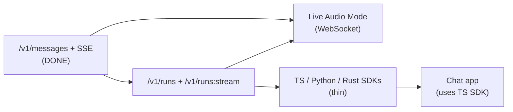

# VAI Gateway Specification (v1)

This is the single authoritative reference for the VAI Gateway — the hosted and self-hostable AI proxy that exposes a stable, provider-agnostic HTTP/SSE/WebSocket API.

Related docs (kept separate by design):
- `DEVELOPER_GUIDE.md` — Go SDK DX reference (direct-mode and proxy-mode usage)
- `LIVE_AUDIO_MODE_DESIGN.md` — WebSocket live audio protocol, session state machine, and provider adapters

---

## Table of Contents

- [1. Mission and Scope](#1-mission-and-scope)
  - [1.4 API versioning and compatibility](#14-api-versioning-and-compatibility)
- [2. Architecture Overview](#2-architecture-overview)
  - [2.1 Hosted topology](#21-hosted-topology)
  - [2.2 Gateway compute](#22-gateway-compute)
  - [2.3 Data stores](#23-data-stores)
  - [2.4 Cloudflare edge (optional, hosted only)](#24-cloudflare-edge-optional-hosted-only)
  - [2.5 Self-host reference deployment](#25-self-host-reference-deployment)
  - [2.6 Deployment, release, and graceful shutdown](#26-deployment-release-and-graceful-shutdown)
- [3. Auth and Keying Model](#3-auth-and-keying-model)
  - [3.1 Gateway API keys](#31-gateway-api-keys)
  - [3.2 Auth modes](#32-auth-modes)
  - [3.3 BYOK provider key headers](#33-byok-provider-key-headers)
  - [3.4 Managed keys (future)](#34-managed-keys-future)
  - [3.5 Security invariants](#35-security-invariants)
  - [3.6 Browser client security (v1 warning)](#36-browser-client-security-v1-warning)
- [4. API Endpoints](#4-api-endpoints)
  - [4.1 POST /v1/messages (non-streaming)](#41-post-v1messages-non-streaming)
  - [4.2 POST /v1/messages (SSE streaming)](#42-post-v1messages-sse-streaming)
  - [4.3 POST /v1/runs (blocking)](#43-post-v1runs-blocking)
  - [4.4 POST /v1/runs:stream (SSE)](#44-post-v1runsstream-sse)
  - [4.5 GET /v1/models](#45-get-v1models)
  - [4.6 GET /v1/live (WebSocket)](#46-get-v1live-websocket)
  - [4.7 Health endpoints](#47-health-endpoints)
- [5. Request Contract](#5-request-contract)
  - [5.1 Strict decoding principles](#51-strict-decoding-principles)
  - [5.2 MessageRequest.System union](#52-messagerequestsystem-union)
  - [5.3 Message.Content union](#53-messagecontent-union)
  - [5.4 Content block strict validation](#54-content-block-strict-validation)
  - [5.5 Tool config strict decoding](#55-tool-config-strict-decoding)
  - [5.6 Tool history validation (tool_use and tool_result)](#56-tool-history-validation-tool_use-and-tool_result)
  - [5.7 Request shape limits](#57-request-shape-limits)
  - [5.8 Structured output (output_format) handling](#58-structured-output-output_format-handling)
  - [5.9 Thinking blocks](#59-thinking-blocks)
  - [5.10 Provider compatibility validation](#510-provider-compatibility-validation)
- [6. Response and Error Contract](#6-response-and-error-contract)
  - [6.1 Non-streaming response](#61-non-streaming-response)
  - [6.2 Error envelope (HTTP)](#62-error-envelope-http)
  - [6.3 Canonical inner error object](#63-canonical-inner-error-object)
  - [6.4 HTTP status mapping](#64-http-status-mapping)
- [7. Streaming Contract (SSE)](#7-streaming-contract-sse)
  - [7.1 SSE framing](#71-sse-framing)
  - [7.2 Message stream events](#72-message-stream-events)
  - [7.3 Keepalive pings](#73-keepalive-pings)
  - [7.4 Stream duration limits](#74-stream-duration-limits)
  - [7.5 Client disconnect handling](#75-client-disconnect-handling)
  - [7.6 Streaming error events](#76-streaming-error-events)
  - [7.7 Proxy/LB compatibility](#77-proxylb-compatibility)
  - [7.8 Voice audio chunk ordering and backpressure](#78-voice-audio-chunk-ordering-and-backpressure)
  - [7.9 stream_event wrapper stability](#79-stream_event-wrapper-stability)
  - [7.10 Keepalive vs idle timeout interaction](#710-keepalive-vs-idle-timeout-interaction)
- [8. Run Event Schema (/v1/runs:stream)](#8-run-event-schema-v1runsstream)
  - [8.1 Event framing](#81-event-framing)
  - [8.2 Event types](#82-event-types)
- [9. Gateway-Managed Tools](#9-gateway-managed-tools)
  - [9.1 Builtin tool categories](#91-builtin-tool-categories)
  - [9.2 Builtin declaration and injection](#92-builtin-declaration-and-injection)
  - [9.3 Client-executed function tools](#93-client-executed-function-tools)
- [10. Voice Support on /v1/messages](#10-voice-support-on-v1messages)
  - [10.1 Voice input (STT)](#101-voice-input-stt)
  - [10.2 Voice output (TTS, non-streaming)](#102-voice-output-tts-non-streaming)
  - [10.3 Voice output (TTS, streaming)](#103-voice-output-tts-streaming)
  - [10.4 Voice credential requirements](#104-voice-credential-requirements)
- [11. Limits, Rate Limiting, and Abuse Controls](#11-limits-rate-limiting-and-abuse-controls)
  - [11.1 Request shape limits (defaults)](#111-request-shape-limits-defaults)
  - [11.2 Base64 budget limits](#112-base64-budget-limits)
  - [11.3 SSE and WebSocket limits](#113-sse-and-websocket-limits)
  - [11.4 Upstream timeouts](#114-upstream-timeouts)
  - [11.5 Rate limiting](#115-rate-limiting)
  - [11.6 Concurrency caps](#116-concurrency-caps)
  - [11.7 SSRF prevention (outbound egress controls)](#117-ssrf-prevention-outbound-egress-controls)
- [12. CORS](#12-cors)
- [13. Observability](#13-observability)
  - [13.1 Request identity](#131-request-identity)
  - [13.2 Metrics](#132-metrics)
  - [13.3 Tracing](#133-tracing)
  - [13.4 Logging](#134-logging)
- [14. SDK Strategy](#14-sdk-strategy)
  - [14.1 Thin vs thick SDKs](#141-thin-vs-thick-sdks)
  - [14.2 SDK endpoint coverage](#142-sdk-endpoint-coverage)
  - [14.3 SDK streaming idioms](#143-sdk-streaming-idioms)
  - [14.4 SDK auth configuration](#144-sdk-auth-configuration)
  - [14.5 SDK error model](#145-sdk-error-model)
- [15. Go SDK Proxy Transport](#15-go-sdk-proxy-transport)
- [16. TypeScript SDK Design](#16-typescript-sdk-design)
  - [16.1 Package layout](#161-package-layout)
  - [16.2 Client configuration](#162-client-configuration)
  - [16.3 Messages API](#163-messages-api)
  - [16.4 Runs API](#164-runs-api)
  - [16.5 Live audio client](#165-live-audio-client)
  - [16.6 Error model](#166-error-model)
- [17. Implementation Status and Roadmap](#17-implementation-status-and-roadmap)
  - [17.1 Current implementation status](#171-current-implementation-status)
  - [17.2 Dependency chain](#172-dependency-chain)
  - [17.3 Phase roadmap](#173-phase-roadmap)

---

## 1. Mission and Scope

### 1.1 Mission

Ship a VAI Gateway that:
- Exposes a stable, provider-agnostic `/v1/messages` API (JSON + SSE).
- Supports `voice` on `/v1/messages` (STT input + TTS output via Cartesia).
- Exposes server-side tool-loop endpoints (`/v1/runs` and `/v1/runs:stream`) so non-Go SDKs stay thin.
- Exposes Live Audio Mode as a WebSocket endpoint (`/v1/live`).
- Is safe for hosted use (auth, limits, rate limiting, observability).
- Is self-hostable with low friction (configurable auth mode, optional Postgres/Redis).
- Becomes the foundation for higher-level services (obs, evals, billing).

### 1.2 In-scope deliverables

1. Gateway proxy endpoints: `/v1/messages`, `/v1/runs`, `/v1/runs:stream`, `/v1/models`, `/v1/live`.
2. Strict HTTP contract hardening (request validation, typed decoding, error parity).
3. Gateway-managed tool allowlist for server-side runs.
4. Voice processing on `/v1/messages` (shared helpers used by both Go SDK and gateway).
5. Thin SDKs (TypeScript, Python, Rust — sequenced).
6. Go SDK proxy transport mode (route through gateway instead of direct provider calls).
7. Health and operational endpoints.

### 1.3 Out-of-scope (initial)

- Billing product / payments integration.
- Multi-region active/active from day 1.
- Arbitrary customer code execution in the gateway.
- Edge compute as primary runtime (Workers-only gateway).

### 1.4 API versioning and compatibility

#### Compatibility promise

Within `/v1`, changes are **additive only**:
- New optional request fields.
- New optional response fields.
- New SSE event types.
- New enum values (clients must treat unknown values safely).

Breaking changes require either a new major path (`/v2`) or an explicit opt-in header.

#### Version negotiation

- HTTP endpoints: `X-VAI-Version: 1` header (currently only `1`).
  - If absent, treat as `1`.
  - If present and unsupported, return `400 invalid_request_error` with `code: "unsupported_version"`.
- SSE run streams: `run_start` event includes `protocol_version`.
- WebSocket live: `hello` / `hello_ack` includes `protocol_version` (see `LIVE_AUDIO_MODE_DESIGN.md`).

#### Forward-compatibility rules for clients

SDKs and clients MUST:
- Ignore unknown top-level fields in response objects.
- Ignore unknown SSE event types (unless they are terminal `error` events).
- Ignore unknown fields within `stream_event.event` wrapper payloads.
- Treat unknown `stop_reason` values as opaque strings (log, don't crash).
- Treat unknown content block `type` values in responses as opaque (log, don't crash).
- Treat unknown `delta.type` values in `content_block_delta` as opaque.

This mirrors the strict-on-ingress / lenient-on-egress philosophy: the gateway rejects unknown inputs, but clients must tolerate unknown outputs.

---

## 2. Architecture Overview

### 2.1 Hosted topology

```mermaid
flowchart LR
  Client((Clients / SDKs))

  CF[Cloudflare Edge\nTLS / WAF / Bot / Edge RL]
  ALB[Origin Load Balancer\nSSE + WebSocket]
  GW[VAI Gateway\nGo service\n(stateless)]

  PG[(Postgres\nRDS / Cloud SQL)]
  RD[(Redis\nElastiCache / MemoryStore)]

  Obs[Logs / Metrics / Traces\n(OpenTelemetry)]
  Up[LLM Providers\nAnthropic / OpenAI / Gemini / ...]

  Client --> CF --> ALB --> GW
  GW --> PG
  GW --> RD
  GW --> Obs
  GW --> Up
```

Notes:
- Cloudflare is optional but recommended for hosted. The origin must work without it.
- The gateway must tolerate clients that do not support HTTP/2; SSE works over HTTP/1.1.

### 2.2 Gateway compute

Good options:
- **AWS ECS Fargate** — simpler than Kubernetes for a small team; excellent for stateless services.
- **GKE Autopilot** — if already on GCP and want managed Kubernetes.

Avoid for primary runtime:
- "Pure serverless" runtimes where connection duration and socket semantics are constrained (Lambda, Cloud Functions).

Build artifact:
- `cmd/vai-proxy` produces a single binary.
- Container image: pinned base image, non-root user, minimal runtime deps.

### 2.3 Data stores

**Postgres (durable control-plane + ledger):**
- Tenants / projects.
- Gateway API keys and policies.
- Allowlisted models per tenant.
- Usage ledger (append-only events, then rollups for billing analytics).
- Audit logs for admin actions.
- Secrets encrypted at rest if managed upstream keys are stored (or store only references to KMS/Vault).

**Redis (hot-path enforcement):**
- Distributed rate limiting counters (token bucket / leaky bucket approximations).
- Concurrency caps.
- Short-lived session state for live mode resume windows (future).

Operational rules:
- Redis is not the source of truth for billing/usage; it's enforcement.
- Keep keys low-cardinality and set TTLs.
- v1 can run purely in-memory limits for single-instance dev/self-host.

### 2.4 Cloudflare edge (optional, hosted only)

**What Cloudflare should do:**
1. TLS termination and cert lifecycle.
2. WAF rules for obvious abuse patterns.
3. Bot mitigation.
4. Basic edge rate limiting (coarse, IP-based — not the source of truth).
5. CDN caching for static assets (docs, status page).

**What Cloudflare should not do (initially):**
1. Run the full gateway compute at the edge.
2. Hold durable tenant state.
3. Implement fine-grained per-tenant rate limiting as the source of truth.

**Configuration checklist:**
- Ensure SSE is not buffered (gateway emits periodic `ping` events and flushes per event).
- WebSockets enabled for live mode.
- Timeouts aligned with SSE/WS SLAs.
- Request body size limits aligned with multimodal policy.

### 2.5 Self-host reference deployment

**Single VM (fastest path):**
- Systemd service runs `vai-proxy`.
- Caddy/Nginx in front for TLS (optional).
- `auth_mode=disabled` if binding to localhost only.
- Postgres/Redis optional: v1 runs in-memory limits for dev.

**Kubernetes:**
- Helm chart or Kustomize: Deployment + HPA, Service + Ingress, ConfigMap/Secret.

### 2.6 Deployment, release, and graceful shutdown

#### Graceful shutdown

During deploy or shutdown (`SIGTERM`), the gateway MUST:
1. Flip `/readyz` to non-ready (stops new traffic from load balancer).
2. Stop accepting new WebSocket sessions.
3. Stop accepting new SSE streams.
4. Allow existing streams and sessions to complete up to a `shutdown_grace_period` (default: 30 seconds).
5. After grace period, force-terminate remaining connections.

This is critical for Live Audio Mode, where WebSocket sessions can last up to 2 hours. Rolling deployments will sever active sessions unless draining is handled correctly.

#### Release strategy (hosted)

Progressive rollout:
1. Deploy to 1% of instances.
2. Monitor error rates, latency p95/p99, SSE disconnect rates.
3. Expand to 10%, then 100%.

Rollback triggers:
- Elevated 5xx error rates above threshold.
- Elevated SSE/WS disconnect rates.
- Elevated latency p95/p99.

#### Rollback compatibility

Older gateway versions and newer SDKs MUST interoperate as long as both respect the forward-compatibility rules in [1.4](#14-api-versioning-and-compatibility). SDKs must not depend on fields or event types that are newer than the gateway version they're talking to.

---

## 3. Auth and Keying Model

### 3.1 Gateway API keys

Hosted requires:
```
Authorization: Bearer vai_sk_...
```

Why the gateway key matters even with BYOK:
- Without it, the service is an unauthenticated public socket endpoint (abuse target).
- You lose tenant identity (no per-tenant policy/rate limits/usage).
- You cannot safely add obs/evals services and expect isolation.

### 3.2 Auth modes

The gateway supports an explicit `auth_mode` configuration:

| Mode | Behavior | Recommended for |
|------|----------|-----------------|
| `required` | Gateway key required on every request. Reject with `401` if missing/invalid. | Hosted, self-host exposed to network |
| `optional` | Allow missing gateway key; apply only global limits. If key is present, validate it. | Self-host with mixed access |
| `disabled` | No gateway auth; rely on network boundaries. | Self-host localhost/private VPC dev |

Defaults:
- Hosted: `required`.
- Self-host: `required` when binding to non-loopback; allow `disabled` only when binding to loopback.

**Principal identity:**

The term "principal" is used throughout this spec for rate limiting, concurrency caps, and usage accounting. It is resolved as follows:
- **`auth_mode=required`**: principal = the authenticated gateway API key (and by extension, its tenant/project).
- **`auth_mode=optional`**: principal = gateway API key if present, else client IP address.
- **`auth_mode=disabled`**: principal = client IP address (or a single "anonymous" bucket if IP tracking is not desired).

All "per-principal" limits in this spec refer to this resolved identity.

### 3.3 BYOK provider key headers

Proxy v1 is **BYOK-first** (a standard proxy pattern where upstream credentials are passed per-request). Developers keep their own provider API keys (Anthropic, OpenAI, etc.) in their own secrets store or environment variables. On each request to the gateway, the caller's backend sets the appropriate `X-Provider-Key-*` header. The gateway uses the key for the upstream provider call and **never stores it** — it is a per-request passthrough. The gateway MAY hold the key in memory only for the lifetime of the request. It MUST NOT persist it to disk, database, or cache, and MUST redact it from all logs, traces, and error responses.

**How it works in practice:**

```
Developer's backend                       VAI Gateway                    Upstream Provider
─────────────────                       ───────────                    ─────────────────
reads ANTHROPIC_API_KEY from env  ──►   receives X-Provider-Key-*  ──►  calls provider with key
                                        uses key for this request       returns response
                                        discards key after response ◄──
```

The developer's backend is responsible for:
- Storing provider keys securely (env vars, Vault, cloud secrets manager).
- Setting the correct `X-Provider-Key-*` header on each request to the gateway.
- Never exposing provider keys to frontend/browser code (see [3.6](#36-browser-client-security-v1-warning)).

The BYOK headers are associated with the **caller service** (or tenant/project via gateway key), not end users. Do not use BYOK from browser clients or per-end-user contexts.

SDKs automate this: configure `providerKeys` once in the SDK client constructor and headers are set automatically on every request. In managed keys mode (Phase 2), SDKs may omit `providerKeys` entirely; the gateway resolves keys from tenant configuration.

**Example request:**

```http
POST /v1/messages HTTP/1.1
Authorization: Bearer vai_sk_...
X-Provider-Key-Anthropic: sk-ant-...
Content-Type: application/json

{"model": "anthropic/claude-sonnet-4", "max_tokens": 1024, ...}
```

The gateway MUST NOT forward provider key headers to any outbound destination other than the matched upstream provider (not to tool fetchers, webhooks, logging services, etc.).

**Header mapping:**

| Header | Provider(s) |
|--------|-------------|
| `X-Provider-Key-Anthropic` | `anthropic/*` |
| `X-Provider-Key-OpenAI` | `openai/*`, `oai-resp/*` |
| `X-Provider-Key-Gemini` | `gemini/*`, `gemini-oauth/*` |
| `X-Provider-Key-Groq` | `groq/*` |
| `X-Provider-Key-Cerebras` | `cerebras/*` |
| `X-Provider-Key-OpenRouter` | `openrouter/*` |
| `X-Provider-Key-Cartesia` | Voice STT/TTS on `/v1/messages`; Live audio STT/TTS |
| `X-Provider-Key-ElevenLabs` | Live audio TTS (when enabled) |

Shared keys:
- `X-Provider-Key-OpenAI` is used by both `openai/*` (Chat Completions) and `oai-resp/*` (Responses API).

### 3.4 Managed keys (future)

Phase 2: the gateway operator configures provider keys per tenant in the gateway's tenant settings (stored encrypted in Postgres or referenced via KMS/Vault). Requests no longer need BYOK headers — the gateway resolves the key at request time.

Resolution order: tenant-managed key > BYOK header > error.

**Override policy:** When tenant-managed keys are configured, managed keys are **authoritative by default** (BYOK headers are ignored even if present). This prevents "shadow routing" where teams accidentally use BYOK keys when they expect managed keys. Operators MAY enable a `byok_override=true` tenant policy to allow BYOK to take precedence for experimentation.

This unlocks browser-direct usage (no provider keys in headers) and simplifies SDK configuration for teams that don't want to distribute provider keys to every calling service.

### 3.5 Security invariants

Hard requirements (all modes):
- Never log BYOK headers or bearer tokens.
- Never return BYOK headers in error responses.
- Apply strict header size limits.
- Redact all secrets in structured logs.

### 3.6 Browser client security (v1 warning)

v1 is designed for **backend-to-gateway** usage. If CORS is enabled and browser clients call the gateway directly, BYOK headers (`X-Provider-Key-*`) are visible in the browser's network inspector.

**v1 guidance:**
- Browser clients SHOULD call the gateway through a backend proxy that injects BYOK headers server-side.
- Do not embed raw provider API keys in frontend JavaScript.

**When browser-direct becomes safe:**
- Phase 2 managed keys: the gateway resolves the upstream key from tenant config, so no BYOK headers are needed in the request. Until managed keys ship, document that CORS + BYOK = key exposure risk.

---

## 4. API Endpoints

### 4.1 POST /v1/messages (non-streaming)

Single-turn LLM execution. Provider-routed based on `request.model`.

**Request (JSON):**

```json
{
  "model": "anthropic/claude-sonnet-4",
  "max_tokens": 1024,
  "system": "You are a helpful assistant.",
  "messages": [
    {
      "role": "user",
      "content": [
        {"type": "text", "text": "Hello"}
      ]
    }
  ],
  "tools": [],
  "tool_choice": null,
  "output_format": null,
  "voice": null,
  "stream": false
}
```

- `model` is a `provider/model-name` string. Routing splits on the **first `/` only**; the remainder may contain additional `/` characters (e.g., `openrouter/openai/gpt-4o`).
- `system` may be a string or `[]ContentBlock` (union; see [5.2](#52-messagerequestsystem-union)).
- `messages[].content` may be a string or `[]ContentBlock` (union; see [5.3](#53-messagecontent-union)).
- `voice` is optional; see [section 10](#10-voice-support-on-v1messages).
- `output_format` is optional; see [5.8](#58-structured-output-output_format-handling).
- `stream` must be `false` or omitted for non-streaming.

**Response (JSON):**

```json
{
  "id": "msg_...",
  "model": "anthropic/claude-sonnet-4",
  "role": "assistant",
  "content": [
    {"type": "text", "text": "Hello! How can I help?"}
  ],
  "stop_reason": "end_turn",
  "usage": {
    "input_tokens": 12,
    "output_tokens": 8,
    "total_tokens": 20
  },
  "metadata": {}
}
```

This is `types.MessageResponse` from `pkg/core/types`.

**Response headers (informational):**

```
X-Request-Id: req_...
X-Input-Tokens: 12
X-Output-Tokens: 8
```

**Flow:**
1. Strict decode request body.
2. Parse model string → `(provider, modelName)`.
3. Resolve BYOK provider key header.
4. Validate model against allowlist (if configured).
5. Provider feature compatibility validation (reject unsupported blocks/tools for this provider).
6. Voice input preprocessing (STT) if `req.Voice.Input` is set.
7. Call upstream provider `CreateMessage`.
8. Voice output post-processing (TTS) if `req.Voice.Output` is set.
9. Return `types.MessageResponse`.

### 4.2 POST /v1/messages (SSE streaming)

Same endpoint; set `"stream": true` in the request body.

**Response:**
- `200 OK`
- `Content-Type: text/event-stream; charset=utf-8`
- `Cache-Control: no-cache`
- `Connection: keep-alive`
- `X-Accel-Buffering: no` (for nginx/proxy compatibility)

**SSE event stream:**

Events mirror `pkg/core/types.StreamEvent`:

```
event: message_start
data: {"type":"message_start","message":{...}}

event: content_block_start
data: {"type":"content_block_start","index":0,"content_block":{"type":"text","text":""}}

event: content_block_delta
data: {"type":"content_block_delta","index":0,"delta":{"type":"text_delta","text":"Hello"}}

event: content_block_stop
data: {"type":"content_block_stop","index":0}

event: message_delta
data: {"type":"message_delta","delta":{"stop_reason":"end_turn"},"usage":{"output_tokens":8}}

event: message_stop
data: {"type":"message_stop"}
```

`message_start.message` is an initial shell. `stop_reason` is not yet known at stream start (it may be omitted or empty)
and is finalized later via `message_delta.delta.stop_reason`.

When voice output is enabled, the gateway also emits `audio_chunk` events interleaved with text events. See [10.3](#103-voice-output-tts-streaming).

**Terminal events:**
- `message_stop` — normal completion.
- `error` — terminal error (see [7.6](#76-streaming-error-events)).

### 4.3 POST /v1/runs (blocking)

Server-side tool loop. Returns a final result after the run completes.

**Request (JSON):**

```json
{
  "request": {
    "model": "anthropic/claude-sonnet-4",
    "max_tokens": 4096,
    "messages": [
      {"role": "user", "content": "Search the web for the latest Go release."}
    ],
    "tools": []
  },
  "run": {
    "max_turns": 8,
    "max_tool_calls": 20,
    "max_tokens": 0,
    "timeout_ms": 60000,
    "parallel_tools": true,
    "tool_timeout_ms": 30000
  },
  "builtins": ["vai_web_search"]
}
```

- `request` is a `types.MessageRequest`. `request.stream` must be `false` or omitted.
- `run` contains tool-loop stop conditions (mirrors Go SDK `RunOption`s).
- `builtins` declares which gateway-managed builtin tools are enabled for this run (see [section 9](#9-gateway-managed-tools)).
- The gateway injects canonical builtin tool definitions into `request.tools`. Do not trust caller-supplied schemas for builtins.

**Response (JSON):**

```json
{
  "result": {
    "response": { /* types.MessageResponse — the terminal response */ },
    "steps": [
      {
        "index": 0,
        "response": { /* types.MessageResponse — this step's assistant response */ },
        "tool_calls": [
          {"id": "call_1", "name": "vai_web_search", "input": {"query": "latest Go release"}}
        ],
        "tool_results": [
          {"tool_use_id": "call_1", "content": [{"type": "text", "text": "..."}], "error": null}
        ],
        "duration_ms": 1234
      }
    ],
    "tool_call_count": 1,
    "turn_count": 2,
    "usage": {"input_tokens": 0, "output_tokens": 0, "total_tokens": 0},
    "stop_reason": "end_turn",
    "messages": [ /* optional final history snapshot */ ]
  }
}
```

`stop_reason` values mirror Go SDK `RunStopReason`:
- `end_turn` — model finished naturally.
- `max_tool_calls` — tool call budget exhausted.
- `max_turns` — turn budget exhausted.
- `max_tokens` — aggregated token budget exceeded.
- `timeout` — run timeout exceeded.
- `cancelled` — request context cancelled.
- `error` — unrecoverable error.
- `custom` — server-side custom stop condition (future).

**Run-specific request validation:**

Beyond standard `/v1/messages` request validation, `/v1/runs` endpoints enforce:

- `request.stream` MUST be `false` or omitted (the gateway controls streaming internally).
- `run.max_turns`: must be `1–64` (upper bound protects hosted resources).
- `run.max_tool_calls`: must be `1–256`.
- `run.timeout_ms`: must be `1000–300000` (1 second to 5 minutes).
- `run.tool_timeout_ms`: must be `1000–60000` (1 second to 1 minute).
- `builtins`: must contain only allowlisted builtin names.
- **Name collision rule:** if `request.tools` includes a `function` tool whose name matches a builtin in `builtins`, **reject** the request. This prevents ambiguity about whether the gateway or the caller owns tool execution.
- `request.tools` + `builtins` merge: builtins are injected **in addition to** `request.tools` (which may include provider-native tools like `web_search`). Provider-native tools are passed through to the provider; builtins are executed by the gateway.
- `run.parallel_tools`: when `true` (default), the gateway executes multiple tool calls from the same model turn concurrently. When `false`, tool calls within a turn are executed sequentially in the order they appear.

**Cancellation semantics (`/v1/runs` blocking):**

If the client disconnects or the request context is cancelled while a blocking run is in progress:
- The gateway MUST cancel the upstream provider request.
- The gateway MUST cancel in-flight tool execution (best effort; tools may not be interruptible).
- The gateway returns `408 Request Timeout` or `error.type: "api_error"` with `code: "cancelled"` if the client is still connected when cancellation is detected.

### 4.4 POST /v1/runs:stream (SSE)

Streaming server-side tool loop. Same request shape as `/v1/runs`; response is an SSE event stream.

**Response:**
- `200 text/event-stream; charset=utf-8`

See [section 8](#8-run-event-schema-v1runsstream) for the full event type catalog.

**Cancellation semantics (`/v1/runs:stream`):**

If a streaming run is cancelled:
- The gateway MUST cancel the upstream provider stream.
- The gateway MUST cancel in-flight tool execution (best effort; tools may not be interruptible).
- **Server-initiated cancellation** (timeout, graceful shutdown): the gateway SHOULD emit a terminal `run_complete` event with `stop_reason: "cancelled"`.
- **Client disconnect**: no guarantee of a terminal event. The gateway silently cleans up resources. Clients MUST NOT depend on receiving `run_complete` after disconnecting — TCP half-close detection is inherently racy.

### 4.5 GET /v1/models

Discover available models and their capabilities.

**Response (JSON):**

```json
{
  "models": [
    {
      "id": "anthropic/claude-sonnet-4",
      "provider": "anthropic",
      "name": "claude-sonnet-4",
      "capabilities": {
        "streaming": true,
        "tools": true,
        "native_web_search": true,
        "native_code_execution": true,
        "vision": true,
        "documents": true,
        "structured_output": true,
        "thinking": true
      }
    }
  ]
}
```

Notes:
- The model set may be filtered by tenant allowlist.
- Capabilities reflect what the gateway knows about each provider's support.
- If the gateway cannot assert a capability for a model, the field is **omitted** from the capability object (absence means unknown, not unsupported). The request is allowed through and the provider's own error handling applies.

Auth requirements (per model):
- Each model entry SHOULD include `auth` metadata so clients can discover which BYOK header is needed before making a request:

```json
{
  "id": "anthropic/claude-sonnet-4",
  "provider": "anthropic",
  "auth": {"requires_byok_header": "X-Provider-Key-Anthropic"},
  "capabilities": { ... }
}
```

Caching:
- **Hosted (tenant-filtered):** the gateway MUST return `Cache-Control: private, max-age=300` to prevent shared caches (CDN, proxies) from serving one tenant's filtered model list to another tenant.
- **Self-host (no tenant filtering):** `Cache-Control: public, max-age=300` is acceptable.
- The model/capability catalog is maintained in gateway code (e.g., `pkg/gateway/compat/`). `/v1/models` is always derived from this catalog, never from live provider API discovery.

### 4.6 GET /v1/live (WebSocket)

WebSocket upgrade endpoint for Live Audio Mode.

- Endpoint: `wss://<gateway>/v1/live`
- Protocol: defined in `LIVE_AUDIO_MODE_DESIGN.md`.
- Auth: gateway API key via query param or first message; BYOK provider keys via `hello` message fields.

This section does not duplicate the full live protocol; see `LIVE_AUDIO_MODE_DESIGN.md` for:
- Handshake (`hello` / `hello_ack`).
- Audio framing and transport.
- Session state machine (endpointing, grace period, barge-in).
- `talk_to_user` terminal tool semantics.
- Backpressure contract and played history.
- Provider adapter interfaces (STT/TTS).

### 4.7 Health endpoints

**`GET /healthz` (liveness):**
- Returns `200 OK` if the process is running.
- No dependency checks. Used by load balancers and container orchestrators for liveness probes.

**`GET /readyz` (readiness):**
- Returns `200 OK` if the gateway is ready to serve requests.
- Checks: config loaded, HTTP client/transport initialized.
- Does **not** check "a managed provider exists" in BYOK-only mode (there are no managed providers to validate).
- Future: check Postgres/Redis connectivity when those are required.

**`GET /metrics` (optional):**
- Prometheus-format metrics endpoint.

---

## 5. Request Contract

### 5.1 Strict decoding principles

The gateway's HTTP API contract is "JSON of `pkg/core/types`". To make this true in practice:

- **Request bodies are strictly decoded.** Unknown content block types, incorrect union shapes, and malformed tool configs are rejected with actionable error messages.
- **Provider responses remain leniently decoded.** Unknown provider-emitted block types are represented as opaque blocks (forward compatibility).

This means:
- `UnmarshalContentBlockStrict` is used for request parsing (rejects unknowns).
- `UnmarshalContentBlock` (existing, lenient) is used for provider response parsing (tolerates unknowns).

Strict decode functions are in `pkg/core/types/strict_decode.go`:
- `UnmarshalContentBlockStrict(data []byte) (ContentBlock, error)`
- `UnmarshalContentBlocksStrict(data []byte) ([]ContentBlock, error)`
- `UnmarshalMessageStrict(data []byte) (Message, error)`
- `UnmarshalMessageRequestStrict(data []byte) (*MessageRequest, error)`
- `UnmarshalToolStrict(data []byte) (Tool, error)`

### 5.2 MessageRequest.System union

`system` may be:
- A JSON **string**, or
- A JSON **array** of content blocks (`[]ContentBlock`).

Strict behavior:
- If `system` is any other JSON type (object, number, bool), reject with `invalid_request_error` and `param="system"`.

Implementation: decode `system` as `json.RawMessage`, try string, else try `UnmarshalContentBlocksStrict`.

### 5.3 Message.Content union

`message.content` may be:
- A JSON **string**, or
- A JSON **array** of content blocks.

Strict behavior:
- Reject any other shape.
- Reject unknown content block types within the array (no placeholder blocks in requests).

### 5.4 Content block strict validation

Known content block types (request-valid):
- `text`
- `image` (with `source` or `url`)
- `audio` (with `source`)
- `video` (with `source`)
- `document` (with `source`)
- `tool_use` (in assistant messages — tool call history)
- `tool_result` (in user messages — tool result history)
- `thinking` (in assistant messages — extended thinking)

Unknown `type` values in request bodies are rejected with an error.

### 5.5 Tool config strict decoding

`tool.config` is tool-type specific. For request bodies:

| `tool.type` | Config struct | Notes |
|-------------|--------------|-------|
| `web_search` | `*types.WebSearchConfig` | |
| `web_fetch` | `*types.WebFetchConfig` | |
| `code_execution` | `*types.CodeExecutionConfig` | |
| `computer_use` | `*types.ComputerUseConfig` | |
| `file_search` | `*types.FileSearchConfig` | |
| `text_editor` | `*types.TextEditorConfig` | Currently empty; allow `{}` or null |
| `function` | Must be absent or null | `name`, `description`, `input_schema` are required on the `Tool` itself |

Strict behavior:
- Unknown `tool.type` → reject with `invalid_request_error`, `param="tools[i].type"`.
- Config exists but cannot decode into the correct struct → reject with a clear message.
- `function` tool with non-null `config` → reject to avoid ambiguity.

### 5.6 Tool history validation (tool_use and tool_result)

Multi-turn tool flows require clients to send follow-up requests containing tool history. Strict validation:

**`tool_use` (in assistant messages):**
- `id` must be non-empty.
- `name` must be non-empty.
- `input` must be a JSON object (map), not an array/string/number.

**`tool_result` (in user messages):**
- `tool_use_id` must be non-empty.
- `content` must be an array of content blocks, strictly decoded.
- `is_error` is optional (defaults false).

**Tool-use ID matching (default strict):**
- Every `tool_result.tool_use_id` must match a preceding `tool_use.id` in the provided request history.
- A mode that relaxes this to a warning may be added later for advanced history trimming.

**Provider-native tool history:**
- The strict decoder can decode known provider-native tool history blocks (e.g. `server_tool_use`, `web_search_tool_result`), but the gateway may reject them for providers that cannot accept them.

### 5.7 Request shape limits

All limits are configurable. Defaults:

| Limit | Default | Notes |
|-------|---------|-------|
| `max_body_bytes` | 8 MiB | Raw HTTP body size |
| `max_messages` | 64 | Messages per request |
| `max_total_text_bytes` | 512 KiB | Total text content across all messages |
| `max_tools` | 64 | Tools per request |
| `max_b64_bytes_per_block` | 4 MiB decoded | Per content block (images, audio, documents) |
| `max_b64_bytes_total` | 12 MiB decoded | Total across all blocks in request |

### 5.8 Structured output (`output_format`) handling

`output_format` is an optional field on `MessageRequest` that requests JSON schema structured output.

**Gateway behavior:**
- The gateway validates that `output_format` is well-formed (valid JSON schema shape) during strict decoding.
- Provider compatibility validation decides:
  - **Supported** (provider natively handles the canonical shape) → pass-through to provider.
  - **Unsupported** (provider/model does not support structured output) → **reject** with `code: "unsupported_output_format"`. Do not silently strip.
- The gateway does **not** translate `output_format` into provider-specific mechanisms for v1. Structured output is supported only on providers where the canonical shape maps directly (Anthropic, OpenAI/OAI-Resp, Gemini).

**Behavior in `/v1/runs`:**
- If `output_format` is present, it is included in every model call within the run.
- Tool results injected by the gateway are not schema-validated against `output_format`.

### 5.9 Thinking blocks

Extended thinking (`thinking` content blocks) flow through the gateway.

**Block shape (non-streaming):**

```json
{
  "type": "thinking",
  "thinking": "Let me work through this step by step..."
}
```

The field name is `thinking` (not `text`). This matches the Anthropic provider shape.

**Streaming delta shape:**

```json
{
  "type": "content_block_delta",
  "index": 0,
  "delta": {
    "type": "thinking_delta",
    "thinking": "Let me"
  }
}
```

The field name in the delta is also `thinking`, matching the non-streaming block field.

**Request policy (ingress):**
- `thinking` blocks are allowed only in **assistant messages** (history replay).
- If the target provider/model does not support thinking, reject with `code: "unsupported_thinking"` via provider compatibility validation. Do not silently strip.

**Response policy (egress):**
- The gateway passes through thinking blocks from providers that emit them.
- Default: **pass-through** (both self-host and hosted). Thinking is the model's output and callers expect to see it.
- Future: per-tenant policy to redact thinking if needed.

**Streaming:**
- Thinking content appears as `content_block_delta` events with the shape above.
- Clients that do not want thinking should ignore `thinking_delta` deltas per the forward-compatibility rules in [1.4](#14-api-versioning-and-compatibility).

**Usage accounting:**
- Thinking tokens are included in `usage.output_tokens` (this is what upstream providers report).
- The gateway does not normalize thinking token accounting across providers in v1. If a provider counts thinking tokens differently, the gateway passes through the provider's reported usage as-is.

### 5.10 Provider compatibility validation

Before forwarding a request to a provider, the gateway validates that the request is compatible with the target provider and model. Incompatible requests are rejected immediately with actionable errors rather than forwarded to fail opaquely at the provider.

**Validation error codes:**

Compatibility errors use the canonical error format (`invalid_request_error`) with specific `code` values:

| Code | Meaning |
|------|---------|
| `unsupported_content_block` | Provider does not support this content block type (e.g., `video` on Groq) |
| `unsupported_tool_type` | Provider does not support this tool type (e.g., native `web_search` on `openai/*` Chat) |
| `unsupported_output_format` | Provider/model does not support structured output |
| `unsupported_thinking` | Provider/model does not support extended thinking |
| `unsupported_voice` | Voice processing not available (missing Cartesia config) |
| `provider_key_missing` | Required BYOK header for the target provider is absent |

**Structured validation response:**

When the gateway detects incompatibilities, the error response includes a `compat_issues` array in the canonical error object so clients and SDKs can surface multiple issues with exact field paths:

```json
{
  "error": {
    "type": "invalid_request_error",
    "message": "Request is incompatible with provider anthropic and model claude-sonnet-4",
    "compat_issues": [
      {
        "severity": "error",
        "param": "messages[0].content[2]",
        "code": "unsupported_content_block",
        "message": "video blocks are not supported by anthropic"
      },
      {
        "severity": "error",
        "param": "output_format",
        "code": "unsupported_output_format",
        "message": "structured output is not supported by this model"
      }
    ]
  }
}
```

`compat_issues[].severity` is always `"error"` in v1 (reserved for future `"warning"` level if the gateway ever wants to allow degraded pass-through).

**Scope:**
- Validation is **per provider and per model**, not provider-wide. `/v1/models` capabilities reflect this granularity.
- If the gateway cannot assert a capability for a model, the capability is omitted (not set to `false`). The request is allowed through and the provider's own error handling applies.
- Validation is enforced **only when the catalog asserts "unsupported"**. Absence of a capability in the catalog means "unknown" and the gateway does **not** reject. This prevents "tightened validation" from accidentally breaking previously-working requests.

**Capability truth:**
- The canonical capability matrix lives in gateway code (e.g., `pkg/gateway/compat/`). `/v1/models` is derived from this catalog.
- The spec does not maintain an exhaustive static matrix; the code is the source of truth. The spec guarantees that `/v1/models` accurately reflects the catalog.

---

## 6. Response and Error Contract

### 6.1 Non-streaming response

Success returns `200 OK` with a `types.MessageResponse` JSON body.

### 6.2 Error envelope (HTTP)

Non-streaming errors use a `core.Error`-compatible envelope:

```json
{
  "error": {
    "type": "invalid_request_error",
    "message": "system must be a string or array of content blocks",
    "param": "system",
    "code": null,
    "request_id": "req_abc123",
    "retry_after": null,
    "provider_error": null
  }
}
```

### 6.3 Canonical inner error object

One canonical error model is used across all surfaces (HTTP error bodies, SSE error events, run error events):

```json
{
  "type": "invalid_request_error",
  "message": "Human-readable description",
  "param": "system",
  "code": "missing_field",
  "request_id": "req_abc123",
  "retry_after": 30,
  "provider_error": { /* raw upstream error if relevant */ },
  "compat_issues": [ /* structured compatibility problems, if applicable */ ]
}
```

Fields:
- `type` (required): error category. Values: `invalid_request_error`, `authentication_error`, `permission_error`, `not_found_error`, `rate_limit_error`, `api_error`, `overloaded_error`.
- `message` (required): human-readable description.
- `param` (optional): which request field caused the error. When `compat_issues` is present, `param` is omitted (individual issues carry their own `param`).
- `code` (optional): machine-readable sub-code.
- `request_id` (optional): for correlation.
- `retry_after` (optional): seconds to wait before retrying.
- `provider_error` (optional): raw upstream provider error payload.
- `compat_issues` (optional): array of structured compatibility problems when request validation fails due to provider/model incompatibility (see [5.10](#510-provider-compatibility-validation)). Each entry contains:
  - `severity`: `"error"` in v1 (reserved for future `"warning"` level).
  - `param`: dot-bracket field path (see below).
  - `code`: one of the compatibility error codes from [5.10](#510-provider-compatibility-validation).
  - `message`: human-readable description.

**`param` path format:** All `param` values (both top-level and within `compat_issues`) use a consistent dot-bracket path format: `messages[<i>].content[<j>]`, `tools[<i>].type`, `output_format`, `voice.output`, `system`. Array indices use zero-based bracket notation; nested fields use dot notation.

### 6.4 HTTP status mapping

| Error type | HTTP status |
|-----------|-------------|
| `invalid_request_error` | 400 |
| `authentication_error` | 401 |
| `permission_error` | 403 |
| `not_found_error` | 404 |
| `rate_limit_error` | 429 |
| `overloaded_error` | 529 |
| `api_error` | 500 |
| Context timeout | 408 or 504 (depending on whether client or upstream timed out) |

Notes:
- `529` is a non-standard status code. Clients SHOULD treat it equivalently to `503 Service Unavailable` for retry/backoff purposes.
- Provider errors are mapped through: if the upstream returns a structured error, the gateway preserves it in `provider_error` and maps the HTTP status based on the upstream status or error type.

---

## 7. Streaming Contract (SSE)

### 7.1 SSE framing

Each SSE event:
```
event: <event_type>
data: <json_payload>\n\n
```

- `event:` is the stream event `type` field value.
- `data:` is the full JSON encoding of the event object (always includes `"type": "<event_type>"`).
- Events are flushed immediately (no buffering).

### 7.2 Message stream events

These are `pkg/core/types.StreamEvent` objects. Key event types:

| Event | Description |
|-------|-------------|
| `message_start` | Contains the initial `MessageResponse` shell (id, model, role, empty content). |
| `content_block_start` | New content block begins (index + initial block shape). |
| `content_block_delta` | Incremental content (text_delta, input_json_delta, thinking_delta). |
| `content_block_stop` | Content block complete. |
| `message_delta` | Message-level updates (stop_reason, usage). |
| `message_stop` | Terminal event for successful stream completion. |
| `audio_chunk` | Voice TTS audio data (when voice output enabled). See [10.3](#103-voice-output-tts-streaming). |
| `ping` | Keepalive. |
| `error` | Terminal error event. |

### 7.3 Keepalive pings

The gateway emits `ping` events at a configurable interval to prevent proxy/LB idle timeouts.

Default: every **15 seconds**.

```
event: ping
data: {"type":"ping"}
```

### 7.4 Stream duration limits

Default maximum SSE stream duration: **5 minutes** (configurable).

Default stream idle timeout: **60 seconds** (no events received from upstream).

When either limit is reached:
- The gateway closes the upstream provider stream.
- Emits a terminal `error` event with `type: "api_error"` and a message indicating the timeout.

### 7.5 Client disconnect handling

When the client disconnects (TCP close, context cancellation):
- The gateway detects via `http.CloseNotifier` or context cancellation.
- Closes the upstream provider stream.
- Releases concurrency slots.
- No further events are emitted.

### 7.6 Streaming error events

SSE terminal `error` events use the **same canonical inner error object** as HTTP error responses:

```
event: error
data: {"type":"error","error":{"type":"api_error","message":"upstream timeout","request_id":"req_abc"}}
```

This is a locked design decision: one error shape across all surfaces.

### 7.7 Proxy/LB compatibility

To ensure SSE works through common reverse proxies:

- Set `X-Accel-Buffering: no` response header (disables nginx buffering).
- Set `Cache-Control: no-cache`.
- Flush after every event.
- Send periodic `ping` events to prevent idle timeout disconnects.
- Document load balancer requirements: pass through `text/event-stream` without buffering, support long-lived HTTP responses, idle timeouts >= maximum expected silent interval.

**No-buffering middleware requirement:**

Streaming routes (`/v1/messages` with `stream=true`, `/v1/runs:stream`) MUST bypass any middleware that buffers responses (gzip compression, response body capture, etc.). If middleware wraps the `http.ResponseWriter`, it must preserve `http.Flusher` semantics.

### 7.8 Voice audio chunk ordering and backpressure

`audio_chunk` events are a **separate logical channel** from text content events. Clients MUST NOT assume audio chunks align 1:1 with text deltas. Audio is generated asynchronously by the TTS pipeline and may arrive at different cadences than text.

Voice streaming is **best-effort**: text always takes priority.

If TTS fails mid-stream, the gateway emits a non-terminal `audio_unavailable` event:

```json
{
  "type": "audio_unavailable",
  "reason": "tts_failed",
  "message": "TTS synthesis failed: connection reset"
}
```

- Text streaming continues unaffected.
- The gateway does **not** silently drop audio chunks. If audio cannot be delivered, the stream signals it explicitly via `audio_unavailable`.
- `audio_unavailable` is **terminal for audio**: no further `audio_chunk` events will be emitted for this response. Clients MUST NOT wait for additional audio after receiving this event.
- Clients MUST treat `audio_unavailable` as non-terminal **for the overall stream** (do not close the stream — text continues).

If TTS initialization fails (e.g., missing Cartesia key):
- Fail fast before streaming begins (see [10.4](#104-voice-credential-requirements)).

### 7.9 `stream_event` wrapper stability

The `event` field within a `stream_event` wrapper (used by `/v1/runs:stream`) is exactly a `types.StreamEvent` JSON object. The gateway normalizes provider-specific event shapes through its adapter layer but does not add gateway-specific mutations to the wrapped event payload.

Clients reuse the same event parsing logic for both `/v1/messages` streaming and the `stream_event` wrappers in `/v1/runs:stream`.

### 7.10 Keepalive vs idle timeout interaction

- **Ping interval** (default 15s): the gateway emits `ping` events downstream to the client to keep the connection alive through proxies/LBs.
- **Stream idle timeout** (default 60s): refers to **upstream silence** (no events received from the provider). Gateway-emitted pings do NOT reset the upstream idle timer.

These are independent concerns: pings keep the client connection alive, while the idle timeout detects a hung upstream provider.

---

## 8. Run Event Schema (/v1/runs:stream)

### 8.1 Event framing

Same SSE framing as `/v1/messages` streaming:

```
event: <type>
data: {"type":"<type>", ...}
```

### 8.2 Event types

#### `run_start`

Emitted once at the beginning.

```json
{
  "type": "run_start",
  "request_id": "req_...",
  "model": "anthropic/claude-sonnet-4"
}
```

#### `step_start`

Emitted at the beginning of each tool-loop iteration.

```json
{"type": "step_start", "index": 0}
```

#### `stream_event`

Wraps `pkg/core/types.StreamEvent` objects from the underlying provider stream. Clients can reuse existing SSE parsing logic for message streaming.

```json
{
  "type": "stream_event",
  "event": { /* types.StreamEvent — e.g. content_block_delta, message_delta, etc. */ }
}
```

#### `tool_call_start`

Emitted when the gateway begins executing a function tool handler (gateway-managed builtin).

```json
{
  "type": "tool_call_start",
  "id": "call_1",
  "name": "vai_web_search",
  "input": {"query": "latest Go release"}
}
```

#### `tool_result`

Emitted after tool execution finishes.

```json
{
  "type": "tool_result",
  "id": "call_1",
  "name": "vai_web_search",
  "content": [{"type": "text", "text": "..."}],
  "is_error": false,
  "error": null
}
```

If a tool fails: `is_error=true` and `error` contains the canonical inner error object.

#### `step_complete`

Emitted when a tool-loop step completes (response accumulated, tools executed if any).

```json
{
  "type": "step_complete",
  "index": 0,
  "response": { /* types.MessageResponse */ }
}
```

#### `history_delta`

Emitted after `step_complete`. Mirrors Go SDK `HistoryDeltaEvent` semantics for deterministic history tracking.

```json
{
  "type": "history_delta",
  "expected_len": 4,
  "append": [ /* []types.Message — messages to append */ ]
}
```

#### `run_complete`

Terminal event for successful completion (including stop reasons like max turns/tool calls).

```json
{
  "type": "run_complete",
  "result": {
    "response": { /* types.MessageResponse */ },
    "steps": [ /* ... */ ],
    "tool_call_count": 1,
    "turn_count": 2,
    "usage": { /* aggregated */ },
    "stop_reason": "end_turn",
    "messages": [ /* optional */ ]
  }
}
```

#### `error`

Terminal event for run failures. Same canonical inner error object.

```json
{
  "type": "error",
  "error": {"type": "api_error", "message": "...", "request_id": "req_..."}
}
```

#### `ping`

Optional keepalive during long-running tool executions.

```json
{"type": "ping"}
```

---

## 9. Gateway-Managed Tools

### 9.1 Builtin tool categories

v1 supports three tool categories in `/v1/runs`:

**1. Provider-native tools:**
- `tool.type` is a native tool (e.g. `web_search`, `code_execution`).
- The provider executes it; the gateway does not run any local handler.
- Passed through to the provider as-is.

**2. Gateway-managed builtins:**
- `tool.type: "function"` with a name from the builtin allowlist.
- The gateway executes a small set of allowlisted builtins.
- Initial builtin: `vai_web_search` (VAI-native web search via Tavily or configured adapter).
- Optional: `vai_web_fetch` (VAI-native web fetch via Firecrawl or configured adapter).

**3. Client-executed function tools:**
- Not supported in `/v1/runs` v1.
- If the request references function tools outside the allowlist, reject with a clear error directing callers to use `/v1/messages` and execute tools in application code.

### 9.2 Builtin declaration and injection

Builtins are **referenced, not defined** in requests:

```json
{
  "builtins": ["vai_web_search"]
}
```

The gateway:
1. Validates that `builtins` contains only allowlisted names.
2. Injects canonical tool definitions (schema, description) into the model request.
3. Does **not** trust caller-supplied schemas/descriptions for builtin tools.

This keeps builtin behavior stable and prevents accidental schema weakening.

### 9.3 Client-executed function tools

Not supported in v1. If needed, callers should:
- Use `POST /v1/messages` to get a single model turn.
- Execute tools in application code.
- Send a follow-up request with tool results.

Future: "registered HTTP tools" where the gateway calls a customer-owned webhook URL.

---

## 10. Voice Support on /v1/messages

Voice processing on `/v1/messages` uses shared helper code (in `pkg/core/voice/`) that is shared between the Go SDK (direct-mode) and the gateway.

### 10.1 Voice input (STT)

When `request.voice.input` is set:
1. The gateway transcribes `audio` content blocks (base64 PCM/WAV) to `text` blocks via Cartesia STT prior to provider execution.
2. The original audio blocks are replaced with transcribed text blocks in the request sent to the LLM.
3. The response includes `metadata.user_transcript` with the concatenated transcript.

Shared helper: `voice.PreprocessMessageRequestInputAudio(ctx, pipeline, req)`.

### 10.2 Voice output (TTS, non-streaming)

When `request.voice.output` is set and `stream=false`:
1. The gateway synthesizes the final assistant text into audio via Cartesia TTS.
2. An `audio` content block (base64) is appended to the response, with a `transcript` field.

Shared helper: `voice.AppendVoiceOutputToMessageResponse(ctx, pipeline, resp)`.

### 10.3 Voice output (TTS, streaming)

When `request.voice.output` is set and `stream=true`:
1. Text deltas from the provider stream are fed into a `StreamingTTS` instance.
2. The `StreamingTTS` buffers text into sentence-sized chunks and streams them to Cartesia TTS.
3. Audio chunks are emitted as SSE `audio_chunk` events interleaved with text events.

**`audio_chunk` SSE event shape:**

```json
{
  "type": "audio_chunk",
  "format": "pcm_s16le",
  "audio": "<base64-encoded audio bytes>",
  "sample_rate_hz": 24000,
  "is_final": false
}
```

- `is_final: true` on the last audio chunk for the response.

Shared helper: `voice.NewStreamingTTS(ctx, pipeline, opts)`.

### 10.4 Voice credential requirements

Voice uses Cartesia for both STT and TTS. The Cartesia API key is provided via:
- BYOK header: `X-Provider-Key-Cartesia`.
- Or gateway-managed Cartesia key (future).

Fail-fast behavior:
- If `request.voice` is set but the Cartesia key is not available, return `401` with a clear error message indicating which credential is missing.

---

## 11. Limits, Rate Limiting, and Abuse Controls

All limits are configurable via gateway configuration. These are the v1 defaults (conservative starting points; tune with real traffic).

### 11.1 Request shape limits (defaults)

| Limit | Default |
|-------|---------|
| `max_body_bytes` | 8 MiB |
| `max_messages` | 64 |
| `max_total_text_bytes` | 512 KiB |
| `max_tools` | 64 |

### 11.2 Base64 budget limits

| Limit | Default |
|-------|---------|
| `max_b64_bytes_per_block` | 4 MiB decoded |
| `max_b64_bytes_total` | 12 MiB decoded |

### 11.3 SSE and WebSocket limits

| Limit | Default |
|-------|---------|
| `max_stream_duration` | 5 minutes |
| `ping_interval` | 15 seconds |
| `stream_idle_timeout` | 60 seconds |
| `max_concurrent_streams_per_principal` | 4 |
| `max_session_duration` (WebSocket) | 2 hours |
| `max_concurrent_sessions_per_principal` (WebSocket) | 2 |

### 11.4 Upstream timeouts

| Timeout | Default |
|---------|---------|
| `connect_timeout` | 5 seconds |
| `response_header_timeout` | 30 seconds |
| `total_request_timeout` (non-stream) | 2 minutes |
| `stream_idle_timeout` | 60 seconds |

### 11.5 Rate limiting

v1: in-memory token bucket per principal (gateway API key).

- Configurable requests-per-second (RPS) and burst.
- Per-principal rate limiter map with TTL-based garbage collection.
- Bounded memory with eviction fallback.

Future: Redis-backed distributed rate limiting.

Rate limit exceeded → `429 Too Many Requests` with `retry_after` in the error response.

### 11.6 Concurrency caps

Per-principal concurrency limits for:
- In-flight HTTP requests.
- Active SSE streams.
- Active WebSocket sessions (live mode).

Concurrency exceeded → `429 Too Many Requests`.

### 11.7 SSRF prevention (outbound egress controls)

Gateway-managed tools that make outbound HTTP requests (e.g., `vai_web_search`, `vai_web_fetch`) MUST enforce egress controls to prevent SSRF attacks.

**Blocked destinations (default deny):**
- Private/link-local IPv4: `127.0.0.0/8`, `10.0.0.0/8`, `172.16.0.0/12`, `192.168.0.0/16`, `169.254.0.0/16`.
- Private/link-local IPv6: `::1/128`, `fc00::/7`, `fe80::/10`.
- IPv4-mapped IPv6: `::ffff:0:0/96` — normalize to IPv4 before checking, or block the entire range.
- Cloud metadata endpoints: `169.254.169.254` (AWS/GCP/Azure instance metadata).
- Non-HTTP(S) schemes (no `file://`, `ftp://`, `gopher://`, etc.).

**DNS resolution and rebinding prevention:**
- Resolve DNS and validate **all A/AAAA records** against the blocked list before connecting.
- **Critical:** do not resolve DNS, validate, and then pass the URL to `http.Get()`. This is vulnerable to DNS rebinding (attacker returns a safe IP on first lookup, then `169.254.169.254` on the actual connection with TTL=0). Instead, enforce validation at the socket layer by overriding `http.Transport.DialContext`: resolve the IP, validate it against the blocklist, and dial the validated IP directly.
- Re-validate resolved IPs on redirects (a public hostname may redirect to an internal IP).
- Limit redirect chain to a maximum of 3 hops.

**Content limits:**
- Maximum downloaded content size: 5 MiB (configurable).
- Maximum URL length: 8192 characters.
- Validate response `Content-Type` where applicable.
- Enforce timeouts on outbound requests (uses `run.tool_timeout_ms`).

**URL normalization:**
- Percent-decode and normalize URLs before validation to prevent bypass via encoding tricks.
- Normalize hostnames via IDNA (Internationalized Domain Names) to prevent homograph and punycode normalization bypasses in allowlists/deny lists.
- Reject URLs with credentials in the authority component (`user:pass@host`).

**Logging:**
- Never log fetched page bodies by default.
- Log URL (with query string optionally redacted) + HTTP status + response byte count for observability.

---

## 12. CORS

CORS is **disabled by default**. Operators enable it via an explicit origin allowlist in gateway configuration.

When enabled:
- `Access-Control-Allow-Origin` is set to the matched origin (not `*`).
- `Access-Control-Allow-Methods: POST, GET, OPTIONS`.
- `Access-Control-Allow-Headers`: the gateway reflects the requested headers from the `Access-Control-Request-Headers` preflight header, filtered against the following internal allowlist:
  - `Authorization`
  - `Content-Type`
  - `X-VAI-Version`
  - `X-Provider-Key-Anthropic`
  - `X-Provider-Key-OpenAI`
  - `X-Provider-Key-Gemini`
  - `X-Provider-Key-Groq`
  - `X-Provider-Key-Cerebras`
  - `X-Provider-Key-OpenRouter`
  - `X-Provider-Key-Cartesia`
  - `X-Provider-Key-ElevenLabs`

  Browsers do not support wildcard patterns like `X-Provider-Key-*` in `Access-Control-Allow-Headers`, so the gateway enumerates concrete allowed headers. Only requested headers that appear in this allowlist are reflected. When a new provider is added, its `X-Provider-Key-*` header must be added to this list.
- `Vary: Origin, Access-Control-Request-Headers` — required when reflecting origin/headers to prevent cache poisoning by intermediary proxies.
- Preflight `OPTIONS` requests are handled by CORS middleware.
- `Access-Control-Allow-Credentials`: **not set** in v1. The gateway does not use cookies for auth; all auth is via `Authorization` header. If credentials support is added later, `Access-Control-Allow-Origin` must not be `*` (already satisfied by the allowlist approach).

When disabled (default):
- No CORS headers are sent.
- Browser-based clients cannot call the gateway directly (they must go through a backend proxy).

This is intentionally conservative for hosted. Self-host operators who need browser access configure the allowlist.

---

## 13. Observability

### 13.1 Request identity

Every request, stream, and session gets:
- `request_id` (ULID or similar) — generated by middleware, propagated via context and response headers.
- `tenant_id` / `project_id` — resolved from gateway API key (when authenticated).

### 13.2 Metrics

Minimum useful set:
- HTTP requests total by route/status/provider.
- Latency histograms by route/provider.
- Streaming completion vs disconnect vs upstream error.
- Rate limit denials (and which limiter triggered).
- WebSocket session counts and close reasons (live mode).
- Voice processing: STT/TTS latency, error rates.
- Concurrency gauges (active streams, active sessions).

### 13.3 Tracing

OpenTelemetry integration:
- Trace for each HTTP request and WS session.
- Spans for upstream provider calls.
- Spans for tool execution (gateway-managed builtins).
- Propagate `traceparent` header.

### 13.4 Logging

Structured JSON logs with:
- Request ID, tenant ID, model, provider.
- Latency, status, error type.
- Token counts (input/output).
- **BYOK headers and bearer tokens are always redacted.**

Log sampling:
- Transcripts / prompt text: optional, off by default (privacy).
- Full request/response bodies: optional, sampling-controlled.

---

## 14. SDK Strategy

### 14.1 Thin vs thick SDKs

**Recommended: thin SDKs.**

Thin SDKs:
- Build request objects in the canonical `pkg/core/types` JSON shapes.
- Call gateway endpoints.
- Provide ergonomic streaming primitives for `/v1/messages` SSE, `/v1/runs:stream` SSE, and (future) `/v1/live` WebSocket.
- Do **not** implement provider translations or the full tool-loop state machine.

**Why thin is correct:**

Without `/v1/runs:stream`, every SDK would need to re-implement the `RunStream` tool loop, which is a large and subtle surface area (tool execution, history deltas, interrupts, stop conditions, voice streaming). `/v1/runs:stream` makes this unnecessary.

**When a "thick" SDK is unavoidable:**

Only if you choose not to expose `/v1/runs:stream` and still want client-side tool-loop orchestration. Recommendation: do not do this.

### 14.2 SDK endpoint coverage

Minimum viable SDK surface:

| SDK method | HTTP endpoint |
|-----------|---------------|
| `messages.create(request)` | `POST /v1/messages` (non-stream) |
| `messages.stream(request)` | `POST /v1/messages` (SSE) |
| `runs.create({request, run})` | `POST /v1/runs` (blocking) |
| `runs.stream({request, run})` | `POST /v1/runs:stream` (SSE) |

Future:
- `live.connect()` → WebSocket live protocol.

### 14.3 SDK streaming idioms

| Language | Streaming primitive |
|----------|-------------------|
| TypeScript | `AsyncIterable<Event>` for SSE; `ReadableStream` adapters for browsers |
| Python | `async for event in client.messages.stream(...)` (async); sync variant if needed |
| Rust | `Stream<Item = Result<Event, Error>>` |

### 14.4 SDK auth configuration

One unified config per SDK:

```
base_url        — gateway URL
gateway_api_key — optional (required for hosted)
provider_keys   — dict/map by provider name
```

SDK sets the correct headers automatically:
- `Authorization: Bearer <gateway_api_key>`.
- `X-Provider-Key-<Provider>: <key>` for each configured provider.

### 14.5 SDK error model

SDKs should expose:
- A canonical error class/type that mirrors the [inner error object](#63-canonical-inner-error-object).
- Fields: `type`, `message`, `param`, `code`, `request_id`, `retry_after`, `provider_error`, `http_status`.
- SSE terminal `error` events throw the same error type.
- Network/transport failures throw a separate transport error type.

---

## 15. Go SDK Proxy Transport

The Go SDK should support routing through the gateway instead of calling providers directly.

**New client options:**
- `WithBaseURL(...)` — gateway URL.
- `WithGatewayAPIKey(...)` — hosted gateway key (optional for self-host with auth disabled).
- `WithProviderKey(provider, key)` — continues to work, maps to BYOK headers in proxy mode.

**Behavior:**
- When `BaseURL` is set, the Go SDK sends requests to the gateway instead of directly to providers.
- `Messages.Create`, `Messages.Stream`, `Messages.Run`, `Messages.RunStream` all route through the gateway.
- BYOK headers are set automatically from configured provider keys.
- Direct mode remains the default (current behavior) for local dev.

**Exit criteria:**
- Internal Go services can switch from direct mode to gateway mode by changing client options, not rewriting call sites.

---

## 16. TypeScript SDK Design

### 16.1 Package layout

```
@vango-ai/vai (core)
├── client      — HTTP/SSE/WS transport
├── types       — Request/response/event TypeScript types
├── helpers     — Content constructors, stream extractors
├── sse         — SSE parser
├── errors      — Canonical error model
├── auth        — Header construction
└── live        — WS protocol client

@vango-ai/vai-node-audio (optional)
@vango-ai/vai-web-audio  (optional)
```

### 16.2 Client configuration

```typescript
const vai = new VAI({
  baseURL: "https://api.vai.example.com",
  gatewayApiKey: "vai_sk_...",
  providerKeys: {
    anthropic: "sk-ant-...",
    openai: "sk-...",
  },
  defaultModel: "anthropic/claude-sonnet-4",
  timeoutMs: 60_000,
});
```

### 16.3 Messages API

**Non-streaming:**

```typescript
const response = await vai.messages.create({
  model: "anthropic/claude-sonnet-4",
  max_tokens: 1024,
  messages: [{ role: "user", content: "Hello" }],
});
```

**Streaming:**

```typescript
const stream = await vai.messages.stream({
  model: "anthropic/claude-sonnet-4",
  max_tokens: 1024,
  messages: [{ role: "user", content: "Hello" }],
});

for await (const event of stream) {
  if (event.type === "content_block_delta") {
    process.stdout.write(event.delta.text);
  }
}

const finalResponse = await stream.finalResponse();
```

### 16.4 Runs API

**Blocking:**

```typescript
const result = await vai.runs.create({
  request: {
    model: "anthropic/claude-sonnet-4",
    max_tokens: 4096,
    messages: [{ role: "user", content: "Search for latest Go release" }],
  },
  run: { max_turns: 8, max_tool_calls: 20 },
  builtins: ["vai_web_search"],
});
```

**Streaming:**

```typescript
const stream = await vai.runs.stream({
  request: { ... },
  run: { max_turns: 8 },
  builtins: ["vai_web_search"],
});

for await (const event of stream) {
  switch (event.type) {
    case "stream_event":
      // Handle wrapped provider events (text deltas, etc.)
      break;
    case "tool_call_start":
      console.log(`Tool: ${event.name}(${JSON.stringify(event.input)})`);
      break;
    case "tool_result":
      console.log(`Result: ${event.content[0].text}`);
      break;
    case "run_complete":
      console.log(`Done: ${event.result.stop_reason}`);
      break;
  }
}
```

### 16.5 Live audio client

```typescript
const session = await vai.live.connect({
  model: "anthropic/claude-sonnet-4",
  audioIn: { encoding: "pcm_s16le", sample_rate_hz: 16000, channels: 1 },
  audioOut: { encoding: "pcm_s16le", sample_rate_hz: 24000, channels: 1 },
  features: { send_playback_marks: true, want_partial_transcripts: true },
});

session.sendAudioFrame(pcmBuffer);
session.sendPlaybackMark({ assistant_audio_id: "a_42", played_ms: 1530, state: "playing" });

for await (const event of session.events()) {
  // Handle transcript_delta, assistant_audio_chunk, audio_reset, etc.
}
```

### 16.6 Error model

```typescript
class VAIError extends Error {
  type: string;        // "invalid_request_error", "rate_limit_error", etc.
  param?: string;
  code?: string;
  requestId?: string;
  retryAfter?: number;
  providerError?: any;
  httpStatus: number;
}

class VAITransportError extends Error {
  // Network failures, timeouts
}
```

---

## 17. Implementation Status and Roadmap

### 17.1 Current implementation status

**Implemented:**
- Gateway binary: `cmd/vai-proxy/main.go`.
- Gateway server with middleware chain: `pkg/gateway/server/server.go`.
- Middleware: request ID, access log, panic recovery, CORS, auth (required/optional/disabled), rate limiting (in-memory token bucket + concurrency).
- `POST /v1/messages` (non-streaming): strict decode, provider routing, BYOK, response. `pkg/gateway/handlers/messages.go`.
- `POST /v1/messages` (SSE streaming): event forwarding, voice TTS pipeline, ping keepalive. `pkg/gateway/handlers/messages.go`.
- Strict request decoding: `pkg/core/types/strict_decode.go` + tests.
- Shared voice helpers: `pkg/core/voice/helpers_messages.go`, `pkg/core/voice/streaming_tts.go` + tests.
- Upstream provider adapters: `pkg/gateway/upstream/`.
- Configuration: `pkg/gateway/config/config.go`.
- API error mapping: `pkg/gateway/apierror/apierror.go`.
- SSE writer: `pkg/gateway/sse/sse.go`.
- `/healthz` and `/readyz` endpoints.

**Not yet implemented:**
- `/v1/runs` and `/v1/runs:stream` (server-side tool loop).
- `/v1/models` (model discovery).
- `/v1/live` (WebSocket live audio).
- Gateway-managed builtin tools (`vai_web_search`, `vai_web_fetch`).
- Redis-backed distributed rate limiting.
- Postgres tenant/key storage.
- Go SDK proxy transport mode.
- TypeScript SDK.
- Python SDK.
- Rust SDK.

### 17.2 Dependency chain



### 17.3 Phase roadmap

**Phase 00: Decisions and Defaults** — DONE
- Locked defaults in configuration.
- Voice SSE contract (`audio_chunk` event shape).
- Error parity between HTTP and SSE.
- Auth mode semantics.

**Phase 01: API Contract Hardening** — DONE
- Strict decoding helpers and tests.
- Shared voice helpers.

**Phase 02: Gateway Skeleton and Middleware** — MOSTLY DONE
- Remaining: CORS allowlist enforcement, SSE max duration enforcement, stricter `/readyz`.

**Phase 03: /v1/messages (Non-stream)** — DONE

**Phase 04: /v1/messages (SSE Streaming)** — DONE
- Remaining SSE hardening tracked in Phase 02.

**Phase 05: Provider Compatibility Validation + /v1/models** — NOT STARTED
- Feature compatibility validator.
- `/v1/models` endpoint.

**Phase 06: /v1/runs + /v1/runs:stream** — NOT STARTED
- Server-side run controller: `pkg/gateway/runloop/`.
- Gateway-managed builtins: `pkg/gateway/tools/builtins/`.
- Run event SSE streaming.
- Strict request validation for run requests.

**Phase 07: OpenAPI and Docs** — NOT STARTED
- `api/openapi.yaml` covering all endpoints.

**Phase 08: Go SDK Proxy Transport** — NOT STARTED
- Objective: allow existing Go call sites to route through the hosted/self-hosted gateway with minimal code changes, while preserving today’s direct-mode behavior for local dev.
- Public SDK options (additive, backwards compatible):
  - `WithBaseURL(url string)` — enables proxy mode when set (route through gateway instead of calling providers directly).
    - Must accept URLs with or without trailing slash and join paths safely (no `//v1/messages` bugs).
  - `WithGatewayAPIKey(key string)` — sets `Authorization: Bearer <key>` for hosted (optional for self-host with `auth_mode=disabled`).
  - `WithHTTPClient(*http.Client)` — allow callers to supply timeouts, custom transports, mTLS, proxies.
  - Keep `WithProviderKey(provider, key)`:
    - Direct mode: continues to override env vars for provider clients.
    - Proxy mode: becomes the source of BYOK headers (the gateway receives the key; the SDK must not call providers directly).
- Transport architecture (recommended approach):
  - Implement a “gateway proxy provider” that satisfies `core.Provider` but sends requests to the gateway’s HTTP API.
  - Register one proxy provider per provider prefix (`anthropic`, `openai`, `oai-resp`, `groq`, `cerebras`, `openrouter`, `gemini`, `gemini-oauth`, …) so existing model strings remain stable.
    - This is required because `core.Engine` routes on the provider prefix and strips it before calling `Provider.CreateMessage/StreamMessage`; the proxy provider must reconstruct the full model string as `<provider>/<modelName>` for the gateway request.
  - When proxy mode is enabled, skip direct-provider initialization and register the proxy providers instead (no accidental “half direct / half gateway” behavior).
- HTTP request details (proxy mode):
  - Endpoints:
    - `POST /v1/messages` (non-stream + SSE) for single turns.
    - `POST /v1/runs` and `POST /v1/runs:stream` for server-side runs (Phase 06 dependency).
  - Required headers:
    - `X-VAI-Version: 1` (explicit version negotiation; treat missing as v1-compatible but send it anyway).
    - `Content-Type: application/json`.
    - For SSE: `Accept: text/event-stream`.
  - Auth headers:
    - If configured: `Authorization: Bearer <gateway_api_key>`.
    - Never log or return bearer tokens.
  - BYOK headers (send only what’s required for the routed provider/model):
    - Determine provider prefix from the *public* model string (before `core.Engine` strips it) and set the correct `X-Provider-Key-*` header per [3.3](#33-byok-provider-key-headers).
    - Voice BYOK headers are orthogonal to the model/provider:
      - If `request.voice.input` and/or `request.voice.output` is set, and the caller configured a Cartesia key, the SDK MUST send `X-Provider-Key-Cartesia` regardless of which LLM provider is selected (because the gateway will perform STT/TTS).
      - Future: Live mode may require `X-Provider-Key-ElevenLabs` for TTS; do not hardcode “only the LLM provider needs a key”.
    - Allow missing BYOK headers to support future managed keys (Phase 2); the gateway will return a canonical auth error if a key is required and missing.
    - Never log or return BYOK header values.
- Error handling (proxy mode):
  - Non-streaming:
    - On non-2xx: decode the HTTP error envelope into `core.Error` (same canonical inner error object as the gateway).
    - If the body is not decodable, return an `api_error` with a safe message (do not echo raw body if it may contain secrets).
    - If present, plumb `X-Request-Id` into the returned error’s `request_id` when the body omits it.
  - Streaming:
    - If the HTTP upgrade/response is non-2xx, decode the error envelope as above.
    - If an SSE terminal `error` event is received, unmarshal the canonical error object and terminate the stream.
  - Transport-level failures (DNS, timeouts, connection reset):
    - Return a distinct transport error type so callers can distinguish retryable network failures from gateway API errors.
- SSE implementation (proxy mode):
  - Implement a robust SSE reader:
    - Supports `event: <type>` + `data: <json>` framing.
    - Supports multi-line `data:` concatenation (SSE spec compliant) and ignores comment lines (`:`).
    - Ignores unknown event types (forward-compat), except terminal `error`.
    - Honors context cancellation promptly (closing the response body stops the goroutine).
  - `/v1/messages` streaming:
    - Unmarshal `data` into `types.StreamEvent` using `types.UnmarshalStreamEvent`.
    - Pings may be ignored; they must not break parsing.
  - `/v1/runs:stream`:
    - Add a `types.UnmarshalRunStreamEvent` helper (analogous to `UnmarshalStreamEvent`) that switches on `"type"` and unmarshals into the concrete structs in `pkg/core/types/run.go`.
    - For `stream_event`, reuse `types.UnmarshalStreamEvent` for the nested provider event payload.
- Voice behavior (proxy mode):
  - Do **not** run local STT/TTS preprocessing/postprocessing in the SDK; forward `request.voice` and audio blocks to the gateway and let it apply the shared helpers.
  - Non-streaming: accept gateway-appended audio blocks.
  - Streaming: forward gateway-emitted `audio_chunk` and `audio_unavailable` events (do not synthesize audio client-side).
- Run behavior in proxy mode (be explicit about tool execution locus):
  - `/v1/runs` v1 supports provider-native tools and gateway-managed builtins only (no client-executed function tools; see [9.3](#93-client-executed-function-tools)).
  - Recommended SDK strategy:
    - Keep the existing client-side tool loop (`sdk/run.go`) available (direct mode and proxy mode); do not change the meaning of today’s `Messages.Run` / `Messages.RunStream` by default.
    - Add a distinct, additive server-run surface (recommended: a new `Runs` service with `client.Runs.Create(...)` and `client.Runs.Stream(...)`) that calls `/v1/runs` and `/v1/runs:stream`.
    - Add an explicit “server-run” option/path that calls `/v1/runs` and `/v1/runs:stream` when callers want gateway-managed builtins and do not need client-executed function tools.
    - If a caller attempts a server-run while providing function tools/handlers, fail fast with a clear `invalid_request_error` explaining the constraint (do not silently fall back to client-side execution).
- Test plan (SDK-focused; all should be hermetic using `httptest`):
  - Header construction:
    - `Authorization` present/absent behavior.
    - `X-VAI-Version: 1` always set in proxy mode.
    - Correct `X-Provider-Key-*` header selection based on model prefix (including shared-key cases like OpenAI + Responses API).
  - URL/path joining edge cases (trailing slash, base path prefixes).
  - `/v1/messages` non-streaming:
    - Success decode into `types.MessageResponse`.
    - Error decode into `core.Error` (including `request_id` plumbing).
  - `/v1/messages` SSE:
    - Parses real gateway framing (`event:` + `data:`), tolerates `ping`, ignores unknown event types, terminates on `error`.
    - Voice stream includes `audio_chunk` and `audio_unavailable`.
  - `/v1/runs` blocking:
    - Decodes `types.RunResultEnvelope` and exposes stop reasons consistently.
  - `/v1/runs:stream`:
    - Parses `run_start`, `step_start`, `stream_event`, `tool_call_start`, `tool_result`, `history_delta`, `run_complete`, `error`.
    - Validates that nested `stream_event.event` round-trips as a `types.StreamEvent`.
- Exit criteria:
  - An internal Go service switches from direct mode to gateway mode by setting `WithBaseURL(...)` + `WithGatewayAPIKey(...)` (and, in BYOK mode, `WithProviderKey(...)`), without changing request shapes.
  - Streaming works reliably through a reverse proxy (verified at least once in staging; pings + cancellation behave as specified).

**Phase 09A: Live Audio Mode (WebSocket) — Core Session + Cartesia Baseline** — NOT STARTED
- Objective:
  - Ship a **useful, stable, provider-agnostic `/v1/live` WebSocket** that supports real-time voice conversation end-to-end using **Cartesia STT + Cartesia TTS** (no ElevenLabs yet), aligned with `LIVE_AUDIO_MODE_DESIGN.md` and the gateway’s strict/lenient philosophy.
  - Keep v1 semantics deterministic and safe even before the “played vs generated” machinery is perfect (default to conservative truncation).
- Public contract (wire protocol v1):
  - Implement the required client→server message set from `LIVE_AUDIO_MODE_DESIGN.md`:
    - `hello` (first message; required)
    - `audio_frame` (JSON/base64 variant required; binary variant optional but recommended to negotiate)
    - `audio_stream_end` (optional; treat as mic stop boundary for STT flush)
    - `playback_mark` (accepted + stored, but v1 can use it only for coarse interrupt handling)
    - `control` (minimum: `interrupt` / `cancel_turn` / `end_session`)
  - Implement the required server→client message set:
    - `hello_ack` (negotiation + server limits + session id)
    - `error` (session or turn scoped; canonical error shape)
    - `warning` (non-fatal)
    - `transcript_delta` (partial transcript updates; include `is_final` when available)
    - `utterance_final` (committed user utterance after endpointing)
    - `assistant_audio_start`, `assistant_audio_chunk`, `assistant_audio_end` (assistant speech segments)
    - `audio_reset` (server tells client to immediately stop/flush assistant audio)
    - `run_event` (optional in 9A; if implemented, keep it minimal and provider-agnostic)
  - Versioning:
    - `hello.protocol_version` must negotiate `"1"`; unsupported versions fail fast with `error(code="unsupported_version")` and close.
    - Reserve the resume fields from `LIVE_AUDIO_MODE_DESIGN.md` but respond with `resume.supported=false` in 9A.
  - Timebase:
    - Implement `session_time_ms` anchored at `hello_ack` (as specified); accept missing timestamps but degrade determinism.
- Server architecture (gateway-side):
  - Routing:
    - Add `GET /v1/live` route in `pkg/gateway/server/server.go` to a new `handlers.LiveHandler`.
  - Handler + session packages (recommended layout):
    - `pkg/gateway/handlers/live.go` — HTTP upgrade + lifecycle / limiter gates.
    - `pkg/gateway/live/protocol/` — typed message structs + strict decoding + validation helpers.
    - `pkg/gateway/live/session/` — `LiveSession` orchestration (STT, turn detector, run controller, TTS, playback tracker).
  - WebSocket library:
    - Use `github.com/gorilla/websocket` (already a dependency) with explicit read limits and ping/pong handlers.
  - Middleware interactions:
    - Ensure middleware wrappers preserve `http.Hijacker` semantics (already handled in `mw.AccessLog`).
    - Auth for `/v1/live` (v1 requirement for cross-platform SDKs):
      - Bypass `mw.Auth` for WebSocket upgrades and authenticate **in-band** using the first `hello` message and/or a query param.
        - Rationale: browser WebSocket clients cannot set arbitrary HTTP headers like `Authorization`.
      - Enforce `auth_mode` invariants consistently and never log secrets.
- Credential resolution (v1 BYOK-first, consistent with the rest of this spec):
  - Gateway auth (tenant/principal identity):
    - Hosted: require a gateway API key via query param or `hello` fields.
    - Self-host: allow `auth_mode=disabled` (loopback/private only) consistent with [3.2](#32-auth-modes).
  - Provider BYOK keys (v1):
    - Require BYOK credentials to be provided via `hello` fields (since WS headers can’t be amended post-upgrade).
    - Minimum required for 9A:
      - Cartesia key for STT+TTS.
      - LLM provider key for the chosen `model` provider (e.g. Anthropic/OpenAI/Gemini).
    - Security invariants (must match [3.5](#35-security-invariants)):
      - Never log BYOK values; never echo them in errors; never send them back to clients in any server→client message.
      - On validation errors, report only which credential is missing (not its value).
    - Future (out of 9A scope): support “managed keys” for Live mode consistent with [3.4](#34-managed-keys-future) so browser-direct Live becomes safe without embedding provider keys in clients.
- STT pipeline (Cartesia streaming WS):
  - On successful `hello`:
    - Initialize one streaming STT session (Cartesia) for the lifetime of the WS session.
    - Enforce v1 baseline input format requirements from `LIVE_AUDIO_MODE_DESIGN.md`:
      - Require `audio_in=pcm_s16le@16000Hz mono` (reject unsupported formats fast).
  - Audio ingest:
    - Accept `audio_frame` messages (base64 JSON).
    - If `audio_transport=binary` is negotiated, accept binary frames (framing must match the design doc’s ordering guarantees).
    - Enforce inbound limits:
      - max frame bytes
      - max frames per second / max inbound bandwidth (close on sustained abuse)
  - Transcript forwarding:
    - Stream `transcript_delta` to client on STT deltas, with monotonic timestamps when possible.
- Turn detection + utterance commit (600ms silence + “real speech” gating):
  - Implement `TurnDetector` driven by:
    - audio-frame timestamps when present (preferred)
    - server receipt time as fallback
  - “Real speech” filter (v1 conservative):
    - Ignore empty deltas, repeated whitespace, and ultra-short/noise-like outputs.
    - Require a minimum character count OR presence of alphanumerics before committing.
  - Endpointing:
    - Commit an utterance when **no meaningful transcript delta** has been observed for `600ms` (configurable).
    - Emit `utterance_final` with the committed text and `end_ms`.
  - Grace period window (5s):
    - Track the last commit time and allow resumed speech within the grace window to cancel the in-flight assistant turn (see below).
- LLM “turn execution” (9A scope: `talk_to_user` only, no general tool-loop yet):
  - For each committed utterance:
    - Start exactly one streamed model call (`Provider.StreamMessage`) with:
      - the current `played_history` (v1 can treat it as “committed-only” history; interrupted assistant output is not committed)
      - a forced `talk_to_user` function tool definition (see `LIVE_AUDIO_MODE_DESIGN.md` §8.2)
      - a system instruction that the assistant MUST respond via `talk_to_user(text)` and must not emit markdown
    - Treat “plain assistant text without `talk_to_user`” as a policy violation:
      - Start v1 **lenient**: synthesize a `talk_to_user` invocation locally and meter it (as recommended in the design doc).
  - Cancellation:
    - If an interrupt/grace cancel happens, cancel the model stream context and stop forwarding any late provider events for that turn.
- `talk_to_user` execution (Cartesia streaming TTS):
  - When `talk_to_user(text)` input is fully available:
    - Create a new assistant speech segment id (`assistant_audio_id`).
    - Emit `assistant_audio_start`.
    - Stream sentence-sized chunks into a Cartesia streaming TTS context (reuse `pkg/core/voice/tts/cartesia.go`).
    - Emit `assistant_audio_chunk` frames tagged with `assistant_audio_id`.
    - Emit `assistant_audio_end` when complete.
  - Backpressure (must exist even in 9A):
    - Bound the outbound write queue; if the client cannot keep up, emit `warning(code="backpressure")` and close the segment (or the session) deterministically.
- Interrupt / barge-in + grace-cancel behavior (9A conservative correctness):
  - On `control.interrupt` OR confirmed resumed speech during grace window:
    - Immediately emit `audio_reset` (client flushes playback).
    - Cancel active TTS context and drop any late audio chunks.
    - Conservative history rule (v1): treat the interrupted assistant segment as **unplayed** and do not append it to the model history.
      - This is safe (prevents the “model remembers words the user didn’t hear”) even if it is sometimes overly aggressive.
- Session lifecycle + limits:
  - Enforce:
    - `VAI_PROXY_WS_MAX_SESSIONS_PER_PRINCIPAL` (must be implemented as a true “active session” semaphore, not only per-request rate limit).
    - `VAI_PROXY_WS_MAX_DURATION` (max session wall duration) with a clean shutdown message (`warning` then close).
  - Keepalive:
    - WS ping/pong at 10–30s (configurable) and idle detection.
- Observability (9A baseline):
  - Metrics (minimum):
    - active sessions gauge
    - utterances committed count
    - STT time-to-first-transcript
    - assistant time-to-first-audio (TTFA)
    - interrupts count
    - audio_resets count
  - Logs:
    - Include `request_id` + derived `session_id` + principal kind (api_key/ip) but never raw keys.
- Tests (must be hermetic):
  - Protocol decode/validation unit tests in `pkg/gateway/live/protocol/*_test.go`.
  - WebSocket contract tests with `httptest.Server` + `gorilla/websocket` client:
    - handshake success/failure (unsupported version, missing creds, bad formats)
    - `audio_frame` ingest → `transcript_delta` forwarding (using fake STT provider)
    - `utterance_final` commit behavior (silence threshold, grace cancel)
    - `talk_to_user` produces `assistant_audio_*` sequence (using fake TTS provider)
    - interrupt/grace triggers `audio_reset` and cancels generation
  - Race/leak checks:
    - ensure goroutines exit on client close and on server draining.
- Exit criteria:
  - A reference client (internal) can:
    - connect, stream mic audio, receive partial transcripts, trigger utterance commits, and hear assistant speech
    - interrupt mid-speech and observe immediate `audio_reset`
    - run for at least 10 minutes without leaks/disconnect loops under normal network conditions.

# Phase 09A Implementation Plan — Live Audio Mode (WebSocket) “Cartesia Baseline” (BYOK-first)

## Summary
Implement `/v1/live` as a stable, provider-agnostic WebSocket endpoint that supports:
- Always-on streaming STT (Cartesia) → `transcript_delta`
- 600ms silence endpointing + “real speech” gating → `utterance_final`
- One LLM turn per committed utterance, gated by terminal `talk_to_user(text)` tool
- Streaming TTS (Cartesia) → `assistant_audio_start/chunk/end`
- Grace window (5s) append-on-resume with immediate `audio_reset` + cancellation
- Interrupt/barge-in with deterministic stop behavior (`audio_reset`, cancel TTS + cancel LLM)
- BYOK for **LLMs + STT/TTS** via `hello.byok` (no provider keys stored)

This phase is intentionally conservative on “played vs generated” correctness: if the assistant is interrupted, do **not** commit any assistant text to history for the next turn.

---

## Scope / Non-scope (Phase 09A)
### In scope
- `/v1/live` WebSocket handler and session orchestration
- Wire protocol v1 (hello/hello_ack + message catalog in `LIVE_AUDIO_MODE_DESIGN.md`)
- Cartesia STT + Cartesia TTS only (no ElevenLabs yet)
- `talk_to_user` tool gate + lenient fallback for plain assistant text
- Per-principal WS session concurrency cap + max session duration + keepalive
- Hermetic tests (fake STT/TTS/LLM) + leak-safe shutdown behavior

### Out of scope (Phase 09A)
- ElevenLabs live TTS + alignment
- Full tool allowlist beyond `talk_to_user` (web search/fetch in live turns)
- Session resume (always `resume.supported=false`)
- Precise played-history truncation using playback marks/alignment (9B)

---

## Public API / Protocol (Decision-Complete)

### Endpoint
- `GET /v1/live` (WebSocket upgrade), protocol v1 defined by `LIVE_AUDIO_MODE_DESIGN.md`.

### Authentication (BYOK-first + browser-compatible)
Because browsers cannot set arbitrary WS headers:
- **Gateway auth is in-band** in the first message (`hello.auth.gateway_api_key`) and/or optional query param (`?gateway_api_key=`).
- Enforce `VAI_PROXY_AUTH_MODE` for live:
  - `required`: must present valid gateway key.
  - `optional`: key optional; if present validate; else principal=IP.
  - `disabled`: no gateway auth; principal=IP/anon.

### Origin policy (chosen)
- If `Origin` header is present, it **must** be in `VAI_PROXY_CORS_ORIGINS`.
- If `Origin` header is absent (non-browser), allow.
- Rationale: safe-by-default for hosted, consistent with BYOK-in-hello risk.

### Hello message (required first client message)
Implement and validate this *minimum* schema (allow unknown fields for forward-compat, but reject missing/invalid required fields):

```jsonc
{
  "type": "hello",
  "protocol_version": "1",
  "client": {"name": "...", "version": "...", "platform": "..."},
  "auth": {"mode": "api_key", "gateway_api_key": "vai_sk_..."},
  "model": "anthropic/claude-sonnet-4",
  "byok": {
    "anthropic": "sk-ant-...",   // required if model provider is anthropic
    "openai": "sk-...",          // required if model provider is openai or oai-resp
    "gemini": "sk-...",          // required if model provider is gemini or gemini-oauth
    "cartesia": "sk-car-..."     // required in 9A (STT + TTS)
  },
  "audio_in": {"encoding":"pcm_s16le","sample_rate_hz":16000,"channels":1},
  "audio_out":{"encoding":"pcm_s16le","sample_rate_hz":24000,"channels":1},
  "voice": {                     // 9A-required for TTS unless you choose a global default
    "language": "en",
    "voice_id": "cartesia_voice_id",
    "speed": 1.0,
    "volume": 1.0,
    "emotion": "neutral"
  },
  "features": {
    "audio_transport": "binary" | "base64_json",
    "send_playback_marks": true,
    "want_partial_transcripts": true,
    "want_assistant_text": true,
    "client_has_aec": true
  }
}
```

Negotiation rules:
- `protocol_version` must be `"1"` else terminal `error(code="unsupported")` + close.
- `audio_in` must be exactly `pcm_s16le@16000Hz mono` else `error(code="unsupported")` + close.
- `audio_out` must be `pcm_s16le` mono; allow only `sample_rate_hz=24000` in 9A (reject others).
- `features.audio_transport`: support both; if client requests `binary` but server is configured to disable it, respond with `base64_json`.

### hello_ack response (server → client)
- Must include:
  - negotiated `protocol_version`
  - `session_id`
  - negotiated `audio_in` and `audio_out`
  - negotiated feature flags (`audio_transport`, `supports_alignment=false` in 9A)
  - `resume: {supported:false, accepted:false, reason:"not_implemented"}`

Also include server limits (additive fields clients can ignore):
```jsonc
"limits": {
  "max_audio_frame_bytes": 8192,
  "max_json_message_bytes": 65536,
  "silence_commit_ms": 600,
  "grace_ms": 5000
}
```

### Client → server messages implemented in 9A
- `audio_frame` (JSON base64) — required
- Binary mic frames — supported when negotiated:
  - `audio_stream_start` JSON then raw PCM bytes in binary frames
- `audio_stream_end` — calls STT finalize boundary
- `playback_mark` — accept + store latest per `assistant_audio_id` (used only for future; 9A uses it only to satisfy protocol and for logging)
- `control` — implement at least:
  - `op="interrupt"` (barge-in)
  - `op="cancel_turn"`
  - `op="end_session"`

### Server → client messages implemented in 9A
- `error` (terminal or per-turn) with the design-doc shape
- `warning`
- `audio_in_ack` (optional; implement, helps debugging and future resume)
- `transcript_delta`
- `utterance_final`
- `assistant_audio_start`, `assistant_audio_chunk`, `assistant_audio_end`
- `audio_reset`
- `run_event` — omit in 9A (or keep extremely minimal behind `want_assistant_text`; decision: omit to reduce surface)

---

## Server-Side Architecture (Decision-Complete)

### Routing
- Add `GET /v1/live` to `pkg/gateway/server/server.go` wired to a new `handlers.LiveHandler`.

### Middleware changes (critical correctness)
Problem: `mw.RateLimit` currently holds request permits until handler returns; a WS session would consume an HTTP request slot for hours.
Chosen behavior (recommended + selected):
- **Bypass `mw.RateLimit` for WebSocket upgrades** (at least for path `/v1/live`).
- Keep HTTP rate limiting for non-WS endpoints unchanged.

Also:
- `mw.Auth` should **bypass** WebSocket upgrades for `/v1/live` (auth is in-band after upgrade).
- `mw.APIVersion` already bypasses WS upgrades; keep.
- Keep `mw.AccessLog` wrapping `Hijacker` intact; it will log once per session on close.

### New packages/files (proposed)
1) `pkg/gateway/handlers/live.go`
- Performs:
  - method/path validation
  - draining gate (`lifecycle.IsDraining()` → reject upgrade with HTTP status + JSON error)
  - origin validation (see policy)
  - websocket upgrade via `gorilla/websocket.Upgrader`
  - read first message with deadline (e.g., 5s) and require `hello`
  - enforce `auth_mode` + gateway key validation
  - resolve principal key:
    - if gateway key present and valid: principal=API key (hashed key using existing `ratelimit.PrincipalKeyFromAPIKey`)
    - else: principal=IP (existing principal resolver logic can be reused)
  - acquire and hold **WS session permit** for duration (new limiter API, see below)
  - create `LiveSession` and run it until close; release permit on exit

2) `pkg/gateway/live/protocol/*`
- Typed message structs + validation:
  - `DecodeClientMessage(data []byte) (any, stringType, error)` based on top-level `"type"`
  - Validation helpers per message type
- Encoding:
  - `WriteJSON(conn, msg)` with write deadlines and size bounds
- Important: never log raw inbound frames; redact `hello.byok` and `hello.auth.gateway_api_key` in any structured log dumps.

3) `pkg/gateway/live/session/*`
Core orchestrator implementing the state machine from `LIVE_AUDIO_MODE_DESIGN.md` §7:
- Components inside session:
  - `STTSession` (Cartesia streaming, always-on)
  - `TurnDetector` (silence timer driven by “meaningful transcript deltas”)
  - `RunController` (one streamed LLM call per committed utterance)
  - `TTS` (Cartesia streaming context per assistant segment)
  - `PlaybackTracker` (store playback marks; used minimally in 9A)
  - `History` (played history only; conservative interruption semantics)

### WS session limiting (per principal)
Implement true per-principal active-session caps using config:
- `VAI_PROXY_WS_MAX_SESSIONS_PER_PRINCIPAL`

Implementation approach (recommended):
- Extend `pkg/gateway/ratelimit.Limiter`:
  - Add a third semaphore per principal: `wsSem`
  - Add `AcquireWSSession(principalKey string, now time.Time) Decision`
- Extend `ratelimit.Config` and `server.New()` limiter wiring to include `MaxConcurrentWSSessions = cfg.WSMaxSessionsPerPrincipal`.

### Live runtime limits (9A defaults)
Implement as constants *and* env-configurable values (minimal set):
- `VAI_PROXY_LIVE_MAX_AUDIO_FRAME_BYTES` default `8192`
- `VAI_PROXY_LIVE_MAX_JSON_MESSAGE_BYTES` default `65536`
- `VAI_PROXY_LIVE_MAX_AUDIO_FPS` default `120`
- `VAI_PROXY_LIVE_MAX_AUDIO_BPS` default `131072` (128 KiB/s)
- `VAI_PROXY_LIVE_INBOUND_BURST_SECONDS` default `2`
- `VAI_PROXY_LIVE_SILENCE_COMMIT_MS` default `600`
- `VAI_PROXY_LIVE_GRACE_MS` default `5000`
- `VAI_PROXY_LIVE_WS_PING_INTERVAL` default `20s`
- `VAI_PROXY_LIVE_WS_WRITE_TIMEOUT` default `5s`
- `VAI_PROXY_LIVE_WS_READ_TIMEOUT` default `0` (rely on ping/pong + deadlines per read loop)
- `VAI_PROXY_LIVE_HANDSHAKE_TIMEOUT` default `5s`
- `VAI_PROXY_LIVE_BACKPRESSURE_MAX_UNPLAYED_MS` default `2500` (9A: enforce via outbound queue/deadlines, not played_ms math)

---

## Live Session Logic (Decision-Complete)

### Timebase
- Server sets `t0 = time.Now()` immediately after sending `hello_ack`.
- `session_time_ms := time.Since(t0).Milliseconds()` used for:
  - transcript timestamps (server-estimated)
  - utterance `end_ms`
  - diagnostics
- If client provides `audio_frame.timestamp_ms`, store it for future, but 9A behavior is driven by STT delta timing + server timers.

### STT (Cartesia streaming)
- Create once per session using `hello.byok.cartesia`.
- Enforce `audio_in` is `pcm_s16le@16000Hz mono`.
- `audio_frame` handling:
  - base64 decode to bytes; reject if decoded > max bytes
  - forward to STT session (`SendAudio`)
  - optionally emit `audio_in_ack` every N frames (e.g., every 25 frames or 500ms)
- On `audio_stream_end`, call `FinalizeUtterance()` on STT session to flush boundary.

### Transcript forwarding
If `hello.features.want_partial_transcripts`:
- For each STT delta: emit `transcript_delta` with:
  - `utterance_id` = current active utterance id (even before commit)
  - `is_final` = from STT if provided
  - `text` = delta text (treat as latest hypothesis, not append)
  - `timestamp_ms` = server-estimated session_time_ms

### “Real speech” gating (from design doc §7.2)
Implement deterministic heuristic function `IsConfirmedSpeech(text string, isFinal bool, assistantSpeaking bool, clientHasAEC bool) bool`:
- Base thresholds:
  - trim whitespace
  - `minChars = 4`
  - must contain at least one letter/digit
- When assistant is speaking OR `client_has_aec` is false/unknown:
  - `minChars = 8`
  - if STT provides `is_final`, prefer final segments for confirmation (but do not block forever; allow interim if it becomes “long enough”)

### Turn commit (600ms silence)
Define “silence” as: **no meaningful transcript update** for `silence_commit_ms`.
- On each meaningful transcript delta, reset silence timer.
- When silence timer fires:
  - if current utterance text is not confirmed speech → do nothing (stay listening)
  - else:
    - emit `utterance_final {text, end_ms=session_time_ms}`
    - call STT `FinalizeUtterance()` to reset for the next segment
    - begin LLM turn (`Running` state)
    - open grace window timer for `grace_ms` starting at commit

### Grace window (5s append-on-resume)
While grace active:
- If transcript deltas arrive but not confirmed speech: ignore for cancellation (stay in Grace).
- If **confirmed speech** arrives:
  1) emit `audio_reset {reason:"barge_in"}` for any active assistant segment
  2) cancel active LLM context (if running)
  3) cancel active TTS context and drop late chunks
  4) append resumed speech to pending user text:
     - `pendingUserText = committedText + " " + resumedText` (trim + collapse whitespace)
  5) return to Listening and wait for another 600ms silence to commit the combined utterance

If grace expires with no confirmed speech:
- continue/finish the assistant output normally.

### LLM turn execution (talk_to_user gate)
For each committed utterance:
- Build `played_history` messages:
  - append user message `{role:"user", content:"<pendingUserText>"}`
- Prepare `types.MessageRequest`:
  - `Model` = provider-stripped model name (use `core.ParseModelString` like other handlers)
  - `Tools` = `[talk_to_user function tool]`
  - `ToolChoice` = `types.ToolChoiceTool("talk_to_user")` (force)
  - `System` = a strict instruction:
    - “You must respond by calling talk_to_user({text}). No markdown. Expand numbers/symbols/abbreviations.”
- Stream with `Provider.StreamMessage` and accumulate events:
  - Use a StreamAccumulator (reuse/port `pkg/gateway/runloop/accumulator.go`) to reconstruct tool inputs from `input_json_delta`.
- Terminal condition:
  - If `talk_to_user` tool_use completes (content_block_stop with valid parsed input), stop reading further and cancel provider stream context (best-effort).
  - If stream ends without `talk_to_user` but contains assistant text blocks: **lenient fallback** → treat concatenated text as `talk_to_user.text`.
  - If neither tool nor text: treat as “no speech” and return to Idle.

Provider BYOK for LLM:
- Determine provider prefix from `hello.model` (split on first `/`).
- Map to required BYOK entry:
  - `anthropic/*` → `hello.byok.anthropic`
  - `openai/*` and `oai-resp/*` → `hello.byok.openai`
  - `gemini/*` and `gemini-oauth/*` → `hello.byok.gemini`
- If missing: send terminal `error(scope="turn", code="unauthorized")` and remain connected (or close if auth_mode required; decision: per-turn error, keep session).

### talk_to_user execution (Cartesia TTS)
When tool input `text` is available:
- Create `assistant_audio_id` (monotonic counter with prefix `a_`).
- Emit `assistant_audio_start`:
  - include negotiated audio format
  - include `text` if `want_assistant_text=true`, else omit/empty
- Create Cartesia streaming context (per segment) using `hello.byok.cartesia` and `hello.voice` settings:
  - output: `pcm_s16le@24000 mono`
- Chunking policy:
  - sentence-ish buffering using existing sentence buffer logic from `pkg/core/voice/streaming_tts.go` (or a simplified local copy)
  - flush at sentence boundaries and final
- Emit audio chunks:
  - base64 JSON variant always supported
  - if negotiated `binary`, also support header+binary framing per design doc
- On completion: emit `assistant_audio_end`.

### Interrupt handling (control + speech-driven)
- `control.op="interrupt"`:
  - immediately emit `audio_reset {reason:"barge_in"}` for active segment (if any)
  - cancel TTS context + cancel LLM ctx
  - do **not** commit assistant text to history (conservative)
  - return to Listening
- `control.op="cancel_turn"`:
  - cancel LLM + stop any TTS; emit `audio_reset {reason:"cancel_turn"}` if needed
  - return to Idle (or Listening if mic still active)
- `control.op="end_session"`:
  - send `warning` then close WS with normal closure

### Backpressure / write safety (9A)
Implement bounded, deterministic write behavior:
- Single writer goroutine that owns all `conn.WriteMessage` calls
- Per-write deadline (`write_timeout`)
- If any write blocks/errors/timeouts → close the session
- Do not buffer unbounded audio:
  - bounded outbound channel; if full, close session (optionally best-effort warning)

### History (played_history only; conservative)
- On normal completion (assistant_audio_end):
  - append assistant message to `played_history` as plain text content (not tool_use)
- On interruption:
  - append **nothing** (assistant text not committed)

---

## Testing Plan (Hermetic + Useful)

### Unit tests
- `pkg/gateway/live/protocol`:
  - strict hello validation: missing fields, bad protocol_version, unsupported audio formats, malformed byok
  - unknown message types → terminal error decision
  - redaction helpers never include secrets
- `pkg/gateway/live/session`:
  - gating function cases (minChars, punctuation-only, assistantSpeaking thresholds)
  - silence commit timer behavior (use short durations)
  - grace window cancel path
  - interrupt path produces `audio_reset` + cancels turn

### WebSocket contract tests (httptest.Server + gorilla/websocket)
Build a test server with injected fakes:
- Fake STT session that emits deltas on demand
- Fake TTS that yields deterministic audio chunks and respects cancel
- Fake LLM provider stream that yields:
  - tool_use with input_json_delta (to validate JSON reassembly)
  - plain-text fallback path

Scenarios:
1) Handshake success → hello_ack
2) Handshake fail: unsupported protocol_version → error + close
3) Auth mode required + missing/invalid gateway key → error + close
4) Origin allowlist behavior:
   - Origin present but not allowlisted → reject upgrade
5) STT → transcript_delta forwarding
6) 600ms silence commit emits utterance_final and triggers LLM call
7) talk_to_user produces assistant_audio_start/chunk/end in order
8) `control.interrupt` during speaking emits audio_reset and stops further audio
9) Grace cancel: resume speech within grace cancels active run/speech, appends, re-commits combined utterance
10) WS session cap: open N sessions with same key, N+1 rejected

### Leak/cleanup checks
- Ensure all goroutines exit when:
  - client closes socket
  - server cancels context
  - session duration timer fires
  - draining mode rejects new sessions
- Run tests with `-race` in CI/local verification.

---

## Implementation Steps (Concrete Task Breakdown)

1) **Plumbing**
- Add `/v1/live` route to server.
- Add `handlers.LiveHandler` with upgrade + origin gate + handshake + session startup.
- Add live package skeleton (`protocol`, `session`).

2) **Middleware correctness**
- Update `mw.RateLimit` to bypass WS upgrades (selected behavior).
- Update `mw.Auth` to bypass WS upgrades for `/v1/live`.

3) **Limiter support**
- Extend `ratelimit.Limiter` to support `AcquireWSSession` with per-principal semaphore.
- Wire `cfg.WSMaxSessionsPerPrincipal` through `server.New()` into limiter config.

4) **Protocol implementation**
- Decode/validate all client message types needed for 9A.
- Encode all server message types needed for 9A.
- Implement binary audio framing rules for server→client when negotiated.

5) **Session orchestration**
- STT: Cartesia streaming session lifecycle + audio ingest
- TurnDetector: silence timer + commit + grace logic
- LLM: streamed call + tool gating + lenient fallback
- TTS: Cartesia streaming per segment, cancellation + drop-late-chunks discipline
- Interrupt/control handling
- Backpressure-safe writer + ping/pong keepalive
- Session duration + draining behavior

6) **Tests**
- Add unit tests for protocol + gating
- Add WS contract tests with fakes
- Validate race/leak safety (run `go test -race ./...`)

---

## Acceptance Criteria (Exit Conditions for “complete” 9A)
- `/v1/live` works end-to-end with:
  - `hello` → `hello_ack`
  - mic audio → partial transcripts → committed utterances
  - committed utterance → `talk_to_user` → audible assistant audio stream
- Interrupt + grace behavior matches `LIVE_AUDIO_MODE_DESIGN.md`:
  - `audio_reset` emitted immediately on barge-in/grace cancel
  - active LLM + TTS are cancelled; no late audio is forwarded
- WS session caps and max duration are enforced per principal without consuming HTTP request concurrency permits.
- Origin allowlist is enforced for browser-origin WS connections.
- All tests are hermetic; no real provider network calls.
- No goroutine leaks in repeated connect/disconnect tests; `-race` passes.

## Assumptions / Defaults
- Phase 09A supports Cartesia-only voice; ElevenLabs and alignment are Phase 09B.
- “Silence” is modeled as “no meaningful STT delta” (not audio energy VAD) in 9A.
- Conservative correctness: interrupted assistant speech is not committed to model history.
- Browser-direct Live is not “safe” with BYOK; this phase provides the protocol, but hosted deployments should use a backend relay or ship managed keys later.


**Phase 09B: Live Audio Mode (WebSocket) — Production Tooling + ElevenLabs + Played-History Correctness** — NOT STARTED
- Objective:
  - Upgrade 9A into a production-grade Live experience: correct “played vs generated” history, realistic TTS (ElevenLabs), bounded tool usage, strong backpressure semantics, and operational safeguards for hosted use.
- Full tool-loop integration (gateway-owned tools + deterministic history deltas):
  - Support a bounded set of gateway-managed tools during a live turn (in addition to `talk_to_user`):
    - Start with `vai_web_search` / `vai_web_fetch` (already present for `/v1/runs`) plus any other low-risk internal tools.
  - Implement **terminal tool semantics**:
    - `talk_to_user` is terminal for the live turn: once executed, the LLM turn completes without another model call.
    - Prefer implementing a shared “terminal tool” mechanism that can be reused by the SDK run loop and the gateway run controller.
  - `run_event` streaming:
    - Emit provider/gateway run events to the client in the stable `run_event` envelope (only the curated subset; no provider-shaped leakage).
  - Budgets:
    - `max_tool_calls_per_turn`, `tool_timeout_ms`, `run_timeout_ms` (turn-scoped) enforced strictly.
    - If budgets are exceeded, emit `warning` and force the model to resolve by calling `talk_to_user` with a concise apology/next step (or terminate the turn).
- ElevenLabs “live” TTS integration (+ fallback policy):
  - Add `pkg/core/voice/tts/elevenlabs.go` implementing `tts.Provider` streaming contexts with:
    - multi-context support (respect provider caps; e.g. context limit)
    - best-effort hard-stop on interrupt (close/cancel context)
    - optional alignment (`sync_alignment`) when available
  - Provider selection:
    - Default: ElevenLabs TTS, Cartesia STT (per `LIVE_AUDIO_MODE_DESIGN.md` §12.1).
    - Explicit fallback to Cartesia TTS (tenant/session policy), never a silent runtime surprise.
  - Keepalive rules for provider WS connections (avoid provider idle disconnect).
- Credential resolution (Live mode, hosted-friendly):
  - Continue v1 BYOK-first: provider keys supplied by the client/SDK via `hello` and used only for the lifetime of the session.
  - Add (optional) managed keys mode consistent with [3.4](#34-managed-keys-future):
    - tenant-managed key > BYOK (unless an explicit `byok_override=true` policy is enabled).
- Correctness: played history vs canonical history (interrupt truncation):
  - Implement `HistoryManager` as described in `LIVE_AUDIO_MODE_DESIGN.md` §11:
    - maintain `canonical_history` for audit/debug
    - maintain `played_history` for what the model sees next turn
  - Implement `PlaybackTracker`:
    - treat client `playback_mark.played_ms` as authoritative
    - map played milliseconds → text prefix using alignment when available
    - when alignment is unavailable, degrade conservatively (discard segment on interrupt)
  - On interrupt:
    - update `played_history` to reflect truncated assistant output (not the full generated text)
    - ensure the next model turn is built from `played_history` deterministically.
- Backpressure contract (required for hosted):
  - Implement negotiated backpressure behavior (design doc §4.5):
    - maximum outbound buffered audio duration/bytes
    - `audio_in_ack` (optional) and/or explicit server warnings when the client is behind
    - deterministic close behavior when the client is persistently non-responsive
  - Ensure large audio bursts can’t OOM the gateway (bounded queues everywhere).
- Session resume (reconnection) — partial v1.1 behavior:
  - Implement short-window resume (10–30s) behind a feature flag:
    - accept `resume_session_id` in `hello`
    - replay un-acked assistant audio for the active segment (optional) and/or re-emit the last known session state
    - enforce strong limits and expire state aggressively to prevent memory blowups.
- Operational hardening:
  - Enforce inbound mic limits (design doc §4.6):
    - bandwidth caps, max duration of continuous audio without commits, max frame rate, max message size.
  - Add graceful draining for live sessions:
    - refuse new sessions immediately on drain
    - optionally send `warning(code="draining")` to active sessions and close after a bounded grace.
  - Expand observability:
    - metrics from design doc §13.5 (TTFB/TTFA, interrupts, audio resets, grace cancels, live session duration histograms)
    - structured close reasons (normal, client disconnect, auth failure, backpressure, timeouts).
- Testing (expanded):
  - Unit tests:
    - state machine transitions (silence commit, grace cancel, interrupt path)
    - played-history truncation using synthetic alignment mappings
    - budget enforcement and terminal tool behavior
  - Contract tests:
    - fake WS servers for ElevenLabs and Cartesia simulating alignment + cancellation edge cases
  - End-to-end simulation harness:
    - deterministic scripted traces (“user speaks / pauses / interrupts”) validating:
      - audio stops within a bound after interrupt
      - played history passed to the model matches `played_ms` truncation
      - no goroutine leaks across repeated connect/disconnect cycles.
- Exit criteria:
  - Production-grade correctness and UX:
    - interrupts stop assistant audio quickly and reliably; the model does not “remember” unheard text
    - TTFA is within target for the default provider mix (measured, not assumed)
    - backpressure and limits prevent runaway resource usage under adversarial clients.

**Phase 10: TypeScript SDK** — NOT STARTED
- Thin client targeting `/v1/messages` and `/v1/runs`.

**Phase 11: Chat App** — NOT STARTED
- End-to-end validation using TS SDK + gateway.

**Phase 12: Python SDK** — NOT STARTED

**Phase 13: Rust SDK** — NOT STARTED

**Phase 14: Production Hardening** — NOT STARTED
- Redis-backed rate limiting.
- Postgres usage ledger.
- Operational dashboards and alerting.

---

## Appendix A: Repository Layout (Gateway Code)

```
cmd/vai-proxy/
  main.go                          — Gateway binary entry point

pkg/gateway/
  server/server.go                 — HTTP server setup, routing, middleware chain
  config/config.go                 — Configuration loading and validation
  handlers/messages.go             — /v1/messages handler (non-stream + SSE)
  handlers/messages_test.go        — Handler tests
  handlers/runs.go                 — /v1/runs handler (TODO)
  mw/mw.go                        — Middleware (request ID, auth, access log, recover)
  mw/cors.go                      — CORS middleware
  mw/ratelimit.go                 — In-memory rate limiter
  sse/sse.go                       — SSE writer utility
  apierror/apierror.go             — Error mapping to HTTP responses
  upstream/factory.go              — Provider instance factory
  upstream/adapters.go             — Provider adapter normalization

pkg/core/types/
  strict_decode.go                 — Strict request decoding (gateway use)
  strict_decode_test.go            — Tests
  stream.go                        — Stream event types and Error type

pkg/core/voice/
  helpers_messages.go              — Shared voice pre/post processing
  helpers_messages_test.go         — Tests
  streaming_tts.go                 — Streaming TTS helper
  streaming_tts_test.go            — Tests
```

## Appendix B: Configuration Reference

All configuration is loaded from environment variables with sensible defaults.

| Variable | Default | Description |
|----------|---------|-------------|
| `VAI_PROXY_ADDR` | `:8080` | Listen address |
| `VAI_PROXY_AUTH_MODE` | `required` | Auth mode: `required`, `optional`, `disabled` |
| `VAI_PROXY_API_KEYS` | (none) | Comma-separated valid gateway API keys |
| `VAI_PROXY_CORS_ORIGINS` | (none) | Comma-separated allowed CORS origins (empty = disabled) |
| `VAI_PROXY_MAX_BODY_BYTES` | `8388608` | Max request body size (bytes) |
| `VAI_PROXY_MAX_MESSAGES` | `64` | Max messages per request |
| `VAI_PROXY_MAX_TOTAL_TEXT_BYTES` | `524288` | Max total text content (bytes) |
| `VAI_PROXY_MAX_TOOLS` | `64` | Max tools per request |
| `VAI_PROXY_MAX_B64_PER_BLOCK` | `4194304` | Max base64 decoded bytes per block |
| `VAI_PROXY_MAX_B64_TOTAL` | `12582912` | Max base64 decoded bytes total |
| `VAI_PROXY_SSE_PING_INTERVAL` | `15s` | SSE keepalive ping interval |
| `VAI_PROXY_SSE_MAX_DURATION` | `5m` | Max SSE stream duration |
| `VAI_PROXY_STREAM_IDLE_TIMEOUT` | `60s` | Stream idle timeout |
| `VAI_PROXY_MAX_STREAMS_PER_PRINCIPAL` | `4` | Max concurrent SSE streams per API key |
| `VAI_PROXY_WS_MAX_DURATION` | `2h` | Max WebSocket session duration |
| `VAI_PROXY_WS_MAX_SESSIONS_PER_PRINCIPAL` | `2` | Max concurrent WS sessions per API key |
| `VAI_PROXY_LIVE_MAX_AUDIO_FRAME_BYTES` | `8192` | Max decoded mic audio bytes per frame |
| `VAI_PROXY_LIVE_MAX_JSON_MESSAGE_BYTES` | `65536` | Max client JSON frame bytes (after websocket frame decode) |
| `VAI_PROXY_LIVE_MAX_AUDIO_FPS` | `120` | Max inbound mic frames per second per session (0 disables) |
| `VAI_PROXY_LIVE_MAX_AUDIO_BPS` | `131072` | Max inbound decoded mic audio bytes per second per session (0 disables) |
| `VAI_PROXY_LIVE_INBOUND_BURST_SECONDS` | `2` | Inbound audio limiter burst window seconds |
| `VAI_PROXY_LIVE_SILENCE_COMMIT_MS` | `600ms` | Endpointing: commit after silence |
| `VAI_PROXY_LIVE_GRACE_MS` | `5s` | Grace window for barge-in cancellation |
| `VAI_PROXY_LIVE_WS_PING_INTERVAL` | `20s` | WebSocket ping interval |
| `VAI_PROXY_LIVE_WS_WRITE_TIMEOUT` | `5s` | WebSocket per-write deadline |
| `VAI_PROXY_LIVE_WS_READ_TIMEOUT` | `0` | WebSocket read deadline (0 disables) |
| `VAI_PROXY_LIVE_HANDSHAKE_TIMEOUT` | `5s` | Handshake (hello) deadline |
| `VAI_PROXY_LIVE_TURN_TIMEOUT` | `30s` | Per-turn LLM stream timeout (0 disables) |
| `VAI_PROXY_CONNECT_TIMEOUT` | `5s` | Upstream connect timeout |
| `VAI_PROXY_RESPONSE_HEADER_TIMEOUT` | `30s` | Upstream response header timeout |
| `VAI_PROXY_TOTAL_REQUEST_TIMEOUT` | `2m` | Non-streaming request timeout |
| `VAI_PROXY_RATE_LIMIT_RPS` | (configurable) | Requests per second per principal |
| `VAI_PROXY_RATE_LIMIT_BURST` | (configurable) | Burst allowance per principal |
| `VAI_PROXY_MODEL_ALLOWLIST` | (none) | Comma-separated model allowlist (empty = all) |
