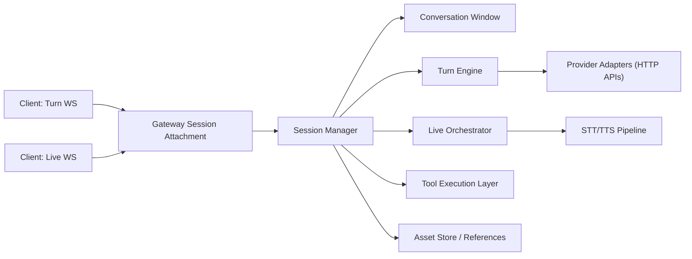

# Gateway WebSocket Session Architecture

This document defines the recommended long-term gateway architecture for stateful WebSocket sessions in `vai-lite`.

It is written from the current repo state:

- `Messages.RunStream` is the main turn-based SDK API
- `Runs.Stream` is the gateway-side SSE API
- `/v1/live` is a gateway WebSocket for live voice sessions
- the live SDK now exists in `sdk/live.go`
- live mode already wraps the normal run controller internally rather than implementing a separate model loop

The goal of this design is to establish the right thesis before making larger gateway changes.

---

## 1. Executive Summary

Recommended direction:

1. Make the gateway own a canonical session state model.
2. Expose two public WebSocket products on top of that session model:
   - a turn-oriented response socket
   - a live voice socket
3. Reuse one internal turn engine for both.
4. Treat live mode as a session orchestrator around the turn engine, not as a separate LLM product.
5. Add first-class in-session multimodal input and assistant multimodal output to live mode.

Key recommendation:

> Keep one session, two WebSocket transports.

That means:

- users do not restart the conversation when switching modes
- clients do reattach through a different socket when switching between turn mode and live mode
- both sockets operate on the same gateway-owned session state

This is better than either extreme:

- better than today's model where clients own almost all continuation state
- better than forcing one giant public socket protocol to handle both coding-agent turns and live voice control flow

---

## 2. Thesis

The correct unifying layer is not "one raw WebSocket for everything."

The correct unifying layer is:

- one canonical session model
- one canonical turn engine
- one canonical multimodal content model
- multiple specialized transports

This is the core architectural thesis:

> A persistent WebSocket should be a lower-latency continuation transport for a gateway-owned session, not a separate model runtime.

That thesis aligns with:

- the current `RunStream` mental model
- the current live gateway implementation, which already commits audio into a normal user turn and then runs the normal turn engine
- the user expectation that they can switch between text, tool-heavy runs, and live voice without restarting the conversation

---

## 3. Current State

### 3.1 What exists today

- `Messages.RunStream`
  - client-side tool loop
  - stateless transport
  - caller usually owns full history

- `Runs.Stream`
  - gateway-side tool loop over SSE
  - still request/response oriented
  - no persistent gateway session abstraction

- `/v1/live`
  - long-lived WebSocket
  - gateway-owned live session state
  - live-specific audio, interruption, and playback protocol

### 3.2 What is already structurally correct

The current live implementation already uses the right inner idea:

- collect live mic input
- commit a user turn
- represent that turn as a normal `audio_stt` message
- run the normal turn engine
- wrap the turn engine with live-specific session rules

That is the right architecture. The main issue is that this shape is not yet generalized into a shared gateway session platform.

### 3.3 Current gaps

1. No gateway-owned session model for normal turn WebSocket continuation.
2. No seamless mode switch between turn socket and live socket.
3. No first-class in-session multimodal upload in live mode.
4. No first-class live event for assistant-generated non-text content such as images.
5. No unified reconnect/reattach semantics across stateful gateway interactions.

---

## 4. Product Model

The gateway should support three interaction shapes:

1. Stateless request/response APIs
   - HTTP `/v1/messages`
   - HTTP `/v1/runs`
   - SSE `/v1/runs:stream`
   - useful for simple integrations and serverless environments

2. Stateful turn-oriented WebSocket mode
   - optimized for tool-heavy, coding-heavy, orchestration-heavy workflows
   - low continuation overhead
   - incremental input items plus gateway-held session state

3. Stateful live voice WebSocket mode
   - optimized for duplex audio
   - mic streaming
   - interruption
   - playback reporting
   - in-session uploads and multimodal turns

The important point is that 2 and 3 should share one session/state core.

---

## 5. Public API Recommendation

### 5.1 Keep two public WebSocket transports

Recommended public endpoints:

- `/v1/responses/ws`
- `/v1/live`

Why two endpoints are better than one:

- turn mode and live mode have materially different control planes
- live mode needs low-latency audio and playback signals
- turn mode should stay simple and canonical for coding/tool workflows
- one giant public protocol would force every client to understand the full superset

### 5.2 Do not restart the session when switching modes

When the user toggles from turn mode to live mode:

1. keep the same `session_id`
2. close the turn WebSocket
3. attach a live WebSocket to that same session
4. continue from the same gateway-owned state

When the user leaves live mode:

1. close the live WebSocket
2. attach the turn WebSocket to the same `session_id`
3. continue from the same gateway-owned state

This yields:

- one conversation
- one session
- one state store
- mode-specific transports

### 5.3 One active attachment per session

Recommended rule:

- a session may have only one active attached WebSocket at a time

Reasons:

- simpler sequencing
- simpler interruption semantics
- simpler scaling/routing
- avoids duplicate event delivery and conflicting control signals

If later we need observers, add read-only attachments as a separate concept.

---

## 6. Core Architecture



### 6.1 Session Manager

Responsibilities:

- create session IDs
- attach/detach sockets
- route incoming events to the correct session
- enforce one active attachment per session
- own session lifecycle and expiration

### 6.2 Conversation Window

Responsibilities:

- hold canonical history/items for the session
- hold current model/tools/instructions/config
- support compaction and truncation policy
- expose authoritative state for reconnect and mode switches

### 6.3 Turn Engine

Responsibilities:

- take session history plus new user items
- run one model/tool turn
- emit canonical response events
- produce authoritative post-turn history

This is the shared inner engine for both WebSocket modes and for existing gateway run behavior.

### 6.4 Live Orchestrator

Responsibilities:

- mic audio ingestion
- silence commit
- staged multimodal input for the next turn
- interruption/grace-cancel/barge-in rules
- playback mark/state handling
- assistant speech truncation based on actual playback
- translation between live control events and canonical turn execution

This is where live-specific complexity belongs. It should not leak into the canonical turn engine.

### 6.5 Tool Execution Layer

Responsibilities:

- gateway server tools
- client tool-call transport
- tool result delivery
- per-session tool config and timeouts

### 6.6 Asset Store / References

Responsibilities:

- support large file/image/video/document payloads
- issue gateway-scoped asset handles
- avoid huge repeated base64 payloads over WebSocket

This is not required for the first iteration, but it is the right long-term direction for robust multimodal WS mode.

---

## 7. Canonical Session Model

### 7.1 Session identity

Recommended identifiers:

- `session_id`
- `response_id`
- `turn_id`
- `asset_id`

### 7.2 Session state

Recommended session state:

- session metadata
  - `session_id`
  - creation time
  - last activity time
  - expiration policy

- request defaults
  - model
  - instructions/system
  - tool definitions
  - tool policy
  - response options
  - compaction policy

- conversation state
  - canonical message/item history
  - latest `response_id`
  - last successful turn result

- live-only state
  - pending mic audio buffer
  - staged user input blocks
  - active playback state
  - active interruption/grace state

- transport state
  - attached socket mode
  - current attachment ID
  - connection-local hot cache

### 7.3 One canonical content model

The session model should use canonical content items across all modes:

- text
- image
- audio
- audio_stt
- video
- document
- tool result
- assistant image/audio/text output blocks

This is the most important consistency rule.

The live socket should not invent a second "special live content" representation for normal multimodal user or assistant content.

---

## 8. Response WebSocket Design

### 8.1 Purpose

The turn-oriented WebSocket mode exists to:

- lower continuation overhead
- let the gateway own session state
- avoid resending full history on every turn
- support tool-heavy chains efficiently

### 8.2 Design influence

OpenAI's Responses WebSocket mode validates the general direction:

- persistent socket
- explicit `response.create`
- incremental new input only
- previous response chaining
- one in-flight response at a time

We should adopt the thesis, not necessarily copy the exact wire names.

### 8.3 Recommended public behavior

Recommended rules:

- one in-flight response per socket
- no multiplexing in v1
- next turn sends only incremental items
- gateway owns prior session state
- sequential response execution

### 8.4 Recommended event families

Recommended canonical event namespaces:

- `session.*`
- `response.*`
- `tool.*`
- `error`

Examples:

- `session.created`
- `session.attached`
- `response.started`
- `response.output_text.delta`
- `response.output_item.added`
- `tool.call`
- `tool.result.required`
- `response.completed`

### 8.5 Response continuation

Recommended continuation inputs:

- `session_id`
- `previous_response_id`
- incremental `input` items only

The gateway should keep:

- a connection-local hot path for the current session/response
- a session-memory fallback for reattach on the same gateway node
- optional persisted fallback later if we choose to support durable sessions

---

## 9. Live WebSocket Design

### 9.1 Purpose

The live socket exists to optimize:

- duplex voice
- low-latency speech turn commit
- playback-aware interruption
- realistic voice UX

### 9.2 The live socket should be a specialized session attachment

The live socket should not be a separate conversation product.

It should be:

- an attachment to the same gateway session model
- an audio and live-control overlay on top of the canonical turn engine

### 9.3 Layering model

Recommended live wire model:

- base canonical session/response/tool events
- live-only overlay events for audio/control

Canonical events visible on live socket:

- `session.*`
- `response.*`
- `tool.*`
- `error`

Live-only overlay events:

- `live.turn_committed`
- `live.audio.chunk`
- `live.audio.reset`
- `live.turn_cancelled`
- `live.playback_required`

This layered approach keeps live mode compatible with the rest of the system rather than making it a dead-end protocol.

---

## 10. In-Session Multimodal User Input

### 10.1 Requirement

Users in live mode must be able to:

- upload an image
- upload a PDF/document
- upload video
- type text
- keep speaking
- continue in the same session without reconnecting or restarting the conversation

### 10.2 Recommended design

Add live client frames for staged user input:

- `input.append`
- `input.commit`
- `input.clear`

### 10.3 `input.append`

Purpose:

- stage user content blocks for the next committed turn

Example:

```json
{
  "type": "input.append",
  "content": [
    {
      "type": "image",
      "source": {
        "type": "url",
        "url": "https://example.com/screenshot.png",
        "media_type": "image/png"
      }
    }
  ]
}
```

Semantics:

- does not create a turn by itself
- appends blocks to the session's staged input buffer
- next speech commit merges staged blocks with the committed audio turn

### 10.4 `input.commit`

Purpose:

- create a user turn immediately while staying in live mode

Example:

```json
{
  "type": "input.commit",
  "content": [
    {
      "type": "text",
      "text": "Look at this screenshot and tell me what failed."
    }
  ]
}
```

Semantics:

- immediately creates a new user turn
- may include staged content, inline content, or both
- may optionally interrupt the current assistant turn if requested by policy

### 10.5 `input.clear`

Purpose:

- clear staged but uncommitted user content

Use cases:

- user removes an attachment
- UI cancels staged text

### 10.6 Merge rule for speech + uploads

If the user stages content and then speaks, the next committed user turn should be:

1. staged content blocks
2. committed text blocks if any
3. `audio_stt` block from the committed speech segment

This preserves a canonical user message while supporting natural multimodal live UX.

### 10.7 Large payload strategy

Short term:

- allow normal content blocks and current limit validation

Long term:

- prefer `asset_id` references instead of large inline base64 over WebSocket

Recommended future pattern:

- upload asset over HTTP or dedicated upload API
- receive `asset_id`
- send `input.append` with `asset_ref`

---

## 11. Assistant Multimodal Output in Live Mode

### 11.1 Problem

Today the live path streams assistant text and assistant audio, but non-text assistant blocks such as generated images are not first-class live events.

That is insufficient for models that can produce:

- generated images
- assistant audio blocks
- future structured assistant media outputs

### 11.2 Requirement

If the model generates an image during a live session, the client should receive it immediately as part of the same session UX, not only discover it later in final synced history.

### 11.3 Recommended design

Add canonical assistant output item events that work in both turn mode and live mode.

Recommended event:

- `response.output_item.added`

Example:

```json
{
  "type": "response.output_item.added",
  "response_id": "resp_123",
  "turn_id": "turn_7",
  "item": {
    "type": "image",
    "source": {
      "type": "base64",
      "media_type": "image/png",
      "data": "..."
    }
  }
}
```

Text should continue to use a specialized low-latency delta event:

- `response.output_text.delta`

Live audio should continue to use a specialized low-latency event:

- `live.audio.chunk`

This gives the correct split:

- canonical complete items for multimodal correctness
- specialized delta/control events for latency-sensitive channels

### 11.4 History remains authoritative

Real-time events exist for UX.

The authoritative state remains:

- final response output
- session conversation window
- completion event history snapshot

---

## 12. Why Not One Public WebSocket

It is tempting to expose one socket and add a mode flag like:

- "now this socket also accepts live audio"

I do not recommend that as the primary design.

Reasons:

1. Different control planes
   - turn mode: request/response continuation
   - live mode: duplex audio and playback control

2. Different latency needs
   - live audio and interruption are timing-sensitive
   - turn mode is primarily about canonical items and tool chains

3. Larger client complexity
   - every client would need to understand the full superset protocol

4. Harder state transitions
   - in-flight turn + active playback + live mode flip is more complex than a clean reattach

5. Harder long-term evolution
   - separate sockets let us improve each transport without forcing every client to adopt the other mode's details

If we ever want one public socket later, we should only do it after the protocol is already layered cleanly into:

- canonical session/response events
- optional live audio control overlay

---

## 13. Session Switching Semantics

### 13.1 Recommended UX

Switching modes should feel seamless to the user, but it does not need to happen on the same TCP/WebSocket connection.

Recommended behavior:

- same `session_id`
- different WebSocket attachment

### 13.2 Turn mode to live mode

1. client detaches from `/v1/responses/ws`
2. client connects to `/v1/live`
3. client sends `session.attach` with same `session_id`
4. gateway resumes the same conversation state in live mode

### 13.3 Live mode to turn mode

1. client detaches from `/v1/live`
2. client connects to `/v1/responses/ws`
3. client attaches same `session_id`
4. gateway resumes canonical response continuation mode

### 13.4 Why this is acceptable

This is acceptable because:

- the conversation does not restart
- the session state remains in the gateway
- the mode switch is fast
- the wire semantics remain clean

It is better than runtime mode mutation on one socket because it preserves protocol clarity.

---

## 14. Reconnect and Recovery

### 14.1 Baseline strategy

When a socket closes:

1. open a new socket of the same mode
2. attach the existing `session_id`
3. continue if the session still exists

### 14.2 Failure modes

Recommended errors:

- `session_not_found`
- `session_expired`
- `previous_response_not_found`
- `attachment_conflict`
- `mode_not_supported`

### 14.3 Store modes

Recommended storage modes:

- `store=false`
  - session exists only in gateway memory
  - reconnect works only while session is still resident

- `store=true`
  - session state can be rehydrated from durable storage
  - reconnect and long-lived resume are more robust

### 14.4 Hot cache vs durable state

Recommended state tiers:

1. connection-local hot state
   - fastest continuation

2. node-local or shared ephemeral session state
   - supports detach/reattach

3. optional durable persistence
   - supports long resume and store=true workflows

---

## 15. Scaling and Infrastructure

### 15.1 Sticky routing

If sessions are memory-resident, the gateway must ensure:

- sticky routing for the active attachment, or
- session lookup and migration across nodes

### 15.2 Distributed session store

If we want cross-node resume in v1, use:

- a distributed session index
- optional distributed ephemeral state

### 15.3 Voice resource management

Live mode consumes more resources because it owns:

- active socket
- STT session
- possible TTS session
- playback/interruption tracking

The session layer should track mode-specific resource budgets and timeouts.

### 15.4 Limits

Recommended baseline limits:

- one active attachment per session
- one in-flight response per socket
- session max duration
- idle timeout
- staged input size limits
- asset size limits

---

## 16. Security and Data Handling

### 16.1 BYOK handling

Gateway-owned sessions should never expose provider keys to model-visible content.

BYOK remains:

- headers at attach time
- or server-owned credentials for managed deployments

### 16.2 Sensitive state

If `store=false`:

- do not persist session window or response cache
- keep only memory-resident state
- evict aggressively on expiry or failure

### 16.3 Asset hygiene

If asset handles are introduced:

- asset scope must be session-bound or principal-bound
- assets should expire
- access must require authorization matching the owning session/principal

---

## 17. SDK Implications

### 17.1 Future SDK surface

Likely future additions:

- `Client.ResponsesWS.Connect(...)`
- `Client.Live.Connect(...)` attached to gateway session IDs
- `SessionID()` / `ResponseID()` accessors
- reattach helpers

### 17.2 Live SDK evolution

Future live SDK additions should include:

- `AppendInputBlocks([]ContentBlock)`
- `CommitInputBlocks([]ContentBlock)`
- `AppendText(string)`
- `CommitText(string)`
- `ClearPendingInput()`

### 17.3 Shared callback model

The current overlap between:

- `RunStream.Process(...)`
- `LiveSession.Process(...)`

is a good foundation.

The gateway session design should reinforce that overlap by exposing canonical response events across both transports.

---

## 18. Recommended Migration Plan

### Phase 1: Extract shared gateway session engine

Goals:

- isolate the canonical turn engine
- isolate session state from the current live handler
- keep current `/v1/live` behavior working

### Phase 2: Introduce session IDs and attachment model

Goals:

- create/attach/detach semantics
- one active attachment per session
- internal support for session reattach

### Phase 3: Add `/v1/responses/ws`

Goals:

- turn-based gateway WebSocket continuation
- incremental input items
- gateway-owned continuation state

### Phase 4: Rebuild `/v1/live` on top of session engine

Goals:

- live socket becomes a specialized session attachment
- no separate conversation model

### Phase 5: Add live in-session multimodal input

Goals:

- `input.append`
- `input.commit`
- `input.clear`

### Phase 6: Add assistant multimodal live output

Goals:

- canonical output item events for non-text assistant blocks
- preserve low-latency text/audio specialized events

### Phase 7: Add asset handles and durable session options

Goals:

- robust large-file UX
- optional persistence and reconnect guarantees

---

## 19. Final Recommendation

The right thesis is:

> Build a gateway session platform, not just another WebSocket endpoint.

Concretely:

- unify on one session model
- unify on one turn engine
- keep two public WebSocket transports
- use same session ID across mode switches
- make live mode a specialized attachment around the shared engine
- add staged multimodal input and assistant multimodal output to live mode

This gives the best long-term properties:

- robust DX
- provider neutrality
- natural live/text mode switching
- clean multimodal story
- scalable internal architecture

It also gives a clean migration path from the repo's current shape rather than requiring a full protocol reset.

