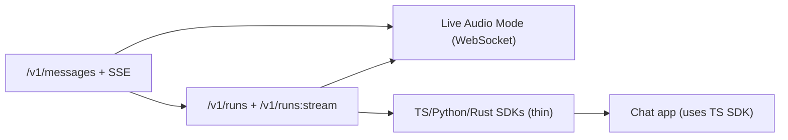

# IMPLEMENTATION_PLAN_OVERVIEW

This is the top-level implementation overview for launching VAI as a hosted, self-hostable AI gateway **including Live Audio Mode**, then building thin SDKs and a chat app on top.

This file is intentionally "maximally thorough" but still an overview. Each phase below should later get its own detailed phase plan file.

Related docs (current):
- `PROXY_MODE_IMPLEMENTATION_PLAN.md` (proxy/gateway milestones and design)
- `API_CONTRACT_HARDENING.md` (strict request decoding decisions)
- `RUNS_API_AND_EVENT_SCHEMA.md` (server-side Run/RunStream API + SSE event schema)
- `LIVE_AUDIO_MODE_DESIGN.md` (future WebSocket live audio design)
- `VAI_SDK_STRATEGY.md` (thin SDK approach)
- `VAI_GATEWAY_HOSTING_ARCHITECTURE_AND_DESIGN.md` (recommended hosted topology)

---

## 1. Mission, Scope, and Success Criteria

### 1.1 Mission

Ship a VAI Gateway that:
- exposes a stable, provider-agnostic `/v1/messages` API (JSON + SSE)
- supports `voice` on `/v1/messages` (STT input + TTS output)
- exposes server-side tool-loop endpoints (`/v1/runs` and `/v1/runs:stream`) so non-Go SDKs stay thin
- exposes Live Audio Mode as a WebSocket endpoint (`/v1/live`)
- is safe for hosted use (auth, limits, rate limiting, observability)
- is self-hostable with low friction (configurable auth mode)
- becomes the foundation for Live Audio Mode (WebSocket) and higher-level services (obs/evals)

### 1.2 In-scope deliverables (end-to-end)

1. Gateway proxy mode:
   - `POST /v1/messages` (non-stream)
   - `POST /v1/messages` (SSE when `stream=true`)
   - `GET /v1/models`
   - `/healthz`, `/readyz`
2. Strict HTTP contract hardening:
   - strict decoding for request unions (`system`, message `content`)
   - strict decoding for typed `tool.config`
   - strict validation for tool history blocks (`tool_use`, `tool_result`)
3. Server-side tool loop:
   - `POST /v1/runs` (blocking)
   - `POST /v1/runs:stream` (SSE)
   - gateway-managed tool allowlist (initially `vai_web_search`, optional `vai_web_fetch`)
4. Non-Go ecosystem:
   - thin SDKs: TypeScript, Python, Rust (sequenced)
   - a chat app that uses the TS SDK against the gateway (forcing function)
5. Live Audio Mode:
   - WebSocket endpoint and session orchestration (per `LIVE_AUDIO_MODE_DESIGN.md`)
6. Go SDK internal usage (explicit):
   - keep using the Go SDK API surface for internal services
   - add a "proxy transport" mode so the Go SDK can talk to the gateway (BYOK + gateway auth headers) instead of calling providers directly
   - preserve the existing direct-mode behavior for local dev and low-infra use cases

### 1.3 Out-of-scope (initial)

- Billing product / payments integration
- Multi-region active/active from day 1
- Arbitrary customer code execution in the gateway (no "upload code and run it")

### 1.4 Success criteria

Gateway (hosted):
- Correctness:
  - no silent request-shape drops (system blocks, tool configs, unknown blocks)
  - deterministic validation errors with actionable messages
  - streaming (SSE) behaves correctly across common proxies
- Safety:
  - strong abuse controls (size limits, concurrency limits, timeouts)
  - secrets never appear in logs
- Usability:
  - BYOK-first ergonomics are good
  - `/v1/runs:stream` makes SDKs thin (no re-implementation of tool loop)

---

## 2. Hard Dependencies (Explicit)

The dependency chain is:

1. Gateway `/v1/messages` + SSE
   -> enables basic SDKs and the chat app
   -> is prerequisite for Live Audio Mode

2. Gateway `/v1/runs` + `/v1/runs:stream`
   -> is the "thin SDK unlock" (otherwise each SDK must port RunStream semantics)
   -> is the natural server-side core that Live Audio Mode reuses

3. Live Audio Mode
   -> depends on gateway infrastructure (auth, limits, observability) and on run semantics
   -> does NOT strictly depend on non-Go SDKs (it can ship with a dedicated reference client)

4. SDKs and chat app
   -> validate the gateway contract end-to-end and are a major distribution path

Mermaid dependency view:

---

## 3. Phase Plan Files (To Be Added)

The overview phases below should later be expanded into separate files (one per phase), with:
- exact tasks (file-level work)
- test plan and acceptance tests
- rollout plan and operational hooks

Proposed filenames:
- `PHASE_00_DECISIONS_AND_DEFAULTS.md`
- `PHASE_01_IMPLEMENTATION_PLAN.md` (API contract hardening + shared voice helpers)
- `PHASE_02_IMPLEMENTATION_PLAN.md` (gateway skeleton + middleware hardening)
- `PHASE_05_PROVIDER_COMPAT_VALIDATION_AND_MODELS.md`
- `PHASE_06_RUNS_BLOCKING_AND_SSE.md`
- `PHASE_07_OPENAPI_AND_DOCS.md`
- `PHASE_08_GO_SDK_PROXY_MODE.md`
- `PHASE_09_LIVE_AUDIO_MODE.md`
- `PHASE_10_TS_SDK.md`
- `PHASE_11_CHAT_APP.md`
- `PHASE_12_PYTHON_SDK.md`
- `PHASE_13_RUST_SDK.md`
- `PHASE_14_PRODUCTION_HARDENING.md`

---

## 4. Phases (Overview)

Each phase has:
- objective
- key work items
- explicit exit criteria ("definition of done")
- main risks / mitigations

### Phase 00: Decisions and Defaults

Objective:
- Lock the remaining "small but expensive to change later" defaults before writing production code.

Status:
- Decisions locked in `PHASE_00_DECISIONS_AND_DEFAULTS.md`; code is partially implemented. Remaining hardening/enforcement lives in Phase 02.

Decisions file:
- `PHASE_00_DECISIONS_AND_DEFAULTS.md` is the source of truth for locked proxy v1 defaults.

Key decisions to lock:
- Hard limits (initial recommendations; tune later):
  - max request body bytes
  - max decoded base64 bytes (per block and total)
  - max messages per request and max total text length
  - max SSE stream duration and idle ping interval
  - max concurrent SSE streams per gateway principal
  - max concurrent WS sessions per principal (required for Live Audio Mode)
- Auth defaults:
  - hosted: `auth_mode=required`
  - self-host: default to `required` when binding non-loopback; allow `disabled` for localhost/dev
- Provider key header mapping:
  - exact `X-Provider-Key-*` names and which providers share keys (e.g. `openai/*` and `oai-resp/*`)
- Error contract alignment:
  - expand SSE error payload to match HTTP error inner object
- Voice policy for proxy v1:
  - implement voice pre/post via shared helpers (STT input + TTS output)

Exit criteria:
- A short "defaults table" exists and is referenced by the gateway code.

Risks:
- Overfitting defaults too early.
Mitigation:
- pick conservative limits; make all limits configurable; document operational tuning knobs.

---

### Phase 01: API Contract Hardening (Strict JSON Decoding)

Objective:
- Make the statement "HTTP contract = JSON of `pkg/core/types`" true in practice for requests.

Status:
- Implemented: strict decoding helpers + tests, and shared voice helpers used by both SDK and gateway.

Key work items (per `API_CONTRACT_HARDENING.md`):
- Add strict decoding functions for:
  - `MessageRequest.System` union decoding (string or `[]ContentBlock`)
  - message `content` union decoding (string or `[]ContentBlock`)
  - tool config decoding into typed structs by tool type (`web_search`, `code_execution`, etc.)
  - strict unknown block rejection in request bodies
  - strict validation for tool history blocks (`tool_use`, `tool_result`) including ID matching
- Add unit tests for strict decoding (no proxy server needed yet).

Exit criteria:
- A "strict request decode" unit test suite passes and covers:
  - system blocks
  - tool.config typing
  - unknown block rejection
  - tool history validation and tool_use_id matching

Main risks:
- Breaking direct-mode SDK behavior if strict decoding accidentally replaces lenient decoding.
Mitigation:
- implement strict decode as separate helper path; keep provider parsing lenient.

---

### Phase 02: Gateway Skeleton and Middleware

Objective:
- Create the gateway binary and cross-cutting middleware that will be reused by all endpoints.

Status:
- Implemented: `cmd/vai-proxy`, `/healthz`, `/readyz`, auth_mode, request IDs, logging, and basic `/v1/messages` handlers.
- Remaining: CORS allowlist, rate limiting/concurrency caps, SSE keepalive + stream duration limits, stricter `/readyz` semantics (see `PHASE_02_IMPLEMENTATION_PLAN.md`).

Key work items:
- Add `cmd/vai-proxy`:
  - config loading
  - shared upstream `http.Client` / `Transport` setup
  - routing/mux
- Add endpoints:
  - `GET /healthz`
  - `GET /readyz`
- Middleware:
  - request ID
  - panic recovery
  - structured logging with BYOK header redaction
  - auth (`auth_mode` required/optional/disabled)
  - basic in-memory rate limiting + concurrency caps (sufficient for single instance)
  - global abuse limits (body size, timeouts)

Exit criteria:
- Gateway starts, answers health endpoints, enforces auth_mode, and logs correctly with redaction.

Main risks:
- SSE buffering through middleware.
Mitigation:
- ensure middleware does not wrap/replace the ResponseWriter in a buffering way; verify with handler tests later.

---

### Phase 03: `/v1/messages` (Non-stream)

Objective:
- Ship the simplest stable gateway endpoint that exercises provider routing + strict decoding.

Key work items:
- Implement `POST /v1/messages`:
  - strict decode request body (Phase 01 helpers)
  - parse model string -> `(provider, modelName)`
  - resolve BYOK provider key header
  - instantiate provider for request using shared `http.Client`
  - provider feature compatibility validation (reject unsupported blocks/tools)
  - call provider `CreateMessage`
  - return `types.MessageResponse`
- Canonical error envelope and HTTP status mapping.

Exit criteria:
- Handler tests with fake providers prove:
  - correct decoding
  - correct error mapping
  - no silent drops

Status:
- Implemented in `pkg/gateway/handlers/messages.go` with handler tests in `pkg/gateway/handlers/messages_test.go`.

Main risks:
- Drift between proxy behavior and direct-mode behavior.
Mitigation:
- keep provider translation in `pkg/core/providers/*`; proxy should be a thin orchestrator.

---

### Phase 04: `/v1/messages` (SSE Streaming)

Objective:
- Implement SSE streaming that matches `pkg/core/types.StreamEvent`.

Key work items:
- Implement `stream=true` behavior:
  - set SSE headers correctly
  - flush per event
  - optional ping keepalive
  - client disconnect handling closes upstream stream
- Streaming error contract alignment:
  - SSE terminal `error` event embeds the same inner error object as HTTP error responses.

Exit criteria:
- Streaming handler tests with fake event stream verify:
  - `event:` name matches `EventType()`
  - `data:` is valid JSON for the event
  - connection terminates after `message_stop` or `error`

Status:
- Implemented basic SSE fan-out in `pkg/gateway/handlers/messages.go` and covered by `pkg/gateway/handlers/messages_test.go`.
- Remaining SSE hardening (ping/keepalive, max duration, disconnect cleanup) is tracked in Phase 02.

Main risks:
- Proxy/LB buffering makes streaming unusable.
Mitigation:
- implement ping; document load balancer requirements; verify with an integration smoke test through your intended proxy stack later.

---

### Phase 05: Provider Compatibility Validation + `/v1/models`

Objective:
- Make unsupported combinations fail fast and make model capabilities discoverable.

Key work items:
- Implement provider feature compatibility validator:
  - content block support by provider API path (e.g. `openai/*` chat vs `oai-resp/*`)
  - native tool support by provider API path
- Implement `GET /v1/models`:
  - allowlist-driven model set
  - include provider capability info for each model

Exit criteria:
- Tests demonstrate:
  - `openai/*` rejects native web_search tool configs (suggest `oai-resp/*` or builtin tools)
  - `openai/*` rejects document/video blocks (until implemented)
  - `/v1/models` returns stable, documented shape

---

### Phase 06: `/v1/runs` + `/v1/runs:stream` (Server-Side Tool Loop)

Objective:
- Provide a server-side tool loop so non-Go SDKs remain thin.

Key work items (per `RUNS_API_AND_EVENT_SCHEMA.md`):
- Implement `POST /v1/runs` and `POST /v1/runs:stream`.
- Implement gateway-managed builtin tool allowlist:
  - `vai_web_search` builtin first (and optional `vai_web_fetch` if needed)
  - builtins are injected by the server (do not trust caller-provided schemas/descriptions)
- Implement the run loop server-side:
  - stop conditions (max turns, max tool calls, timeout, token caps)
  - tool execution (builtin only in v1)
  - history delta emission and deterministic append semantics
- Define server-owned run event structs that match the schema.

Exit criteria:
- Run endpoints work end-to-end with:
  - a fake provider that emits tool calls
  - builtin tool execution producing tool_result blocks
  - SSE run event stream that matches schema

Main risks:
- Re-implementing the Go SDK run loop incorrectly.
Mitigation:
- reuse semantics from `sdk/run.go` and test against those invariants; keep the schema tight and add regression tests.

---

### Phase 07: OpenAPI and Compatibility Contract

Objective:
- Make HTTP the source-of-truth contract for SDK generation and long-term stability.

Key work items:
- Add `api/openapi.yaml` covering:
  - `/v1/messages` (including SSE semantics documentation)
  - `/v1/runs` and `/v1/runs:stream`
  - `/v1/models`
- Establish a review policy for breaking changes.

Exit criteria:
- OpenAPI matches the implementation and is used by SDK generation planning.

---

### Phase 08: Go SDK Proxy Mode (Internal First-Class Client)

Objective:
- Keep the Go SDK as the primary internal integration surface while routing through the hosted gateway.

Key work items:
- Add a proxy transport mode to the Go SDK:
  - `WithBaseURL(...)` (gateway URL)
  - `WithGatewayAPIKey(...)` (hosted; optional for self-host with auth disabled)
  - `WithProviderKey(provider, key)` continues to work, but should map to BYOK headers when using proxy mode
- Ensure the Go SDK can call:
  - `/v1/messages` (non-stream + SSE)
  - `/v1/runs` and `/v1/runs:stream`
- Preserve direct mode as the default (current behavior), so local dev remains zero-infra.

Exit criteria:
- Internal Go services can switch from direct mode to gateway mode by changing client options (not rewriting call sites).

---

### Phase 09: Live Audio Mode (WebSocket)

Objective:
- Implement Live Audio Mode per `LIVE_AUDIO_MODE_DESIGN.md` on top of gateway primitives.

Key work items (high level):
- WebSocket protocol and handshake
- session management, endpointing, grace window, barge-in
- `talk_to_user` terminal tool semantics (prefer strict)
- STT/TTS providers
- backpressure contract and played history handling
- ship with at least one reference client (can be a simple web or CLI client) for demo and regression testing

Exit criteria:
- A stable WS protocol with a reference client; demo-ready behavior.

---

### Phase 10: TypeScript SDK (Thin Client)

Objective:
- Build the first non-Go SDK as a forcing function for streaming and auth ergonomics.

Key work items:
- Implement:
  - `messages.create`, `messages.stream`
  - `runs.create`, `runs.stream`
- Provide streaming primitives that work in Node and browsers (if needed).
- Provide a unified auth configuration:
  - gateway key + BYOK headers.

Exit criteria:
- TS SDK can drive a basic streaming chat and a tool-loop run against the gateway.

---

### Phase 11: Chat App (t3.chat/chatgpt clone)

Objective:
- Validate the full stack with a real product-shaped consumer.

Key work items (high level):
- Auth
- Conversation persistence
- Streaming UI for SSE (messages and runs)
- Model selection and BYOK UX (if you expose it in UI)
- Basic uploads (if desired) with strict size limits

Exit criteria:
- A production-like demo uses TS SDK + gateway end-to-end.

---

### Phase 12: Python SDK

Objective:
- Provide thin Python client with ergonomic streaming.

Exit criteria:
- parity with TS SDK endpoint coverage and streaming.

---

### Phase 13: Rust SDK

Objective:
- Provide thin Rust client with streaming support.

Exit criteria:
- parity with TS/Python for endpoint coverage.

---

### Phase 14: Production Hardening

Objective:
- Make hosted gateway operationally robust.

Key work items:
- Redis-backed rate limiting and concurrency limits
- Postgres usage ledger (and rollups if needed)
- retries/backoff policy for upstream transient errors
- operational dashboards and alerting
- optional managed keys / hybrid tenant policy

Exit criteria:
- Meets your production SLO targets and operational runbooks.

---

## 5. Cross-Cutting Engineering Standards

### 5.1 Security
- Never log provider keys or bearer tokens.
- Strict payload limits and timeouts on all endpoints.
- Reject unknown request blocks and unknown tool types.
- No SSRF behavior added to the gateway (URL fetching is either provider-native or via an explicit, allowlisted gateway tool).

### 5.2 Compatibility and versioning
- Additive changes preferred.
- Breaking changes require explicit versioning strategy.

### 5.3 Testing
- Unit tests for strict decoding and validation.
- Handler tests with fake providers and fake event streams.
- Integration smoke tests for SSE behavior through your intended proxy stack (once you have infra).

---

## 6. Open Questions (To Resolve in Phase 00)

1. Initial limits/timeouts defaults.
2. Whether proxy v1 supports `voice` or rejects it.
3. Streaming error shape alignment (expand `types.ErrorEvent.Error` fields vs keep split shapes).
4. Include `vai_web_fetch` builtin in v1 runs or keep `vai_web_search` only.
5. Whether the chat app lives in this repo or a separate repo (recommended separate).
