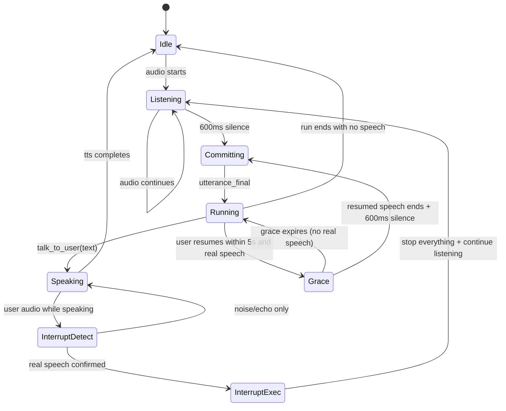

# VAI Live Audio Mode (RunStream) — Design Plan

This document proposes a **provider-agnostic**, **proxy-friendly**, **WebSocket-based** “Live Audio Mode” built on top of the existing `RunStream` tool-loop semantics.

It is written to support the end goal: **VAI as a hosted proxy AI gateway** (with SDKs in multiple languages) that exposes a stable public Live API while allowing VAI to swap/extend STT/TTS providers behind the scenes.

The design assumes:
- **Streaming STT** (always-on) + endpointing at **600ms silence**
- **Grace period**: if speech resumes within **5s**, cancel current assistant output/run and append the resumed text
- **Barge-in interrupt** while assistant audio is playing, with best-effort “truncate to what the user actually heard”
- A terminal tool `talk_to_user(text)` that governs when the assistant speaks

---

## 0. Goals and Non-Goals

### Goals
- Provide a single **WebSocket endpoint** for live audio conversations.
- Keep the agent loop semantics aligned with `sdk/RunStream` (tools, interrupts, deterministic history deltas).
- Make the **wire protocol provider-agnostic** (clients do not become ElevenLabs- or Cartesia-shaped).
- Support **ElevenLabs TTS** (primary realism) and **Cartesia TTS** (fallback / latency / single-vendor option).
- Support **Cartesia STT** (already present in repo) as v1 default STT; allow future STT providers.
- Implement:
  - 600ms end-of-utterance detection
  - 5s grace period (append-on-resume)
  - barge-in interrupt that halts playback immediately and produces a coherent “played history”
- Enable multi-language SDKs with a clear framing for:
  - audio formats
  - backpressure
  - reconnection
  - authentication
  - versioning

### Non-goals (v1)
- Building a full GUI or browser reference client (but we define requirements that any client must meet).
- Perfect word/character-accurate truncation for all TTS providers; we degrade gracefully.
- Preemptive “parallel contexts” for speculative TTS; keep at most one active assistant speech context.
- Allowing Gemini Live / “model-owned STT/TTS pipeline” APIs that cannot respect `talk_to_user` and tool-loop history.

---

## 1. Repository Reality Check (What Exists Today)

This repo (`vai-lite`) is intentionally “direct-mode only” and currently excludes proxy/server mode. However, it already includes:

- `RunStream` with cancellation/interrupt and lifecycle events: `sdk/run.go`
- A `talk_to_user`-like mechanism can be implemented as a function tool via `MakeTool`/`ToolSet`: `sdk/tools.go`, `sdk/run.go`
- Cartesia voice plumbing:
  - Streaming STT session: `pkg/core/voice/stt/cartesia.go` (`NewStreamingSTT`, `SendAudio`, `Finalize`)
  - Streaming TTS context: `pkg/core/voice/tts/cartesia.go` (`NewStreamingContext`, `SendText`, `Audio()`)
  - Current `RunStream` can emit audio chunks via TTS streaming: `sdk/run.go` (`runVoiceStreamer` -> `AudioChunkEvent`)

Notably:
- The Cartesia TTS code in-tree currently behaves like a **single streaming context**; it does not yet expose multi-context multiplexing or “cancel context by ID”.
- ElevenLabs is not integrated today.

This doc describes the **gateway service** and its Live endpoint, but it also identifies the minimal `vai-lite` library primitives that are useful to share (e.g., tool semantics, event types, provider interfaces).

---

## 2. High-level Architecture

Each end-user live connection maps to a single long-lived **LiveSession**. The session owns:

1. `STTSession` (streaming, always-on)
2. `TTSConnection` (streaming, always-on; may contain multiple contexts if provider supports it)
3. `TurnDetector` (600ms silence endpointing, plus semantic “real speech” filtering)
4. `RunController` (creates/cancels an in-progress `RunStream` for each committed turn)
5. `PlaybackTracker` (what audio was sent/played; alignment if available)
6. `HistoryManager` (what the model “knows” vs what the user actually heard)

### Component diagram

```mermaid
flowchart LR
  Client((Client))
  WS[Live WS Endpoint]
  Sess[LiveSession]
  STT[Streaming STT]
  VAD[TurnDetector\n(600ms + real speech)]
  Run[RunController\n(RunStream)]
  Tool[talk_to_user tool\n(terminal)]
  TTS[Streaming TTS\n(multi-context if available)]
  Play[PlaybackTracker\n(alignment + played_ms)]
  Hist[HistoryManager\n(played vs generated)]

  Client <--> WS
  WS --> Sess
  Sess --> STT
  STT --> VAD
  VAD --> Run
  Run --> Tool
  Tool --> TTS
  TTS --> WS
  WS --> Client
  Client --> Play
  Play --> Sess
  Sess --> Hist
  Run <--> Hist
```

---

## 3. Key Concepts and Terminology

- **Session**: one WebSocket connection (one end-user conversation).
- **Utterance**: a user “turn” of speech, committed on 600ms silence.
- **Grace window**: 5 seconds after an utterance ends during which resumed speech cancels current assistant output/run and is appended.
- **Speech segment**: one assistant spoken segment (typically one `talk_to_user(text)` call).
- **TTS context**: provider-side stream identifier for a speech segment (ElevenLabs `context_id`).
- **Generated text**: what the model has produced server-side.
- **Played text**: what we believe the user heard before barge-in (best-effort).
- **Alignment**: timing mapping from audio to text (character-level best; word-level okay; none means coarse truncation).

---

## 4. Public Live API (Wire Protocol)

### 4.1 Versioning and compatibility

The Live WS endpoint must support explicit versioning to keep SDKs stable:

- Endpoint: `wss://<gateway>/v1/live`
- First client message must be `hello` including:
  - `protocol_version`: `"1"`
  - `client`: `{name, version, platform}`
  - audio input spec (format + sample rate)
  - requested output audio format (codec, sample rate)
  - optional feature flags (binary audio frames, alignment, captions)

Server responds with `hello_ack`:
- negotiated audio formats
- server feature flags
- rate limits / max frame size
- session id

### 4.1.1 Session resume (reconnection) — reserved in v1

Mobile and flaky networks will drop WebSockets. Even if v1 does not implement full resume, the wire protocol
should reserve a clean path so SDKs don’t need breaking changes later.

Proposal:
- `hello` MAY include:
  - `resume_session_id`: a previously issued `session_id`
  - `last_client_audio_seq`: last mic frame seq the server acknowledged (if using seq)
  - `last_playback_mark`: the latest `playback_mark` the server should consider authoritative for the active `assistant_audio_id`
- Server replies in `hello_ack` with:
  - `resume`: `{ "supported": bool, "accepted": bool, "reason": string }`

Initial implementation options:
- **v1 (simple):** `resume.supported=false` always; clients reconnect as a new session.
- **v1.1+:** accept resume for short windows (e.g. 10–30s) by persisting session state (played history, pending segment IDs).

### 4.2 Message transport

To maximize cross-language SDK compatibility:

- All control messages are **JSON text frames** with a top-level `type`.
- Audio frames SHOULD be binary WS frames if negotiated (`audio_transport: "binary"`).
  - If binary isn’t available (or for simplicity), support `audio_transport: "base64_json"` as a fallback.

### 4.2.1 Ordering guarantees (binary + JSON frames)

WebSocket ordering is guaranteed **per direction**:
- client→server frames arrive in order relative to other client→server frames
- server→client frames arrive in order relative to other server→client frames

There is no global ordering across directions (client sends do not “interleave” with server sends in any meaningful ordering sense).

Implications for this design:
- It is safe to mix JSON control frames and binary audio frames in the same direction.
- Sequence numbers (`seq`) are still recommended for:
  - debugging
  - reconnection/resume
  - detecting dropped frames in intermediary stacks

### 4.3 Client -> Server message types (minimum)

#### `hello`
```json
{
  "type": "hello",
  "protocol_version": "1",
  "client": {"name": "vai-js", "version": "0.1.0", "platform": "web"},
  "auth": {"mode": "api_key"},
  "audio_in": {"encoding": "pcm_s16le", "sample_rate_hz": 16000, "channels": 1},
  "audio_out": {"encoding": "pcm_s16le", "sample_rate_hz": 24000, "channels": 1},
  "features": {
    "audio_transport": "binary",
    "send_playback_marks": true,
    "want_partial_transcripts": true,
    "want_assistant_text": true,
    "client_has_aec": true
  }
}
```

#### `audio_frame` (JSON variant)
```json
{
  "type": "audio_frame",
  "seq": 123,
  "timestamp_ms": 1700,
  "data_b64": "..."
}
```

Binary variant:
- Client sends `type=audio_frame_header` JSON occasionally or once at start:
```json
{"type":"audio_stream_start","stream_id":"mic","encoding":"pcm_s16le","sample_rate_hz":16000,"channels":1}
```
- Then sends binary WS frames as raw PCM bytes. Sequence can be implicit (frame order) or explicit via interleaved headers; v1 recommends **implicit** ordering.

#### `audio_stream_end`
```json
{"type":"audio_stream_end","stream_id":"mic"}
```

#### `playback_mark`
Client provides ground truth for “what has actually played” to drive truncation.
```json
{
  "type": "playback_mark",
  "assistant_audio_id": "a_42",
  "played_ms": 1530,
  "buffered_ms": 320,
  "state": "playing"
}
```

`state` values (recommended):
- `playing`: actively playing audio for this segment
- `paused`: playback paused (user/system)
- `stopped`: playback stopped early (typically after `audio_reset`)
- `finished`: playback naturally completed (all audio for the segment played)

Normative v1 requirements:
- After the client receives `audio_reset{assistant_audio_id}`, it MUST clear its buffers and emit a `playback_mark`
  for that `assistant_audio_id` with `state:"stopped"` as soon as it has actually stopped output (target: < 500ms).
- The gateway should wait a bounded time (e.g. 500ms) for this final mark; if it doesn’t arrive, fall back to the
  last known `played_ms` and proceed.
- When the client naturally finishes playing a segment, it SHOULD emit `state:"finished"` (helps the gateway commit
  played history confidently, independent of network timing).

#### `control`
Examples:
- user hits mute
- user requests stop
- client wants to end session
```json
{"type":"control","op":"end_session"}
```

### 4.4 Server -> Client message types (minimum)

#### `hello_ack`
```json
{
  "type": "hello_ack",
  "protocol_version": "1",
  "session_id": "s_abc",
  "audio_in": {"encoding":"pcm_s16le","sample_rate_hz":16000,"channels":1},
  "audio_out": {"encoding":"pcm_s16le","sample_rate_hz":24000,"channels":1},
  "features": {
    "audio_transport": "binary",
    "supports_alignment": true
  }
}
```

#### `transcript_delta`
```json
{
  "type": "transcript_delta",
  "utterance_id": "u_10",
  "is_final": false,
  "text": "so I was thinking",
  "stability": 0.72,
  "timestamp_ms": 1840
}
```

#### `utterance_final`
Emitted when the server commits a user turn (600ms silence).
```json
{
  "type": "utterance_final",
  "utterance_id": "u_10",
  "text": "so I was thinking we should try the new endpoint",
  "end_ms": 2200
}
```

#### `assistant_audio_start`
```json
{
  "type": "assistant_audio_start",
  "assistant_audio_id": "a_42",
  "format": {"encoding":"pcm_s16le","sample_rate_hz":24000,"channels":1},
  "text": "Sure—here’s how I’d approach it..."
}
```

#### `assistant_audio_chunk`
Base64 JSON variant:
```json
{
  "type": "assistant_audio_chunk",
  "assistant_audio_id": "a_42",
  "seq": 1,
  "audio_b64": "...",
  "alignment": null
}
```

Binary variant:
- Emit a JSON `assistant_audio_chunk_header`:
```json
{"type":"assistant_audio_chunk_header","assistant_audio_id":"a_42","seq":1,"bytes":4096}
```
- Follow with a binary frame of audio bytes.

If alignment is supported (ElevenLabs char alignment; others may be word alignment), include a normalized shape:
```json
{
  "type": "assistant_audio_chunk",
  "assistant_audio_id": "a_42",
  "seq": 1,
  "audio_b64": "...",
  "alignment": {
    "kind": "char",
    "normalized": true,
    "chars": ["H","e","l","l","o",","],
    "char_start_ms": [0,12,19,25,32,44],
    "char_dur_ms": [12,7,6,7,12,10]
  }
}
```

Note: this is VAI’s **normalized** alignment shape. ElevenLabs’ server messages use `audio`, `contextId`,
and `normalizedAlignment/alignment` with fields like `charStartTimesMs`, `charDurationsMs`, `chars`
(camelCase). VAI should adapt vendor payloads into this stable cross-provider shape.

#### `assistant_audio_end`
```json
{"type":"assistant_audio_end","assistant_audio_id":"a_42"}
```

#### `audio_reset`
Sent to force the client to drop buffered audio immediately (interrupt/grace).
```json
{"type":"audio_reset","reason":"barge_in","assistant_audio_id":"a_42"}
```

#### `run_event`
Optional: forward selected `RunStream` lifecycle/tool events for debugging / UI.
This must be curated; do not leak provider-internal details by default.

#### `session_config` (reserved)
Reserved for mid-session changes (v1.1+), such as changing voice, adjusting silence thresholds, or toggling features,
without reconnecting.

### 4.5 Backpressure contract (required for production)

Live TTS produces data continuously; slow or backgrounded clients can cause unbounded buffering if not managed.

v1 should define a concrete backpressure mechanism. Two practical approaches:

1. **Playback-mark windowing (recommended):**
   - Treat client `playback_mark.played_ms` as the authoritative “ack”.
   - Track `unplayed_ms = sent_ms - played_ms` per `assistant_audio_id`.
   - `sent_ms` MUST be computed from the decoded PCM duration of audio emitted for the segment (not byte counts of a
     compressed transport codec). For this reason, v1 should strongly prefer `audio_out=pcm_*`.
   - If `unplayed_ms` exceeds a threshold (e.g. 1500–3000ms), the gateway must:
     - stop the TTS context (provider-specific close/cancel)
     - emit `audio_reset{reason:"backpressure"}`
     - downgrade behavior (shorter segments, or pause speaking until marks recover)
   - Mark-timeout/backpressure timers should only run while the gateway is actively sending audio chunks for the
     segment (not during LLM “thinking time” when no audio is being emitted).

2. **Credit-based flow control:**
   - Client grants “audio credits” (bytes or ms) and replenishes as it plays audio.
   - Server only sends audio while credits remain.
   - More complex but can be more deterministic for embedded clients.

Regardless of approach, the server must never buffer unbounded audio in memory.

---

## 5. Audio Formats and Normalization

### 5.1 Recommended canonical input (client -> gateway)
- **PCM16LE**, mono, **16kHz**
  - Best compatibility with streaming STT.
  - Browser clients can resample from 48kHz WebAudio.

Gateway MAY support additional input encodings (future):
- Opus in WebM (browser-native) → requires transcoding in gateway.

### 5.2 Recommended canonical output (gateway -> client)
For lowest latency and easiest playback across platforms:
- PCM16LE mono 24kHz or 48kHz depending on chosen TTS provider output.

The protocol allows negotiation; SDKs should provide a “best default”:
- web: opus is bandwidth-friendly but adds decoding complexity
- native: PCM is simplest if bandwidth is fine

v1 recommendation:
- Prefer `audio_out=pcm_*` to keep timing/backpressure math simple and correct. If you support compressed `audio_out`
  formats (opus/mp3) later, the gateway must still maintain a `sent_ms` clock based on decoded PCM duration.

---

## 6. Provider Abstraction (Internal Interfaces)

The public Live API must not encode vendor APIs. Internally, implement adapters with explicit capabilities.

### 6.1 STT

```go
type LiveSTTProvider interface {
    Name() string
    NewSession(ctx context.Context, cfg LiveSTTConfig) (LiveSTTSession, error)
}

type LiveSTTSession interface {
    SendAudio(ctx context.Context, pcm []byte) error
    FinalizeUtterance(ctx context.Context) error
    Deltas() <-chan LiveTranscriptDelta
    Close() error
}

type LiveTranscriptDelta struct {
    Text       string
    IsFinal    bool
    Confidence *float64 // optional
    EndMs      *int64   // optional: end time of segment
}
```

Cartesia mapping:
- `LiveSTTSession` wraps `pkg/core/voice/stt.StreamingSTT` (`SendAudio`, `Finalize`, `Transcripts()`).

### 6.2 TTS (multi-context)

```go
type LiveTTSProvider interface {
    Name() string
    Capabilities() LiveTTSCaps
    NewConnection(ctx context.Context, cfg LiveTTSConnConfig) (LiveTTSConnection, error)
}

type LiveTTSCaps struct {
    SupportsMultiContext bool
    MaxContexts          int // 0 = unknown/unlimited
    SupportsAlignment    bool
    AlignmentKind        string // "char" | "word" | ""
    SupportsSSML         bool
}

type LiveTTSConnection interface {
    StartContext(ctx context.Context, contextID string, settings LiveTTSSettings) error
    SendText(ctx context.Context, contextID string, text string, flush bool) error
    CloseContext(ctx context.Context, contextID string) error
    Chunks() <-chan LiveTTSChunk
    Close() error
}

type LiveTTSChunk struct {
    ContextID string
    Audio     []byte
    Format    LiveAudioFormat
    Alignment *LiveAlignment // optional
    IsFinal   bool
}

type LiveAlignment struct {
    Kind        string   // "char" or "word"
    Normalized  bool
    Tokens      []string // chars or words
    StartMs     []int
    DurMs       []int
}
```

ElevenLabs mapping:
- One WS connection per end-user session:
  - URL: `wss://api.elevenlabs.io/v1/text-to-speech/{voice_id}/multi-stream-input`
  - Auth: `xi-api-key` header (recommended) or via the first context init message.
  - Query params (selected):
    - `model_id` (required for live; multi-context is not available for `eleven_v3`)
    - `output_format` (e.g. `pcm_24000`, `opus_48000_64`, `mp3_44100_128`)
    - `inactivity_timeout` (default 20s; up to 180s per docs)
    - `sync_alignment=true` to receive `alignment` + `normalizedAlignment`
    - `apply_text_normalization=auto|on|off`
    - `enable_ssml_parsing` (default false)
- `StartContext`:
  - For the first context on a fresh socket, send the “initialize connection” message:
    - `{"text":" "}` (single space is required)
    - optionally include `context_id` and settings (`voice_settings`, `generation_config`, dictionaries)
  - For additional contexts, send “initialise context” with:
    - `{"text":"... " , "context_id":"a_42", ...}` (note: text should end with a single space)
- `SendText`:
  - `{"text":"... ", "context_id":"a_42", "flush": false}`
  - Use `flush:true` at sentence boundaries and/or end of turn to force buffered generation.
- `CloseContext`:
  - `{"context_id":"a_42", "close_context": true}`
- `KeepAlive` (optional):
  - `{"text":"", "context_id":"a_42"}` resets inactivity timeout without generating audio.
- `Chunks()` receives server messages shaped as one of:
  - Audio chunk:
    - `{ "audio": "<base64>", "contextId": "a_42", "alignment": {...}, "normalizedAlignment": {...} }`
  - Final:
    - `{ "isFinal": true, "contextId": "a_42" }`

Important casing notes (per ElevenLabs AsyncAPI spec):
- Client messages use `context_id` (snake_case), server messages use `contextId` (camelCase).
- Audio field is `audio` (base64 string).
- Final field is `isFinal` (camelCase).
- Alignment fields are `alignment` and `normalizedAlignment`, each with `chars`, `charStartTimesMs`, `charDurationsMs`.

Cartesia mapping (current repo code):
- Current `tts.StreamingContext` is effectively a single context; implement `SupportsMultiContext=false` for now.
- `SendText` maps to `StreamingContext.SendText(text, isFinal)` and `flush` maps to `Flush()` semantics if available.

Cartesia mapping (WebSocket “contexts” + continuations, recommended for the gateway):
- One WS connection per end-user session:
  - URL: `wss://api.cartesia.ai/tts/websocket`
  - Auth:
    - Header: `X-API-Key: <key>`, `Cartesia-Version: 2025-04-16` (or whichever version you standardize on)
    - Browser-friendly alternative: query params `api_key` and `cartesia_version` (headers not available in browser WS)
- Multi-context is supported by including `context_id` on every request; the server also echoes `context_id` in responses. A single socket can interleave multiple contexts (subject to practical limits).
- Input streaming within a context:
  - Send multiple generation requests on the same `context_id` with `continue:true` until the final part.
  - Finish a context by sending a request with `continue:false` (either with the final transcript chunk or with an empty transcript).
  - Important constraint: on the same context, all fields except `transcript`, `continue`, and `duration` must remain the same.
  - Transcripts are concatenated verbatim: include spaces/punctuation explicitly (e.g. `"Thanks for coming, "` then `"it was great..."`).
- Context lifetime:
  - Contexts expire ~1 second after the last audio output is streamed. Reusing the same `context_id` after expiry is not supported.
  - This aligns well with “one `assistant_audio_id` == one Cartesia `context_id`” for Live segments.
- Request shape (selected fields):
  - `model_id`, `voice`, `language`, `context_id`, `output_format`
  - `continue` (default false)
  - `flush` (boolean)
  - `max_buffer_delay_ms` (0–5000; default behavior buffers on provider side if set)
  - `add_timestamps` (word timestamps events)
  - `add_phoneme_timestamps` (phoneme timestamps events)
  - `use_normalized_timestamps` (normalized vs original)
- Responses (types):
  - `type:"chunk"` with `data` (base64 audio) and `context_id`
  - `type:"timestamps"` with `word_timestamps` (and optionally phoneme timestamps)
  - `type:"flush_done"` with `flush_id` and `context_id`
  - `type:"done"` with `done:true` and `context_id`
  - `type:"error"` with `error` and `context_id`
- Flushing and `flush_id`:
  - Manual flush creates a boundary between transcript submissions inside the same context.
  - Trigger: send an empty transcript with `continue:true` and `flush:true` on the same `context_id`.
  - The system increments a `flush_id` counter (starts at 1) and returns a `flush_done` response containing the `flush_id`.
  - Per the Cartesia WebSocket API response schema, `flush_id` is carried on the `flush_done` event, **not** on `chunk` audio events.
    - Correct mental model: `flush_done(flush_id=N)` is a **boundary marker**; all `chunk` events before it belong to the preceding submission(s) since the last boundary.
    - For live streaming, avoid designs that require retroactively tagging/holding audio chunks for a future `flush_done` signal (it adds latency).
- Cancellation (`cancel:true`):
  - Cartesia supports sending `{"context_id":"...","cancel":true}`.
  - However, per docs it only halts requests that have not begun generating; an actively generating request continues until completion.
  - For barge-in UX, treat cancel as **best-effort**; rely on `audio_reset` + dropping late chunks (see §10.4).
- Timestamps correlation details (important for alignment):
  - `timestamps` events do **not** include `flush_id` or any other per-submission correlation beyond `context_id`.
  - Word timestamp times are in **seconds** (`start`/`end` floats); normalize to milliseconds by multiplying by 1000.
  - If you use manual flushing, correlate timestamp batches to “submissions” positionally: timestamps for submission N arrive before the `flush_done` boundary for N.
  - `use_normalized_timestamps` is underdocumented; treat its exact semantics as “must validate with real traffic” before relying on it for precise truncation.
    - Practical recommendation: set `use_normalized_timestamps:true` for live usage so timing aligns to what was spoken after normalization, similarly to ElevenLabs’ `normalizedAlignment`.

---

## 7. Session State Machine (Authoritative)

The Live session is a deterministic state machine driven by:
- mic audio frames
- STT deltas
- timers (600ms silence; 5s grace)
- `talk_to_user` tool invocation
- playback marks from the client

### 7.1 States



### 7.2 “Real speech” gating

The system must not treat random noise (or TTS echo) as user intent.

Suggested minimum heuristics:
- ignore deltas with:
  - fewer than N characters (e.g. < 4) unless they contain a word boundary
  - only punctuation
  - extremely low confidence (if provider supplies)
- prefer `IsFinal` segments to confirm speech, but do not block responsiveness entirely on finals.

If client provides echo cancellation (AEC), that should be required for web/mobile SDKs; server still uses gating.

Client capability negotiation:
- `hello.features.client_has_aec` should be treated as a hint that the gateway can use less aggressive gating.
- If `client_has_aec=false` (or unknown), the gateway should tighten gating thresholds to reduce false barge-ins.

### 7.3 Grace period truth table (normative)

Grace is active for `<= 5s` after `utterance_final.end_ms` while the assistant may already be generating/speaking.

The gateway should apply the following rules while **Grace is active**:

| Condition | Meaning | Action |
|---|---|---|
| no speech detected | silence / no transcript signal | keep current assistant run; remain in `Grace` until timeout |
| speech detected but **not** confirmed real speech | noise, echo, too-short delta | do **not** cancel; remain in `Grace` and continue observing |
| confirmed real speech arrives | user is actually continuing | immediately `audio_reset` + stop TTS; cancel run; append transcript to pending user turn; return to listening until 600ms silence commits |
| grace window expires | 5s passes without confirmed real speech | resume assistant run (or continue speaking if already speaking) and exit `Grace` |

Notes:
- “speech detected” may come from VAD energy or interim STT deltas; “confirmed” should be based on semantic gating.
- The assistant should never be cancelled due to noise-only activity.

---

## 8. RunStream Integration and `talk_to_user`

### 8.1 Design principle

In Live mode, the assistant should only “speak” when it calls `talk_to_user(text)`. This avoids:
- accidental speaking while the model is still thinking/tooling
- unclear distinction between “thinking text” and “speech text”
- the need to heuristically parse assistant text deltas

### 8.2 `talk_to_user` tool shape

```go
type TalkToUserInput struct {
    Text string `json:"text" desc:"Text to speak to the user. Write naturally for speech. No markdown. Expand numbers, symbols, and abbreviations."`
}
```

Handler responsibilities (gateway-side):
- Create a new assistant speech segment (`assistant_audio_id`)
- Start/initialize a TTS context
- Stream `Text` into TTS in sentence-sized chunks (quality/latency tradeoff)
- Stream audio chunks to client tagged with `assistant_audio_id`
- Close context and emit `assistant_audio_end`

#### V1 requirement (speech gate)

For v1 Live mode, `talk_to_user` is not optional:
- Models used in Live mode should be instructed to **always** respond by calling `talk_to_user` (or choose to remain silent and wait).
- The gateway should treat “assistant plain text output without `talk_to_user`” as a policy violation and handle it explicitly (choose one):
  1. **Strict:** return an error to the client (developer-mode), or
  2. **Lenient:** wrap the plain text into a synthetic `talk_to_user` call server-side (safer UX, but changes semantics).

Recommendation: start lenient for reliability, log + meter it, and move to strict once prompts/models stabilize.

### 8.3 Terminal tool semantics

**Requirement:** After `talk_to_user` runs, the LLM turn should be treated as complete for Live mode.

Options:
1. Add a `RunOption` to `vai-lite` such as `WithTerminalTools("talk_to_user")` so the SDK run loop stops immediately after executing that tool.
2. Implement Live mode in the gateway by running exactly one model step, and treating `talk_to_user` as the stop condition (but still allow other tools before it).

Recommendation:
- Implement option (1) in shared library code so all callers behave consistently.

### 8.4 Low-latency enhancement (future)

Tool input for `talk_to_user` may arrive as a streamed `input_json_delta` (provider dependent). A future optimization:
- Start TTS before the full JSON input is complete by reconstructing `text` incrementally from deltas.
- This reduces time-to-first-audio but complicates correctness.
v1 should wait for the fully parsed tool input.

Addendum: perceived latency
- Streaming `talk_to_user` input (reconstructing tool JSON from `input_json_delta`) can substantially improve TTFA in production.
- If TTFA is a primary KPI for v1, prioritize this optimization earlier, but only after you have a robust “partial JSON reassembly” implementation and tests.

---

## 9. Grace Period and Cancellation Rules

### 9.1 Core rule

If the user resumes speaking and produces **confirmed speech** (not noise) and:
- time since `utterance_final.end_ms` < 5000ms
then:
1. Immediately stop assistant audio (send `audio_reset` and close TTS context).
2. Cancel the active `RunStream` (if still running) or discard pending assistant output.
3. Append resumed speech to the same pending user message, update `end_ms`.
4. Wait for another 600ms silence and then start a new run.

### 9.2 Where to measure “time since end”

Use server time anchored to the end-of-utterance commit moment:
- `utterance_final.end_ms` is a logical timestamp within the session, not wall time.
- The session maintains a monotonic “audio clock” derived from client frame timestamps when available.

If the client does not provide timestamps, the server estimates using arrival times; SDKs SHOULD provide timestamps.

---

## 10. Interrupt (Barge-in) Truncation

### 10.1 Requirements

When the user interrupts while assistant audio is playing:
- stop audio *immediately* (flush client buffers)
- avoid the assistant “remembering” that it said words the user never heard

### 10.2 Best-effort algorithm

Maintain `SpeechSegment`:
- `assistant_audio_id`
- `full_text` (what TTS is speaking)
- `alignment` (optional, per chunk)
- `sent_audio_ms` (estimate)
- `played_ms` (from client playback marks, authoritative)

On interrupt commit:
1. Determine `played_ms` for the active `assistant_audio_id` from latest client `playback_mark`.
2. If TTS alignment is available:
   - Convert `played_ms` to a character/word index.
   - Compute `played_text = full_text[:idx]` (char) or word prefix.
3. If no alignment:
   - Fallback to segment-level truncation: `played_text = ""` (discard segment) or keep a conservative prefix only if client reports “completed”.
4. Update **played history**:
   - Replace the assistant’s last message content with `played_text` (or remove it if empty).
5. Start listening/collecting user speech for the new utterance.

### 10.3 Why the client must send playback marks

Server-only “sent bytes” is not enough due to buffering and jitter. The client is the only reliable source for:
- what actually played
- current buffer depth
- when playback was stopped

SDK requirement:
- If `send_playback_marks` is enabled, SDK must periodically emit:
  - `played_ms` (monotonic, per segment)
  - `buffered_ms` (optional)
  - on reset/flush completion

### 10.4 Provider-specific stop semantics (important)

Not all TTS providers can hard-stop a currently generating stream immediately.

- ElevenLabs multi-context:
  - `close_context:true` reliably stops that context and no further audio should arrive for it (still guard against races).
- Cartesia contexts:
  - `cancel:true` only prevents responses for requests that haven’t started generating yet; in-flight generation may continue producing `chunk` messages.
  - Therefore the session must:
    1. send `audio_reset` to the client immediately
    2. mark the segment as “stopped” locally
    3. drop any subsequent audio chunks for that `assistant_audio_id`/`context_id` (do not forward)

This is a key reason the Live wire protocol must include `assistant_audio_id` on every chunk and provide an explicit reset mechanism.

---

## 11. History Management (“Played vs Generated”)

`RunStream` assumes an append-only canonical history. Live mode needs a slightly different perspective:
- The model should not be fed assistant content that was never played.

Proposed strategy:

- Maintain two histories:
  1. `canonical_history`: all committed turns and tool results (internal audit trail)
  2. `played_history`: what the model should see on the next turn

Use `WithBuildTurnMessages` (already supported in `vai-lite`) to supply the model with `played_history` at each turn boundary.

Rules:
- User utterances are always committed to both histories once finalized.
- Assistant speech segments are committed to `canonical_history` immediately (for audit/debug), but to `played_history` only once:
  - segment completes normally; or
  - segment is interrupted and truncated to `played_text`.

This gives you a principled way to handle interruptions without hacking the provider or `RunStream` internals.

---

## 12. Provider Selection Policy

### 12.1 Default recommendation
- STT: **Cartesia** (already present, streaming WS)
- TTS: **ElevenLabs** for realism + alignment (multi-context WS + `sync_alignment`)

### 12.2 Optional / fallback
- TTS: **Cartesia** when:
  - ElevenLabs isn’t configured for the tenant
  - the tenant prioritizes cost/latency over alignment
  - regional residency requires it

### 12.3 Capability-driven behavior

The session should not branch on provider name; it should branch on capabilities:
- if `SupportsAlignment`: enable precise truncation
- else: coarse truncation + stricter buffer resets + shorter segments

### 12.4 WIP baseline provider settings (starting point)

These are recommended initial settings for a production live gateway. Treat them as defaults that
must be tuned with real traffic (latency, noise environments, voice choice, and tier constraints).

#### ElevenLabs live TTS (primary)

- **Model:** `eleven_flash_v2_5` (multi-context is not available for `eleven_v3`)
- **Output format:** `pcm_24000` (good quality/bandwidth baseline for conversational audio)
- **Alignment:** `sync_alignment=true` (enables `alignment` + `normalizedAlignment` for truncation)
- **Text normalization:** `apply_text_normalization=off`
  - Prefer LLM “pre-normalization” in the `talk_to_user` tool prompt (expand numbers/symbols/abbreviations).
  - If `off` is not permitted for your account/model tier, fall back to `auto` and treat `normalizedAlignment` as canonical.
- **Inactivity timeout:** `inactivity_timeout=60` (default is 20s; raise to tolerate “thinking time”)
- **Keepalive:** if a context must stay open while no text is being sent, send `{"text":"", "context_id":"..."}` every ~15s.
- **Chunking:** stream sentence-ish chunks; set `flush:true` at sentence boundaries and at the end of the segment.

#### Cartesia live STT (default)

- **Model:** `ink-whisper`
- **Encoding:** `pcm_s16le`
- **Sample rate:** `16000 Hz`, mono
- **Frame size:** ~20ms frames (~640 bytes at 16kHz PCM16 mono)
- **min_volume:** start around `0.1` and tune per environment (too high will miss quiet speakers)
- **Endpointing:** two viable approaches:
  1. **Gateway-owned endpointing (recommended):** keep STT streaming without provider silence-based endpointing and commit turns based on the gateway’s 600ms silence detector + semantic “real speech” checks.
  2. **Provider endpointing:** set provider silence threshold to `0.6s` so STT emits finals on silence; still keep semantic checks and grace/interrupt logic in the gateway.

#### Cartesia live TTS (secondary / fallback)

- **Model:** `sonic-3`
- **Output format:** `container=raw`, `encoding=pcm_s16le`, `sample_rate=24000`
- **Input streaming:** stream transcript chunks with `continue:true`; finish with `continue:false` (empty transcript allowed).
- **Provider buffering:** `max_buffer_delay_ms=200` as a starting point (latency/quality tradeoff).
- **Timestamps:** `add_timestamps=true` and `use_normalized_timestamps=true` if you plan to do word-level truncation.
- **Interrupt stop:** send `{"context_id":"...","cancel":true}` as best-effort, but always drop late chunks after `audio_reset` (Cartesia may continue in-flight generation).

---

## 13. Operational Concerns for a Hosted Gateway

### 13.1 Auth and tenancy
- The gateway authenticates the client (API key / JWT).
- The gateway stores per-tenant provider credentials (ElevenLabs API key, Cartesia key, etc.).
- The gateway never forwards raw provider keys to clients.

Fail-fast policy:
- If the requested `voice_provider` is not configured for the tenant (missing credentials), the gateway should fail
  fast during the handshake (e.g. `hello_ack` includes an explicit error, or a terminal error message is sent and the
  socket is closed).
- Provider fallback should be explicit (tenant policy/config), not an implicit runtime surprise.

### 13.2 Rate limits and resource caps
- enforce:
  - max session duration (e.g., 30 min)
  - max inbound audio bandwidth
  - max concurrent sessions per tenant
  - max contexts per TTS connection (respect ElevenLabs = 5)

### 13.3 Backpressure
- If client cannot consume audio fast enough:
  - server should stop generating more audio and/or close contexts
  - notify client with `warning` events

### 13.4 Timeouts and keepalive
- ElevenLabs contexts can time out after inactivity; send provider-specific keepalive internally.
- WS ping/pong at 10–30s intervals.

### 13.5 Observability
Emit structured metrics:
- `live_sessions_active`
- `stt_ttct_ms` (time to first transcript)
- `vad_commit_latency_ms`
- `run_turn_latency_ms`
- `tts_ttfb_ms`
- `interrupts_total`
- `audio_resets_total`
- `grace_cancels_total`

Log sampling:
- keep transcripts / texts optional (privacy)
- keep alignment optional (size)

---

## 14. Testing Strategy

### 14.1 Unit tests
- State machine transitions (silence commit, grace cancel, interrupt path).
- History truncation logic with synthetic alignment.
- Provider capability branching.

### 14.2 Contract tests (provider adapters)
- Fake websocket servers for ElevenLabs/Cartesia:
  - ensure reconnection and close semantics
  - ensure context lifecycle obeys caps

### 14.3 End-to-end simulation
- Synthetic “user speaks / pauses / interrupts” traces.
- Validate:
  - assistant audio stops within bound (e.g., < 200ms after interrupt detected)
  - played history matches `played_ms` truncation

---

## 15. Open Questions / Docs to Fetch (If Needed)

To implement adapters correctly and pick default settings, we may need:

1. ElevenLabs recommended settings for low-latency conversational use:
   - model id choices that support multi-context
   - output formats allowed per plan tier
3. Cartesia STT:
   - recommended sample rate and encoding constraints for lowest TTCT
4. Cartesia TTS (if we want it to support cancel/multi-context/alignment):
   - confirm precise semantics of `use_normalized_timestamps` (docs are vague; validate with real traffic)
   - confirm ordering guarantees between `timestamps`, `chunk`, and `flush_done` for robust correlation logic

If you provide those exact API docs/snippets, we can finalize:
- adapter structs
- alignment normalization mapping
- default model/format choices
