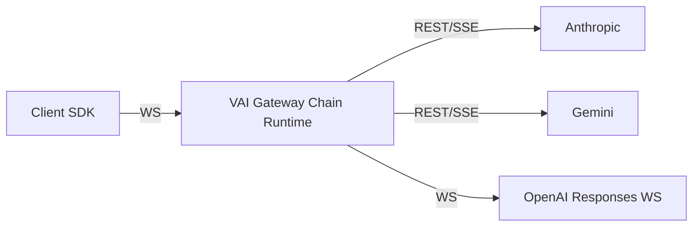

# VAI Upgraded Design

Status: Draft  
Date: 2026-03-09  
Scope: VAI gateway chain architecture, stateful WebSocket mode (inspired by OpenAI's new websocket mode for their Responses API), SDK direction, storage model, observability model, and phased rollout.

## 1. Purpose

This document defines the recommended upgraded design for `vai-gateway` and the Go SDK.

It is intentionally shaped by the current repo state:

- Public request/response contracts are currently Messages-shaped.
- `Messages.Run` and `Messages.RunStream` are the core SDK primitives.
- `/v1/runs` and `/v1/runs:stream` already exist as gateway server-side run surfaces.
- `/v1/live` already proves that the gateway can own long-lived state over WebSocket.

This document answers four questions:

1. Should the first upgrade step be a rewrite around OpenAI Responses?
2. How should stateful WebSocket mode work?
3. How should sessions, chains, runs, history, tools, and assets be stored?
4. What should the end-state SDK DX look like?

## 2. Executive Summary

Recommended direction:

1. Do **not** make the first step a full rewrite of provider normalization around raw OpenAI Responses.
2. Keep the current Messages/Run mental model as the primary public surface for phase 1.
3. Build a gateway-owned **chain runtime** first.
4. Add a new **stateful WebSocket chain transport** on top of that runtime.
5. Keep stateless HTTP/SSE modes as first-class supported modes.
6. Treat upstream provider WebSocket support as an **adapter optimization**, not as the public contract.
7. Store hot active chain state in memory first, use Postgres for durable metadata and logs, and use S3/R2 for large binary assets.
8. Make observability richer than the public API by storing explicit run timeline items such as `tool_call` and `tool_result`.

Key recommendation:

> Build the chain infrastructure first. Do not couple stateful transport, provider translation, and API-shape migration into one rewrite.

## 3. Core Thesis

The most important architectural choice is **not** "Messages vs Responses."

The most important architectural choice is:

> The gateway should own canonical active chain state, and WebSocket should be a stateful transport for that chain state.

That means:

- one gateway chain can span many sequential runs
- the next run does not resend full history
- tool calls can continue inside the same run over the same socket
- when the client compacts or materially rewrites history, it starts a new chain
- model/tools/system prompt can still change between runs
- upstream providers may use REST, SSE, or WebSocket depending on capability

This design is directly aligned with the Vango state model described in [VANGO_GUIDE.md](/Users/collinshill/Documents/vango/vai-gateway/VANGO_GUIDE.md):

- server-owned state
- one authoritative runtime container
- single writer for deterministic state mutation

The gateway should follow the same principle for agent chains.

## 4. What We Are Deciding Now

These decisions should be treated as committed design direction:

### 4.1 Public shape for phase 1

- Keep the current Messages/Run semantics for the first stateful WebSocket implementation.
- Do not require a public migration to raw OpenAI Responses before shipping stateful chains.
- Preserve non-WebSocket modes.

### 4.2 Transport strategy

- Add a gateway-owned stateful WebSocket mode.
- One WebSocket connection is a **chain attachment**, not a single run.
- A chain can execute many sequential runs over the same socket.
- Only one in-flight run should be allowed per chain attachment in v1.

### 4.3 Provider adaptation strategy

- Public client talks to the gateway over one stable chain protocol.
- Gateway talks to providers via REST/SSE or WebSocket depending on provider capability.
- Upstream provider WebSocket support is an optimization layer only.

This is the target mental model:



### 4.4 Storage strategy

- Active chain runtime state lives in memory first.
- Shared ephemeral resume state can use Redis later if needed.
- Durable metadata, observability, run/chains/sessions, and queryable history live in Postgres.
- Large binary assets live in S3/R2 or another object store.

### 4.5 SDK strategy

- Keep `Run` and `RunStream` as the core primitives.
- Keep stateless top-level methods.
- Add an explicit chain-attached SDK surface for stateful WebSocket mode.
- Default transport should be `Auto`, and in proxy mode `Auto` should prefer WebSocket for chain-attached agent flows.

### 4.6 Delivery priorities and phase boundaries

This upgrade should explicitly optimize for four things, in this order:

1. **Developer Experience**
   - predictable transport semantics
   - explicit chain-attached APIs
   - clear recovery rules
   - no hidden sticky state in stateless APIs

2. **Functionality and correctness**
   - one authoritative chain runtime
   - one writer at a time
   - deterministic commit points
   - durable idempotency and replay recovery

3. **Performance**
   - hot in-memory active state
   - minimal history resend
   - bounded queues and replay buffers
   - provider continuation handles only as optional optimization

4. **Security**
   - credential scope derived from headers or handles only
   - `resume_token` treated as a capability secret
   - no raw secret persistence
   - redaction before durable storage

Delivery rule:

- phase 1 must ship the stable chain runtime, writer-authority model, typed chain socket, canonical errors, replay/idempotency semantics, and the minimum durable persistence required for safe reconnect and dedupe
- exports, compaction jobs, provider continuation caches, read-only observers, and cross-node resume are important later work, but they must not block the first usable chain-attached release

## 5. What We Are Not Deciding Yet

These are intentionally deferred:

- whether raw OpenAI Responses becomes the primary public API surface
- whether a higher-level `thread` abstraction is needed later once the gateway owns compaction/fork orchestration
- whether the final turn-oriented socket endpoint should be named `/v1/chains/ws`, `/v1/runs/ws`, or `/v1/responses/ws`
- whether the long-term internal canonical execution model should become fully Responses-like
- whether durable cross-node chain resume is required in the first rollout

The design must leave room for all of these.

## 6. Why Not Make Responses the First Step

OpenAI Responses is strategically important and should likely be supported as a first-class compatibility surface later. However, it should not be the first migration step.

Reasons:

1. It conflates too many changes at once.
   - public API shape
   - SDK semantics
   - provider normalization
   - stateful storage/runtime
   - WebSocket transport

2. The current repo is already Messages/Run centered.

3. The hardest unsolved problem right now is stateful chain infrastructure, not request-shape translation.

4. Provider support is uneven.
   - OpenAI already has a Responses WebSocket model.
   - Gemini has live/stateful patterns.
   - Anthropic is still publicly centered on Messages plus streaming rather than a general-purpose public Messages WebSocket.

5. A Messages-first chain runtime does not block future Responses support.

Conclusion:

> Build chain infrastructure first, then add Responses compatibility as a public surface if it remains strategically valuable.

## 7. Public API Direction

### 7.1 Phase 1 public contract

The gateway should continue to support:

- `POST /v1/messages`
- `POST /v1/runs`
- `POST /v1/runs:stream`
- `GET /v1/live`

And add a new stateful chain socket:

- `GET /v1/chains/ws`

Alternative acceptable name:

- `GET /v1/runs/ws`

Not recommended for phase 1:

- `GET /v1/runs:stream/ws`
- `GET /v1/responses/ws`

Reason:

- `chains` matches the v1 runtime abstraction
- `runs:stream/ws` incorrectly implies a one-run WebSocket translation of the SSE endpoint
- a Responses-branded endpoint implies a public commitment we have not yet chosen to make

### 7.2 Stateful chain socket semantics

The socket should support:

- `chain.start` or `chain.attach`
- `run.start`
- `client_tool.result`
- `run.cancel`
- `chain.update`
- `chain.close`

The socket should **not** be one-run-per-connection.

Instead:

- open a socket for a chain
- run many sequential `Run` / `RunStream` calls over that socket
- keep one in-flight run at a time

### 7.3 Why `chain` is the right v1 runtime noun

For phase 1, compaction and major history rewrites are expected to be client-managed.

That means:

- a chain is the actual working context lineage the gateway is holding hot in memory
- when the client compacts or forks history, it should usually create a new chain
- that new chain will usually get a new WebSocket attachment
- the old and new chains can still be linked by the same optional `external_session_id`

So in phase 1:

- `chain` is the runtime state container
- `session` is the higher-level grouping concept
- `attachment` is the concrete WebSocket connection

If the gateway later gains first-class managed compaction or branch orchestration, a higher-level `thread` object can be introduced then. It should not be forced early.

### 7.4 Per-run flexibility

WebSocket mode should eliminate repeated history resends, not remove configuration flexibility.

Each `run.start` should still be able to override:

- `model`
- `system` / `instructions`
- `tools`
- `tool_choice`
- `temperature`
- `max_tokens`
- reasoning controls
- output config
- gateway-native tool config

Default rule:

- omitted fields inherit chain defaults
- provided fields apply to that run only

Persistent changes should be explicit via `chain.update`.

### 7.5 Stateful non-WebSocket parity

WebSocket should be the preferred stateful transport, not the only one.

Add stateful HTTP/SSE parity endpoints:

- `POST /v1/chains`
- `PATCH /v1/chains/{id}`
- `POST /v1/chains/{id}/runs`
- `POST /v1/chains/{id}/runs:stream`

These should mirror the semantics of:

- `chain.start`
- `chain.update`
- `run.start`

Phase 1 rule:

- stateful HTTP/SSE chain runs support provider tools and gateway tools
- client-executed tools require `GET /v1/chains/ws`

Reason:

- client tools are inherently bidirectional
- WebSocket gives better DX and lower latency for interactive tool loops
- HTTP parity still preserves stateful history ownership for simpler or more constrained deployments

### 7.5.1 Writer authority across transports

The single-writer invariant must apply across typed WebSocket, live WebSocket, and stateful HTTP/SSE.

Rules:

- every chain has at most one active writer lease at a time
- `GET /v1/chains/ws` holds a long-lived writer lease while attached
- `/v1/live` holds the same writer lease type when it is attached to a chain
- each mutating stateful HTTP/SSE request acquires an ephemeral writer lease for the duration of the request
- if another writer lease is already active, the mutation fails deterministically with `chain.attach_conflict` in phase 1 unless the operation is an authorized attach takeover
- no transport may bypass the writer lease by mutating chain state directly

Operational consequence:

- a chain cannot be mutated concurrently by a typed socket and `POST /v1/chains/{id}/runs`
- switching transport modes does not change the chain authority model; it only changes who currently holds the writer lease

### 7.6 Credential scope and BYOK

Credential handling must be explicit and conservative.

Rules:

- raw provider or tool API keys must never be sent inside WebSocket frames
- raw provider or tool API keys must never be persisted in chain, run, or timeline records
- a WebSocket attachment's credential scope is derived only from upgrade headers or future credential handles
- a run may use only models and gateway tools allowed by the current attachment credential scope
- to expand credential scope, the client opens a new attachment with additional headers
- expanding credential scope does not require a new chain if history is unchanged
- HTTP chain endpoints derive credential scope per request from request headers

Operational consequence:

- chain defaults may reference a model or tool that is not currently authorized on the active attachment
- in that case, `run.start` must fail deterministically with a credential-scope error rather than silently degrading

### 7.6.1 Ownership, principal, and attach authority

Authentication and live chain control should use a hybrid model:

- `org_id` is the hard tenant boundary
- `principal_id` is the authenticated actor for audit and authorization
- `actor_id` is the logical end user when available
- `resume_token` is the opaque capability used for live `chain.attach` and `takeover`

Rules:

- every chain belongs to exactly one `org_id`
- every chain records `created_by_principal_id` and `created_by_principal_type`
- every chain may optionally record `actor_id` when the caller is acting on behalf of an end user
- raw API keys are authentication material only; they are not the durable ownership identity
- key rotation must not break access to previously created chains inside the same principal and org scope

Authorization model:

- history read APIs are authorized by org-scoped RBAC
- live write control over an active chain requires same-org authentication plus possession of the valid `resume_token`
- if `actor_id` is present, attach and takeover should require the same `actor_id` unless the caller has elevated org-level permission
- `takeover=true` is allowed only for the same org plus valid `resume_token`, and for the same actor when actor scoping is present unless elevated permission applies

SDK rule:

- SDKs should store and replay `resume_token` automatically for reconnect and should avoid exposing it in normal application logs or UI surfaces

Resume-token lifecycle:

- successful `chain.start` returns a fresh `resume_token`
- successful `chain.attach` and authorized takeover return a fresh replacement `resume_token`
- the gateway stores only `resume_token_hash` durably
- SDKs must replace the previously stored token after each successful attach or takeover
- the server may allow a brief overlap window for retry races, but only the newest token should be considered the active credential for future reconnects

Operational reason:

- same-org alone is too broad for live chain control
- same raw API key is too brittle because keys rotate
- `resume_token` gives safe reconnect UX without making any same-org caller able to steal an active chain

### 7.7 Protocol versioning

The chain socket should use an explicit WebSocket subprotocol:

- `Sec-WebSocket-Protocol: vai.chain.v1`

And the server should echo the accepted subprotocol on successful upgrade.

Rules:

- the WebSocket subprotocol is the authoritative protocol version for WS traffic
- `X-VAI-Version: 1` remains useful for HTTP endpoints and diagnostics
- breaking wire changes require a new subprotocol version such as `vai.chain.v2`
- additive fields remain allowed within a protocol version
- unknown client-to-server frame `type` values must fail closed with canonical protocol errors
- unknown server-to-client event `type` values must also fail closed; introducing new event types requires a new protocol version
- servers must not silently ignore unknown client mutation frames

### 7.8 Idempotency and reconnect semantics

Every mutating operation needs explicit deduplication and reconnect rules.

Idempotency rules:

- every mutating HTTP request accepts `Idempotency-Key`
- every mutating WebSocket frame includes `idempotency_key`
- idempotency scope is `org_id` plus `principal_id` plus operation kind plus chain scope when applicable
- idempotency records for durable mutations must themselves be stored durably in phase 1 and survive process restarts within the idempotency window
- recommended default idempotency window: `24h` for `chain.start` and `run.start`; `1h` for `chain.update`, `run.cancel`, and `client_tool.result`
- duplicate `chain.start` with the same principal and idempotency key returns the same created chain instead of creating a second one
- duplicate `run.start` returns the same `run_id` and current run status instead of starting a second run or billing twice
- duplicate `chain.update` is first-write-wins within the idempotency window
- duplicate `client_tool.result` with the same resolved payload is acknowledged idempotently
- duplicate `client_tool.result` with a conflicting payload for an already-resolved execution must fail with a conflict error

Reconnect rules:

- every server event includes `event_id`
- every durable chain mutation increments `chain_version`
- `chain.attach` may include `after_event_id` so the gateway can replay recent buffered events
- `chain.attach` may include `require_exact_replay=true` when exact buffered replay is a hard precondition for the caller
- `chain.attach` may request attachment takeover when replacing a stale or lost socket from the same principal
- the gateway should keep a bounded in-memory replay buffer per active chain
- exact delta replay is best-effort, not a guaranteed durable contract in phase 1

Phase 1 resume guarantees:

- if a run is waiting for client tool results, reconnecting clients can reattach and continue that run
- if a run is actively streaming model output, the gateway may finish the run in the background after disconnect
- missed token deltas are not guaranteed to replay after reconnect beyond the replay buffer window
- if replay is unavailable, the client recovers from `GET /v1/chains/{id}`, `GET /v1/chains/{id}/context`, and `GET /v1/runs/{id}/timeline`

### 7.9 Live integration

`/v1/live` should remain a specialized transport in phase 1, but it should no longer be a separate conceptual runtime.

Design rule:

- `/v1/live` uses the same shared turn engine, chain history model, storage model, and observability model as chain-attached runs

Phase 1 behavior:

- a live session implicitly creates or attaches to a chain
- that chain relationship should be persisted and queryable
- when a caller switches between typed chain mode and live mode without rewriting history, the same `chain_id` remains authoritative and only the attachment mode changes
- `session_id` groups related chains, but `chain_id` is the active runtime handle for reattach, takeover, and replay
- live-specific audio, playback, and barge-in events remain unique to `/v1/live`
- typed chain WebSocket and live WebSocket do not need to share the same wire protocol in phase 1

Future direction:

- later, the gateway may support explicit handoff between typed chain sessions and live sessions by attaching `/v1/live` to an existing chain
- this should be built on top of the same chain runtime rather than introducing a second history system

### 7.10 Canonical error taxonomy

The gateway should use a stable, transport-independent error taxonomy.

Rules:

- clients should branch on canonical `code`, not on transport-specific status codes or free-form message text
- the same logical failure should use the same `code` across HTTP, SSE, and WebSocket
- HTTP status remains useful, but it is transport mapping rather than primary semantics

Canonical error envelope:

```json
{
  "code": "chain.attach_conflict",
  "message": "chain already has an active attachment",
  "retryable": false,
  "fatal": false,
  "suggested_action": "retry_with_takeover",
  "chain_id": "chain_123",
  "run_id": null,
  "execution_id": null,
  "details": {}
}
```

Recommended code families:

- `auth.*`
- `chain.*`
- `tool.*`
- `transport.*`
- `protocol.*`
- `quota.*`
- `asset.*`

Codes that should be locked in for phase 1:

- `auth.credential_scope_denied`
  - caller is authenticated, but the current attachment or request credential scope does not allow the requested provider model or gateway tool
- `auth.resume_token_invalid`
  - supplied `resume_token` is missing, invalid, expired, or does not match the chain
- `auth.actor_scope_denied`
  - caller is authenticated but not authorized for actor-scoped attach or takeover
- `chain.attach_conflict`
  - another active writer lease is already bound to the chain, whether surfaced during WebSocket attach or a mutating stateful HTTP/SSE request, and valid takeover did not occur
- `chain.replay_unavailable`
  - exact replay was requested but buffered replay is unavailable
- `chain.expired`
  - chain exists durably but is no longer resumable for live attachment or further runs under its lifecycle policy
- `tool.timeout`
  - client or gateway tool execution exceeded the configured timeout
- `tool.result_conflict`
  - a duplicate `client_tool.result` was submitted with a conflicting payload for an already-resolved execution
- `transport.client_tools_require_websocket`
  - caller attempted client-executed tools over stateful HTTP/SSE instead of chain WebSocket
- `transport.backpressure_exceeded`
  - the attachment stopped consuming events quickly enough and exceeded the bounded outbound queue
- `protocol.unsupported_capability`
  - the requested provider/model/tool/transport combination is not supported by the capability registry
- `quota.rate_limited`
  - caller exceeded a temporal rate limit
- `quota.limit_exceeded`
  - caller exceeded a configured concurrency, storage, or plan quota
- `asset.payload_too_large`
  - the supplied asset or inline media payload exceeded the allowed size limit

Recommended suggested actions:

- `reconnect_with_credentials`
- `retry_with_takeover`
- `recover_from_history`
- `switch_to_websocket`
- `start_new_chain`
- `retry_later`
- `reduce_payload`
- `reduce_rate`

Transport mapping guidance:

- `auth.credential_scope_denied` -> usually HTTP `403`
- `auth.resume_token_invalid` -> usually HTTP `401` or `403`
- `auth.actor_scope_denied` -> usually HTTP `403`
- `chain.attach_conflict` -> usually HTTP `409`
- `chain.replay_unavailable` -> usually HTTP `412` only when exact replay was required
- `tool.result_conflict` -> usually HTTP `409`
- `transport.client_tools_require_websocket` -> usually HTTP `422`
- `transport.backpressure_exceeded` -> usually WebSocket close plus canonical chain error event
- `protocol.unsupported_capability` -> usually HTTP `422`
- `quota.rate_limited` -> usually HTTP `429`
- `quota.limit_exceeded` -> usually HTTP `429` or `403` depending on whether the limit is burst-based or plan-based
- `asset.payload_too_large` -> usually HTTP `413`
- `chain.expired` -> usually HTTP `410`

Replay nuance:

- `chain.replay_unavailable` should not be emitted for normal reconnects by default
- normal reconnect should succeed with `replay_status=partial|none`
- emit `chain.replay_unavailable` only when the client explicitly requested replay as a hard requirement
- SDKs should treat `replay_status=partial|none` as a recoverable reconnect condition, not as an exception by default

### 7.11 Attachment roles and backpressure

Phase 1 should keep attachment semantics strict.

Rules:

- each chain may have exactly one writable typed attachment at a time
- phase 1 does not expose concurrent read-only observer attachments on `GET /v1/chains/ws`
- if observer attachments are added later, they must never be allowed to send mutating frames or take over the writer

Backpressure rules:

- each attachment has a bounded outbound queue measured by event count and serialized bytes
- recommended hard limit: `256` events or `1 MiB`, whichever is reached first
- the gateway may coalesce adjacent low-level text delta events for the same run before enqueueing, but it must not drop semantic events such as `client_tool.call`, `run_complete`, or `chain.error`
- on queue overflow, the gateway emits or records `transport.backpressure_exceeded` and closes the attachment
- one slow client must never be allowed to cause unbounded memory growth or stall unrelated chains

Run behavior after a backpressure close:

- if the active run can continue without client input, the gateway may continue it in the background until the next step commit or terminal state
- if the run needs client tool results, the run waits for reattach until timeout
- reconnecting clients recover from replay if available, otherwise from durable history and run APIs

### 7.12 Provider capability registry

Provider and model validation should be centralized.

Add one authoritative capability registry that is consulted by both the gateway and SDK.

The registry should answer at least:

- supported input modalities
- supported output modalities
- support for function tools
- support for provider-native tools
- support for gateway tools
- support for structured output
- support for reasoning controls
- support for upstream WebSocket transport
- support for provider continuation handles
- max context window and other key limits when known

Rules:

- `chain.start`, `chain.update`, and `run.start` must validate requested settings against the capability registry before expensive work begins
- unsupported combinations fail deterministically with `protocol.unsupported_capability`
- the gateway capability registry is authoritative; SDK capability metadata is advisory and may be stale

## 8. Session, Chain, Run, and Attachment Model

### 8.1 Definitions

- **Session**: optional continuity boundary across chains. It groups related chains for observability and product semantics, even if compaction or branching occurs.
- **Chain**: one contiguous working context lineage. In phase 1, it is also the runtime state container that the socket attaches to.
- **Run**: one complete runloop execution.
- **Attachment**: one transport-level connection to a chain, such as a turn socket or live socket.

### 8.1.1 Public naming

Public naming should be explicit:

- `external_session_id` is the optional client-supplied continuity identifier
- `session_id` is the gateway-generated durable grouping identifier
- `chain_id` is the authoritative handle for active runtime attachment, replay, and takeover
- clients should never need to supply internal `session_id` in order to reconnect to an active chain

### 8.2 Recommended semantics

- A new user message in the current lineage creates a new run on the same chain.
- Regenerating a completed response creates a new chain fork with a new run carrying `rerun_of_run_id`.
- Editing an earlier message creates a new chain fork.
- Client-managed compaction that materially resets active context creates a new chain.
- In phase 1, a new chain usually means a new WebSocket attachment.
- A dropped attachment does not necessarily destroy the chain; the client can reattach by `chain_id`.
- Switching between typed chain mode and live mode without rewriting history stays on the same chain; only attachment mode changes.
- WebSocket connections are attachments, not chains.
- Sessions are optional groupings, not transport containers.

### 8.3 Chain boundary rules

Chains should be treated as append-only working lineages.

Stay on the same chain when:

- appending a new user turn
- rerunning the exact same request idempotently
- changing model, reasoning, system prompt, or tools for the next run without rewriting prior history
- reattaching with different credential scope
- updating chain defaults for future runs

Create a new chain when:

- compacting, summarizing, trimming, or otherwise rewriting prior history
- editing, deleting, or reordering any earlier message or content block
- regenerating a completed response as an alternative continuation
- branching from an earlier run or message
- performing an explicit reset or starting a fresh working context from imported history

Important design consequence:

- chain history remains append-only
- alternative continuations are modeled as new chains linked by session and parent-chain relationships

### 8.4 Lifecycle state machines

Recommended chain states:

- `idle`
  - chain exists and can accept a new run
- `running`
  - a run is currently executing or streaming
- `waiting_for_client_tool`
  - the active run is blocked on one or more client tool results
- `closed`
  - no new attachments or runs are accepted
- `expired`
  - retention policy or explicit lifecycle policy has ended the chain's resumability window

Recommended run states:

- `queued`
- `running`
- `waiting_for_client_tool`
- `completed`
- `cancelled`
- `failed`
- `timed_out`

Recommended attachment states:

- `connecting`
- `active`
- `closing`
- `closed`

Notes:

- chain state is mostly derived from the current run plus retention/close policy
- only one run may be non-terminal on a chain at a time
- only one writable attachment may be active on a chain at a time
- hot in-memory eviction of an idle chain does not by itself mean the chain is expired; a durable chain may be lazily rehydrated until its resumability window ends

### 8.5 Branching and regenerate UX

Branching should be explicit in the data model and convenient in the SDK.

Rules:

- regenerate of a completed response always creates a new chain fork
- explicit branching from an earlier message or run always creates a new chain fork
- branch and regenerate never mutate prior canonical chain history in place
- the new forked chain inherits `session_id`, defaults, and storage policy unless overridden

Recommended product surfaces:

- SDK convenience:
  - `chain.RegenerateLast(...)`
  - `chain.Fork(...)`
- HTTP endpoints:
  - `POST /v1/runs/{id}:regenerate`
  - `POST /v1/chains/{id}:fork`

Recommended response shape:

- return the new `chain_id`
- return inherited or overridden defaults
- optionally return attach metadata so the caller can immediately continue on the new chain

Phase 1 wire-protocol rule:

- the chain WebSocket does not need dedicated fork or regenerate frames
- branching can happen through HTTP endpoints or SDK helpers that create a new chain and then attach to it

## 9. Tool Execution Model

The gateway must support three execution locations:

1. **Provider tools**
   - executed by the upstream provider
   - examples: provider-native web search, code execution, file search

2. **Gateway tools**
   - executed by the gateway
   - examples: gateway-native web/image/fetch tools

3. **Client tools**
   - executed inside the caller's application process
   - gateway emits a `client_tool.call`
   - SDK invokes local handler
   - SDK returns `client_tool.result`
   - same run resumes on the same chain

Important rule:

> Client tool results are continuation of the current run, not the next run.

Wire-protocol naming rule:

- wrapped `run.event` inner events such as `tool_call_start` and `tool_result` describe gateway/provider-side run progression
- top-level `client_tool.call` and `client_tool.result` are reserved for client-executed tool transport
- SDKs should not merge these two layers into one ambiguous tool-event stream

### 9.1 Client tool batching and waiting semantics

The gateway should support multiple outstanding client tool calls in one model step.

Rules:

- each client tool call gets a unique `execution_id`
- the gateway may emit multiple `client_tool.call` events for a single run step
- the client may answer those `client_tool.result` messages in any order
- the gateway resumes model execution only after all required client tool calls in the current batch resolve, time out, or the run is cancelled
- tool results are reinserted into canonical chain history in the originating tool-call order

Phase 1 limits should be explicit and configurable. Recommended defaults:

- max outstanding client tool calls per batch: `16`
- max inline `client_tool.result` text/json payload per execution: `64 KiB`
- larger or binary tool outputs must be returned as asset references

Failure handling:

- if the client disconnects while the run is `waiting_for_client_tool`, the run remains resumable until the tool timeout expires
- if the tool timeout expires, the run fails deterministically with observable timeout metadata
- `run.cancel` abandons all outstanding client tool executions for that run

### 9.2 Tool side effects and idempotency classes

Gateway-managed tools and SDK-declared client tools should carry explicit effect semantics.

Recommended effect classes:

- `read_only`
- `idempotent_write`
- `non_idempotent_write`
- `unknown`

Rules:

- every gateway tool declares an `effect_class`
- SDK/client tools may declare an `effect_class`; if omitted, treat it as `unknown`
- every tool execution receives a deterministic `tool_execution_id`
- gateway retries are allowed only when they are safe for the declared `effect_class`

Retry policy:

- `read_only`
  - safe for bounded automatic retries on transient failures
- `idempotent_write`
  - may be retried only when the tool honors the deterministic execution id as an idempotency key
- `non_idempotent_write`
  - never retried automatically
- `unknown`
  - never retried automatically

Failure policy:

- deterministic read-only or idempotent-write failures may be committed and then returned to the model for another reasoning step
- ambiguous failures for `non_idempotent_write` or `unknown` tools should be committed with `execution_outcome=unknown` and should usually terminate the current run
- tool execution metadata should record `effect_class`, `retryable`, and `execution_outcome`

## 10. History Model

### 10.1 Runtime history

For phase 1, the runtime provider projection can remain Messages-shaped.

That means provider adapters can still construct provider-specific request history from:

- system prompt
- user messages
- assistant messages
- tool interactions as needed by the target provider

### 10.2 Observability history

Observability should be richer than the runtime projection.

For logs, traces, replay, and eval datasets, use an explicit **run timeline item** model with default kinds:

- `system`
- `user`
- `assistant`
- `tool_call`
- `tool_result`

This gives the desired DX:

```text
[System: text]
[User: text, image]
[Assistant: text]
[Tool Call: args]
[Tool Result: output]
[Tool Call: args]
[Tool Result: output]
[Assistant: text]
```

This is better than exposing runtime internals like:

- `role=assistant, kind=tool_call`

The underlying schema should remain extensible for future kinds:

- `reasoning`
- `compaction`
- `warning`
- `asset_ref`
- `assistant_image`
- `assistant_audio`

### 10.3 Important distinction

Tool call and tool result should be first-class visible records in logs and traces.

However:

- they should not be overloaded into the current conversational `role` axis
- they should instead be stored as explicit timeline item kinds

### 10.4 Projection rules

Do not force one representation to serve runtime, replay, and observability equally well.

Use two durable projections:

1. **Chain message projection**
   - canonical Messages-shaped history used to build the next provider request
   - append-only within a chain
   - may include tool-use and tool-result content blocks when the provider projection needs them

2. **Run timeline projection**
   - fine-grained observability trace
   - explicit `tool_call` and `tool_result` items
   - may also include future kinds such as `reasoning` or `warning`

Materialization rules:

- every completed run writes its high-fidelity `run_items`
- every completed run also writes the canonical chain-message delta that should be visible to the next run
- provider requests are built from chain messages plus run overrides plus provider adapter logic
- context retrieval APIs read from chain messages
- timeline and replay APIs read from run items and run metadata

Causal metadata rule:

- every `run_item` should carry enough causal metadata for replay and UI grouping, including `step_index`, `step_id`, and `execution_id` when applicable
- `tool_call` and `tool_result` items should be joinable without re-parsing opaque content blobs

### 10.5 Assistant commit points

Canonical chain history must commit at **causally complete step boundaries**.

Do not commit:

- token-by-token streamed assistant text
- partial assistant output from an unfinished step
- unmatched tool calls without their resolved tool results

Use three layers:

1. **Stream buffer**
   - token deltas and partial streamed output
   - visible to the live stream and replay buffer
   - never canonical chain history

2. **Pending step state**
   - the in-progress assistant step, including partial text, pending tool calls, and unresolved tool executions
   - resumable across disconnect/reconnect while the chain remains hot
   - not yet canonical chain history

3. **Canonical chain history**
   - only committed when a step is causally complete
   - becomes the source of truth for the next provider request

Commit rules:

- a text-only assistant turn commits when that assistant step completes
- an assistant step that emits tool calls does **not** commit immediately
- tool-using steps commit only after the tool batch resolves, times out, or is cancelled
- that commit is atomic for the step

For a tool-using step, the atomic commit should include:

- the assistant tool-call message/content
- the corresponding tool-result message/content batch in canonical order

Important consequence:

- canonical chain history never contains dangling tool calls
- the next provider request is always built from internally consistent history

### 10.6 Partial output and failure persistence

Partial output should remain visible for debugging without polluting canonical history.

Rules:

- partial assistant text from a cancelled, failed, or interrupted unfinished step is written to run timeline items only
- unfinished streamed text is not appended to canonical chain history
- transport-only interruptions such as dropped connections, interrupted provider streams, or unfinished assistant token streams are timeline-only unless the step had already reached a commit point
- explicit tool failure outcomes that the model should be able to reason about are written to both timeline and canonical chain history
- unresolved tool executions must resolve into explicit timeout/cancel/error outcomes before the step is terminally recorded

Failure and cancellation handling:

- if a tool handler or gateway tool returns an explicit error result, that error result should be committed like any other `tool_result` so future agent steps can reason about it
- if a tool step is cancelled or times out, the gateway should synthesize terminal tool-result outcomes for unresolved executions
- then it should atomically commit the assistant tool-call message plus the resolved tool-result batch
- each committed error result should include structured failure metadata such as `is_error`, `error_kind`, and whether the outcome is `retryable` or `execution_outcome=unknown`
- if the failure outcome is deterministic and safe to reason about, the current run may continue to the next model step
- if the failure outcome is ambiguous, especially when side effects may have occurred but completion is unknown, the failure should still be committed to chain history but the run should terminate after that commit
- transport-only interruption without a resolved tool outcome must not be committed into canonical chain history
- the run is marked `cancelled`, `failed`, or `timed_out` when the gateway does not continue after the terminal tool step
- the gateway must not continue to the next model step after a terminal commit

This keeps canonical chain history consistent while preserving the true sequence of events for replay and support.

## 11. Storage Model

### 11.1 Runtime storage tiers

Use three storage tiers:

1. **Hot active state**
   - in-memory on the gateway node
   - fastest path for active runs
   - includes pending step state, partial assistant buffers, replay buffers, and outstanding client tool waits

2. **Shared ephemeral chain state** (optional later)
   - Redis or equivalent
   - supports cross-node resume or detach/reattach

3. **Durable storage**
   - Postgres for metadata, history, traces, and queries
   - S3/R2 for binary assets and archival payloads

### 11.2 What belongs in Postgres

- sessions
- chains
- chain messages
- runs
- run timeline items
- tool calls/results metadata
- compaction metadata
- provider continuation handles
- asset metadata
- usage and cost records
- request/response summaries
- session/chains/run relationships

### 11.3 What belongs in S3/R2

- image bytes
- audio bytes
- video bytes
- PDFs/documents
- large exports
- optional archived snapshots

Use the upload lifecycle described in [VANGO_S3_GUIDE.md](/Users/collinshill/Documents/vango/vai-gateway/VANGO_S3_GUIDE.md):

- presigned upload
- claim/promote
- private-by-default
- object store holds bytes, not authoritative agent state

### 11.4 Recommended durable schema

Recommended durable tables or equivalent models:

- `sessions`
- `chains`
- `chain_messages`
- `runs`
- `run_items`
- `run_tool_calls`
- `attachments`
- `idempotency_records`
- `compactions`
- `provider_continuations`
- `assets`

Suggested fields:

#### `sessions`

- `id`
- `org_id`
- `external_session_id` nullable
- `created_by_principal_id`
- `created_by_principal_type`
- `actor_id` nullable
- `storage_policy_json`
- `metadata_json`
- `created_at`
- `updated_at`

#### `chains`

- `id`
- `org_id`
- `session_id` nullable
- `created_by_principal_id`
- `created_by_principal_type`
- `actor_id` nullable
- `parent_chain_id` nullable
- `forked_from_message_id` nullable
- `forked_from_run_id` nullable
- `status`
- `chain_version`
- `max_context_tokens` nullable
- `storage_policy_json`
- `current_defaults_json`
- `message_count_cached`
- `token_estimate_cached`
- `created_at`
- `updated_at`

#### `chain_messages`

- `id`
- `chain_id`
- `run_id`
- `role`
- `sequence_in_chain`
- `content_json`
- `created_at`

#### `runs`

- `id`
- `org_id`
- `chain_id`
- `session_id` nullable
- `parent_run_id` nullable
- `rerun_of_run_id` nullable
- `idempotency_key` nullable
- `provider`
- `model`
- `status`
- `stop_reason`
- `billing_status`
- `effective_config_json`
- `usage_json`
- `cost_json`
- `usage_finalized_at` nullable
- `tool_count`
- `duration_ms`
- `started_at`
- `completed_at`

#### `run_items`

- `id`
- `run_id`
- `chain_id`
- `kind`
- `step_index`
- `step_id` nullable
- `execution_id` nullable
- `sequence_in_run`
- `sequence_in_chain`
- `content_json`
- `asset_id` nullable
- `created_at`

#### `run_tool_calls`

- `id`
- `run_id`
- `step_index`
- `execution_id`
- `tool_call_id`
- `name`
- `effect_class`
- `input_json`
- `call_item_id` nullable
- `result_item_id` nullable
- `is_error`
- `execution_outcome`
- `idempotency_key` nullable
- `duration_ms`
- `created_at`

#### `attachments`

- `id`
- `org_id`
- `chain_id`
- `principal_id`
- `principal_type`
- `actor_id` nullable
- `attachment_role`
- `mode`
- `protocol`
- `credential_scope_json`
- `resume_token_hash`
- `node_id`
- `close_reason` nullable
- `started_at`
- `ended_at`

#### `idempotency_records`

- `id`
- `org_id`
- `principal_id`
- `chain_id` nullable
- `operation`
- `idempotency_key`
- `request_hash`
- `result_ref_json`
- `created_at`
- `expires_at`

#### `compactions`

- `id`
- `chain_id`
- `created_by_run_id`
- `replaced_through_item_id`
- `summary_item_id`
- `snapshot_json`
- `created_at`

#### `provider_continuations`

- `id`
- `chain_id`
- `run_id`
- `provider`
- `model`
- `handle_kind`
- `handle_value_encrypted`
- `valid_from_chain_version`
- `invalidated_at` nullable
- `metadata_json`
- `created_at`

#### `assets`

- `id`
- `org_id`
- `storage_provider`
- `bucket`
- `object_key`
- `media_type`
- `validated_media_type` nullable
- `size_bytes`
- `sha256`
- `scan_status`
- `metadata_json`
- `created_at`
- `expires_at` nullable

### 11.5 Provider continuation handles

Provider continuation handles should be treated as optimization caches, not canonical truth.

Rules:

- a continuation handle is always scoped to a provider, model family, and chain version
- handles must be stored encrypted at rest when persisted
- handles may be reused only when the effective run is compatible with the stored provider/model scope and the chain has not diverged since the handle was recorded
- handles are invalidated by chain rewrites, compaction into a new chain, incompatible provider/model changes, or provider-declared invalidation
- when a handle is unavailable or invalid, the gateway falls back to building the provider request from canonical chain messages

This preserves correctness while still letting provider-native stateful APIs improve latency and token efficiency when available.

### 11.6 Retention, quotas, delete, and export

Retention and cleanup rules should be explicit before implementation.

Recommended defaults:

- active attachment replay buffer: last `1024` events or `60s`, whichever is smaller
- hot idle chain eviction: `15m` after last activity, with lazy rehydration from durable state while the chain remains resumable
- client tool wait timeout: configurable, default `30s`
- attachment heartbeat: regular ping/pong with close on missed heartbeats
- idempotency record retention: at least the largest active idempotency window, recommended `24h`

Quota categories:

- max active chains per org/principal
- max concurrent attachments per principal
- max pending client tool executions per run
- max input bytes per run
- max asset bytes per org/session/chain

Deletion and export rules:

- deleting a chain removes hot runtime state immediately and tombstones durable records before background cleanup
- deleting a session cascades to member chains according to retention policy
- assets are deleted only when no remaining chain, run, or export record references them
- export should be supported at least at the chain and session level so managed history is not a trap

### 11.7 Usage and billing semantics

Usage and cost should be recorded incrementally and finalized at run completion.

Rules:

- provider usage is recorded per upstream provider turn as soon as it is known
- gateway tool usage and cost are recorded per tool execution attempt
- usage already incurred is never discarded just because the overall run later fails, is cancelled, or times out
- idempotent replay of the same `run.start` must not create duplicate billable usage
- `usage_json` and `cost_json` may be updated during the run and finalized when the run reaches a terminal state
- when exact cost is unavailable, the gateway may store an estimate, but it must be marked as estimated

Recommended semantics:

- `billing_status=running` while usage may still accumulate
- `billing_status=finalized` once the run reaches a terminal state and all known provider/tool usage has been recorded
- cancellation after streamed model output still records the consumed provider tokens
- ambiguous side-effecting tool attempts may still produce billable usage records if the gateway or downstream provider incurred cost

### 11.8 Privacy, redaction, and eval capture policy

Managed storage needs first-class privacy controls.

Recommended storage policy knobs:

- `content_mode`
  - `full`
  - `redacted`
  - `metadata_only`
- `tool_args_mode`
  - `full`
  - `redact_marked`
  - `metadata_only`
- `asset_mode`
  - `retain`
  - `metadata_only`
  - `drop_after_run`
- `eval_capture`
  - `enabled`
  - `disabled`
- `retention_days`

Default managed-service policy should be `standard`:

- persist chain messages and run timeline text content
- never persist provider keys, auth tokens, resume tokens, or other transport secrets
- persist binary assets only in object storage, not duplicated inside timeline rows
- redact tool fields that are explicitly marked sensitive by the SDK or gateway tool definition
- allow org-level opt-out of eval capture

Rules:

- redaction happens before durable persistence, not only at read time
- timeline and export APIs must reflect the redacted form, not the original secret form
- search and analytics only operate on data retained by the effective storage policy

### 11.9 Export and import bundle format

Exports should use one portable, versioned bundle format:

- `vai.bundle.v1`

Recommended structure:

- `manifest.json`
  - sessions
  - chains
  - chain messages
  - runs
  - run timeline items
  - tool execution metadata
  - storage policy metadata
  - asset manifest
- `assets/`
  - optional binary payloads included when policy allows

Rules:

- chain and session export should be supported through asynchronous export jobs
- export results should be written to object storage and downloaded via signed URL
- export must include enough metadata to reconstruct chain history and replay traces outside the managed service
- import, when added, should create a new chain or session rather than mutating existing history in place
- phase 1 should prioritize export over full import, but the bundle format should be designed so future import is straightforward

### 11.10 Asset lifecycle security

Asset handling must be private-by-default and validated before use.

Rules:

- assets are scoped to one org and are never directly reusable across orgs without an explicit copy
- upload and read URLs must be signed, short-lived, and operation-specific
- both declared and sniffed media type should be validated; mismatches fail closed
- per-media-type size limits are enforced before durable storage promotion
- documents such as PDFs should support malware scanning and quarantine before provider/tool use when scanning is enabled
- assets with unsafe or unknown scan status must not be forwarded to providers or gateway tools that require trusted content
- deduplication by hash, if used, should be scoped within an org boundary

### 11.11 Rate limits and quotas

Rate limits and quotas should be enforced separately from auth and storage policy.

Recommended categories:

- chain creations per minute
- run starts per minute
- concurrent active attachments per principal and org
- concurrent active chains per org
- tool executions per minute
- asset ingress bytes per minute
- durable asset storage bytes per org
- export jobs in progress per org

Rules:

- temporal limits fail with `quota.rate_limited` and should include `retry_after` when known
- concurrency or plan ceilings fail with `quota.limit_exceeded`
- oversized inline or uploaded media fails with `asset.payload_too_large`
- quota enforcement should happen as early as possible before expensive provider or tool work begins

## 12. API Design for Reading Stored History

The gateway should expose three different read patterns.

### 12.1 Structure browsing

For dashboards and app UIs:

- `GET /v1/sessions/{id}`
- `GET /v1/sessions/{id}/chains`
- `GET /v1/chains/{id}`
- `GET /v1/chains/{id}/runs`
- `GET /v1/runs/{id}`

### 12.2 Effective context/history retrieval

For "show me the effective context at this point":

- `GET /v1/chains/{id}/context`

Useful query parameters:

- `at_run_id`
- `after_item_id`
- `limit`
- `format=messages|timeline`
- `include_assets=none|metadata|signed_urls`

### 12.3 Run replay and debugging

For evals, support, and deterministic replay:

- `GET /v1/runs/{id}/timeline`
- `GET /v1/runs/{id}/effective-request`
- `GET /v1/runs/{id}/trace`

Important distinction:

- `timeline` tells humans what happened
- `effective-request` tells engineers what the model actually saw

### 12.4 Recovery and export patterns

These APIs should also support reconnect recovery and managed-service portability.

Recovery:

- after a replay miss on `chain.attach`, the client should recover by reading:
  - `GET /v1/chains/{id}`
  - `GET /v1/chains/{id}/context`
  - `GET /v1/runs/{id}/timeline` when an active or recent run exists

Export:

- the service should eventually support chain-level and session-level export
- exported payloads should include canonical chain messages, run timeline items, run metadata, and asset references
- export should be designed so managed history can be moved into customer-controlled systems later

## 13. SDK Direction

### 13.1 Core principle

`Run` and `RunStream` remain the core primitives.

But they should become **transport-agnostic semantics**, not APIs that force the caller to care about SSE vs WebSocket.

### 13.2 Stateless compatibility surface

Keep:

- `Messages.Create`
- `Messages.Stream`
- `Messages.Run`
- `Messages.RunStream`
- `Runs.Create`
- `Runs.Stream`

These remain important for:

- serverless environments
- simple scripts
- tests
- constrained networks

### 13.3 Stateful chain-attached surface

Add an explicit chain-attached SDK surface.

Recommended direction:

- `client.Chains.Connect(...)`
- `client.Chains.Attach(...)`
- `chain.Run(...)`
- `chain.RunStream(...)`
- `chain.Update(...)`
- `chain.Close()`

The exact naming can change, but the semantics should be:

- top-level stateless calls remain
- chain-attached calls are explicit
- chain-attached proxy mode prefers WebSocket by default
- chain-attached callers provide `ExternalSessionID` when they want cross-chain continuity; they do not provide internal `session_id`

### 13.4 Transport selection

Use:

- `TransportAuto` as the default
- `TransportWebSocket`
- `TransportSSE`
- `TransportHTTP`

`TransportAuto` should behave like this:

- proxy mode + chain-attached API => prefer WebSocket
- proxy mode + stateless API => use existing HTTP/SSE
- direct mode => use provider-native transport where available, otherwise fall back

Important rule:

- if a chain-attached run needs client-executed tools, `TransportHTTP` and `TransportSSE` are invalid in phase 1 and the SDK should either upgrade to WebSocket under `TransportAuto` or fail clearly under an explicit HTTP/SSE transport

### 13.5 Example target DX

```go
chain, err := client.Chains.Connect(ctx, &vai.ChainRequest{
    ExternalSessionID: "agent_session_123",
    Model:             "anthropic/claude-sonnet-4",
    System:            "Be concise and use tools when helpful.",
}, vai.WithTools(weatherTool, accountTool))
if err != nil {
    panic(err)
}
defer chain.Close()

stream, err := chain.RunStream(ctx, &vai.RunRequest{
    Input: vai.ContentBlocks(
        vai.Text("What's the weather in Denver?"),
    ),
    GatewayTools: []string{"vai_web_search"},
})
if err != nil {
    panic(err)
}
defer stream.Close()

_, err = stream.Process(vai.StreamCallbacks{
    OnTextDelta: func(s string) { fmt.Print(s) },
})
if err != nil {
    panic(err)
}
```

Important DX property:

> The next run sends only new user input plus optional overrides. The gateway chain owns prior context.

## 14. Recommended Rollout Plan

Delivery rule:

- phase 1 and phase 2 define the minimum useful chain-attached v1 release
- only the minimal durable persistence needed for reconnect, security, and idempotency should block that release
- broader exports, provider continuation caches, observer attachments, and cross-node resume must not block the first usable chain socket

### Phase 1: Extract chain runtime beneath current APIs

Goals:

- keep current Messages/Run semantics
- introduce internal chain manager
- add minimal durable chain/run/idempotency records required for safe reconnect and dedupe
- keep provider translation largely as-is

### Phase 2: Add stateful turn socket for current chain semantics

Goals:

- chain attach/detach
- one active attachment per chain
- many sequential runs per chain
- client tool execution over socket
- client-managed compaction creates new chains rather than mutating the active chain in place

### Phase 3: Add durable storage and history APIs

Goals:

- Postgres-backed runs/chains/sessions
- asset metadata and S3/R2 integration
- timeline APIs
- context retrieval APIs

### Phase 4: Add shared ephemeral resume and cross-node support

Goals:

- Redis or equivalent for attach/reattach
- optional durable resume windows

### Phase 5: Consider first-class Responses compatibility surface

Goals:

- only after chain runtime and storage model are stable
- add a Responses-compatible ingress surface if it is still strategically useful
- do not rewrite the whole system just to mirror OpenAI naming

## 15. Decision Summary

These are the current recommended decisions:

- Build chain infrastructure first.
- Do not make a full Responses rewrite the first step.
- Keep Messages/Run semantics for the first stateful socket rollout.
- Use one WebSocket per chain attachment, not per run.
- Allow many sequential runs over one attached socket.
- Enforce one active writer lease per chain across typed WS, live WS, and stateful HTTP/SSE.
- When the client compacts or materially rewrites history, start a new chain and usually a new socket.
- Treat regenerate of a completed response as a new chain fork, not an in-place chain mutation.
- Keep per-run overrides for model, tools, system prompt, and generation settings.
- Keep non-WebSocket modes as first-class supported modes.
- Add stateful chain-scoped HTTP/SSE parity endpoints, but reserve client-executed tools for WebSocket in phase 1.
- Bind provider and gateway-tool access to the current attachment/request credential scope.
- Use `external_session_id` as the public continuity identifier and keep `session_id` server-generated.
- Fail closed on unknown client frames and unknown server events within a protocol version.
- Persist idempotency in phase 1 and rotate `resume_token` on successful attach or takeover.
- Use runtime chain state in memory, durable state in Postgres, and large assets in S3/R2.
- Use explicit `tool_call` and `tool_result` timeline items for observability.
- Keep `session` as the optional cross-chain grouping concept.
- Reserve Responses as a future compatibility surface rather than a forced immediate migration.

## 16. Final Recommendation

The optimal path is:

> Build a Messages-first chain runtime now, with a richer internal and observability timeline model, and leave room to add Responses compatibility later.

This path gives:

- the lowest-risk migration from the current repo
- the fastest route to real stateful WebSocket chains
- explicit support for client tools, gateway tools, and provider tools
- clean storage and replay semantics
- no premature lock-in to one provider's public wire format

It also preserves the most important long-term option:

> If Responses becomes the right public compatibility layer later, it can be added on top of the same chain runtime instead of forcing a full architectural reset.

## 17. Opinionated Implementation Checklist

This checklist is intentionally concrete. It is the recommended execution order for the first upgraded design rollout.

### 17.1 Foundation and invariants

- [ ] Freeze the phase 1 public design:
  - current Messages/Run semantics remain primary
  - stateful socket is chain-oriented
  - Responses compatibility is deferred
- [ ] Record the following invariants in code comments and tests:
  - one active attachment per chain
  - one active writer lease per chain across typed WS, live WS, and stateful HTTP/SSE
  - one in-flight run per attachment
  - phase 1 supports only one writable attachment per chain
  - client tool results resume the same run
  - per-run overrides are ephemeral by default
  - persistent config changes require `chain.update`
  - client-managed compaction and fork create a new chain
  - completed-response regenerate creates a new chain fork
  - chain history is append-only within a chain
  - live attach/takeover requires org auth plus valid `resume_token`
  - `external_session_id` is the only client-supplied continuity identifier
  - successful attach or takeover rotates `resume_token`
  - unknown client frames and unknown server events fail closed within a protocol version
  - partial assistant output is never canonical chain history until the step commit point is reached
- [ ] Do **not** retrofit hidden sticky chain state into repeated top-level `Messages.RunStream(...)` calls.

### 17.2 Core shared types

Add new core types under `pkg/core/types/`:

- [ ] `chain_ws.go`
  - `ChainStartFrame`
  - `ChainAttachFrame`
  - `ChainUpdateFrame`
  - `ClientToolResultFrame`
  - `RunStartFrame`
  - `RunCancelFrame`
  - `ChainCloseFrame`
  - `ClientToolCallEvent`
  - `ChainStartedEvent`
  - `ChainAttachedEvent`
  - `ChainUpdatedEvent`
  - `RunEnvelopeEvent`
  - `ChainErrorEvent`
- [ ] `chain_types.go`
  - `ChainDefaults`
  - `RunOverrides`
  - `ClientToolReference`
  - `GatewayToolReference`
  - `ReplayStatus`
  - `AttachmentMode`
- [ ] `capabilities.go`
  - provider/model capability registry
  - validation helpers
- [ ] `errors.go`
  - canonical error envelope
  - stable error codes
  - transport mapping helpers
- [ ] Strict decode helpers for all new frames/events.

Acceptance criteria:

- [ ] Every client frame and server envelope has strict JSON decoding.
- [ ] Unknown client frame types fail closed with canonical errors.
- [ ] Unknown server event types fail closed and require a new protocol version before use.
- [ ] Types can be re-exported from `sdk/types.go` without extra glue logic.
- [ ] Error codes are transport-independent and documented in one place.
- [ ] Capability validation is centralized rather than scattered across adapters and handlers.

### 17.3 Chain runtime engine

Create a dedicated gateway chain runtime package:

- [ ] `pkg/gateway/chains/manager.go`
  - create chain
  - attach/detach chain
  - chain lookup
  - writer lease arbitration across WS/live/HTTP
  - enforce single active attachment
- [ ] `pkg/gateway/chains/chain.go`
  - canonical chain state
  - current run pointer
  - ownership metadata
  - defaults
  - staged history changes
- [ ] `pkg/gateway/chains/attachment.go`
  - attachment lifecycle
  - writer role enforcement
  - write queue
  - replay buffer
  - resume token validation
  - close reasons
- [ ] `pkg/gateway/chains/memstore.go`
  - in-memory hot chain store

Acceptance criteria:

- [ ] A chain can survive multiple sequential runs on the same socket.
- [ ] A dropped attachment does not destroy the chain immediately.
- [ ] Chain expiry is explicit and configurable.
- [ ] Chain version increments only on durable chain mutations.
- [ ] A chain never has more than one active writer lease in phase 1.

### 17.4 Shared turn engine extraction

Unify existing run control paths:

- [ ] Extract a shared turn executor from the current `pkg/gateway/runloop/` and `/v1/live` orchestration.
- [ ] Keep provider call logic, tool routing, and history mutation in one place.
- [ ] Add explicit pending-step staging for partial assistant output and unresolved tool batches.
- [ ] Make this engine callable from:
  - `/v1/runs`
  - `/v1/runs:stream`
  - chain WebSocket runs
  - `/v1/live`
- [ ] Ensure `/v1/live` persists and exposes its backing `chain_id`.

Acceptance criteria:

- [ ] Live mode no longer owns a separate LLM loop conceptually.
- [ ] Stateless SSE runs and chain WS runs produce equivalent final results for the same input/history.
- [ ] Canonical chain history is committed only at causally complete step boundaries.
- [ ] Timeline items preserve partial output and terminal failure details even when chain history does not.

### 17.5 Tool routing

Implement explicit tool routing categories:

- [ ] provider tool path
- [ ] gateway tool path
- [ ] client tool path

Concrete tasks:

- [ ] Add a chain-aware client tool execution registry.
- [ ] Key active client tool waits by `chain_id` plus `run_id` plus `execution_id`.
- [ ] Add timeout handling for client tool results.
- [ ] Add `effect_class` metadata for gateway tools and plumb it through execution records.
- [ ] Ensure gateway-native tools can run inside the same chain run without extra client coordination.
- [ ] Preserve tool results in the chain history and in the run timeline.

Acceptance criteria:

- [ ] A single run can mix client tools and gateway tools.
- [ ] Missing client tool results fail the run deterministically.
- [ ] Tool retries and timeouts are observable in logs and traces.
- [ ] Side-effecting tools are never retried automatically unless they explicitly support idempotent replay.

### 17.6 Chain WebSocket handler

Add a new handler, preferably:

- [ ] `pkg/gateway/handlers/chain_ws.go`

Supporting tasks:

- [ ] subprotocol negotiation for `vai.chain.v1`
- [ ] upgrade request auth and BYOK header handling
- [ ] request limits and chain caps
- [ ] ping/pong and idle timeout
- [ ] bounded outbound queue
- [ ] backpressure overflow handling
- [ ] chain attach/start handshake
- [ ] resume-token issuance and validation
- [ ] resume-token rotation on successful attach/takeover
- [ ] attachment takeover for reconnect
- [ ] credential-scope enforcement
- [ ] idempotency-key handling
- [ ] replay-buffer based reconnect path
- [ ] run frame dispatch

Acceptance criteria:

- [ ] One chain can execute N sequential runs on one socket.
- [ ] A second write attachment to the same chain is rejected deterministically.
- [ ] Gateway close reasons are surfaced with canonical error payloads.
- [ ] The same logical failure yields the same canonical `code` regardless of transport.
- [ ] Slow consumers cannot cause unbounded queue growth.

### 17.7 Stateful HTTP parity

Add chain-scoped HTTP/SSE endpoints:

- [ ] `POST /v1/chains`
- [ ] `PATCH /v1/chains/{id}`
- [ ] `POST /v1/chains/{id}/runs`
- [ ] `POST /v1/chains/{id}/runs:stream`

Acceptance criteria:

- [ ] HTTP request bodies mirror `chain.start`, `chain.update`, and `run.start` semantics.
- [ ] HTTP mutating requests support `Idempotency-Key`.
- [ ] HTTP mutating requests respect the same writer-lease model as WebSocket and fail deterministically when another writer is active.
- [ ] Phase 1 explicitly rejects client-executed tool loops on stateful HTTP/SSE endpoints.
- [ ] Regenerate and fork can create new chains without WebSocket-only behavior.

### 17.8 SDK chain-attached surface

Add explicit chain APIs under `sdk/`:

- [ ] `sdk/chains.go`
  - `ChainsService`
  - `Connect`
  - `Attach`
- [ ] `sdk/chain_run.go`
  - `Chain.Run`
  - `Chain.RunStream`
- [ ] `sdk/chain_stream.go`
  - event pump
  - run envelope unwrap
- [ ] `sdk/transport.go`
  - `TransportAuto`
  - `TransportWebSocket`
  - `TransportSSE`
  - `TransportHTTP`

Acceptance criteria:

- [ ] Chain-attached proxy mode prefers WS when `TransportAuto` is selected.
- [ ] Stateless `Messages.*` APIs remain unchanged in phase 1.
- [ ] Chain-attached SDK users do not resend full history on each turn.
- [ ] SDKs store `resume_token` automatically and do not expose it in normal logs.
- [ ] The SDK exposes `ExternalSessionID` directly as the public continuity field.

### 17.9 Durable storage

Add durable storage in phases:

- [ ] Postgres migrations for:
  - `sessions`
  - `chains`
  - `chain_messages`
  - `runs`
  - `run_items`
  - `run_tool_calls`
  - `attachments`
  - `idempotency_records`
  - `compactions`
  - `provider_continuations`
  - `assets`
- [ ] repository/service layer for write path
- [ ] repository/service layer for read path
- [ ] usage and billing aggregation layer
- [ ] storage-policy redaction layer
- [ ] background cleanup for expired chains and old attachments
- [ ] background cleanup for orphaned or expired sessions when retention policy allows

Acceptance criteria:

- [ ] Every completed run has a durable run record.
- [ ] Every completed run has a canonical chain-message delta.
- [ ] Tool calls and results are queryable independently.
- [ ] Chains can be reconstructed without replaying raw provider streams.
- [ ] Usage incurred before cancellation or failure is still durably recorded.

### 17.10 Asset storage

- [ ] Reuse or integrate the `vango-s3` upload lifecycle.
- [ ] Store bytes in S3/R2 and asset metadata in Postgres.
- [ ] Do not embed raw object store URLs in canonical history records.
- [ ] Enforce media sniffing and per-type size limits.
- [ ] Add scan/quarantine hooks for risky document types.
- [ ] Add presigned read API or gateway-streamed download API.

Acceptance criteria:

- [ ] Large image/video/document payloads do not bloat Postgres history rows.
- [ ] History APIs can return signed asset URLs on demand.
- [ ] Unsafe or unscanned assets are not forwarded to providers or gateway tools that require trusted content.

### 17.11 History and observability APIs

Add read APIs for:

- [ ] sessions
- [ ] chains
- [ ] runs
- [ ] run timeline
- [ ] effective context materialization
- [ ] effective request replay
- [ ] async export jobs for chain/session bundles

Acceptance criteria:

- [ ] App developers can fetch session/chain/run history from the managed service.
- [ ] Support and eval tooling can inspect exact tool calls and outputs.
- [ ] Export bundles contain enough data to reconstruct chain history outside the service.

### 17.12 Testing checklist

- [ ] Unit tests for strict frame decoding
- [ ] Unit tests for chain manager invariants
- [ ] Unit tests for run continuation with client tools
- [ ] Unit tests for per-run override semantics
- [ ] Unit tests for chain-boundary decisions
- [ ] Unit tests for assistant commit-point semantics
- [ ] Contract tests for chain socket handshake
- [ ] Contract tests for sequential runs on one socket
- [ ] Contract tests for attach conflict
- [ ] Contract tests for reconnect/reattach
- [ ] Contract tests for attachment takeover
- [ ] Contract tests for actor-scoped attach authorization
- [ ] Contract tests for replay-buffer hits and misses
- [ ] Contract tests for `chain.replay_unavailable` only when strict replay is requested
- [ ] Contract tests for idempotent `run.start` and `client_tool.result`
- [ ] Contract tests for credential-scope rejection
- [ ] Contract tests for `protocol.unsupported_capability`
- [ ] Contract tests for `transport.backpressure_exceeded`
- [ ] Contract tests for rate limiting and quota enforcement
- [ ] Contract tests for HTTP-versus-WS writer conflicts on the same chain
- [ ] Contract tests for `resume_token` rotation on attach and takeover
- [ ] Contract tests for unknown server events failing closed within a protocol version
- [ ] Contract tests for stateful HTTP chain runs
- [ ] Contract tests for regenerate creating a new chain fork
- [ ] Contract tests for mixed client/gateway tool runs
- [ ] Contract tests for cancelled or timed-out tool steps preserving timeline but not partial chain history
- [ ] Contract tests for canonical error code stability across HTTP and WebSocket
- [ ] Storage tests for run/chain/session persistence
- [ ] Privacy/redaction tests for sensitive tool args and storage policies
- [ ] Usage/billing tests for cancelled and failed runs
- [ ] Asset tests for signed URL generation and content references

### 17.13 Explicit non-goals for phase 1

- [ ] Do not add a full raw Responses public API yet.
- [ ] Do not require durable cross-node chain migration on day one.
- [ ] Do not add a higher-level `thread` abstraction yet.
- [ ] Do not make hidden sticky state the default for top-level stateless APIs.

## 18. API Schema Appendix

This appendix defines a concrete phase 1 schema direction. These schemas are intentionally Messages/Run centered while leaving room for future Responses compatibility.

### 18.1 Chain socket endpoint

Recommended phase 1 endpoint:

- `GET /v1/chains/ws`

Alternative acceptable endpoint:

- `GET /v1/runs/ws`

Not recommended for phase 1:

- `GET /v1/runs:stream/ws`
- `GET /v1/responses/ws`

Phase 1 socket rule:

- one socket attaches to one active chain
- many sequential runs can execute on that socket
- if the client compacts or materially rewrites history, it should usually start a new chain and a new socket

Stateful HTTP/SSE parity endpoints:

- `POST /v1/chains`
- `PATCH /v1/chains/{id}`
- `POST /v1/chains/{id}/runs`
- `POST /v1/chains/{id}/runs:stream`

HTTP body mapping rule:

- `POST /v1/chains` uses the `chain.start` payload without the outer `"type"` or `idempotency_key`
- `PATCH /v1/chains/{id}` uses the `chain.update` payload without the outer `"type"` or `idempotency_key`
- `POST /v1/chains/{id}/runs` and `POST /v1/chains/{id}/runs:stream` use the `run.start` payload without the outer `"type"` or `idempotency_key`

Phase 1 limitation:

- stateful HTTP/SSE chain endpoints support provider tools and gateway tools
- client-executed tools require the WebSocket endpoint

### 18.2 Upgrade request headers and protocol versioning

Required for WebSocket:

- `Authorization: Bearer <gateway-api-key>` when gateway auth is enabled
- `Sec-WebSocket-Protocol: vai.chain.v1`
- `X-Provider-Key-*` headers as required by the attachment credential scope

Required for mutating HTTP stateful chain requests:

- `Authorization: Bearer <gateway-api-key>` when gateway auth is enabled
- `X-VAI-Version: 1`
- `Idempotency-Key` for create/update/run mutating requests
- `X-Provider-Key-*` headers as required by the requested model and gateway tools

Optional for both:

- `X-Request-ID`
- future tracing headers

Credential-scope rule:

- the gateway derives the allowed provider/tool set for a WebSocket attachment from upgrade headers only
- raw secrets are never sent inside subsequent frames
- the server should return a non-secret credential-scope summary in `chain.started` and `chain.attached`

Ownership and attach rule:

- `chain.start` returns a `resume_token`
- `chain.attach` requires `chain_id` plus `resume_token`
- successful `chain.attach` and authorized takeover return a fresh replacement `resume_token`
- the gateway stores only a hash of the active `resume_token`
- `takeover=true` requires the same org plus valid `resume_token`, and the same `actor_id` when actor scoping is present unless elevated permission applies
- `resume_token` is a capability secret and must be handled like session credentials by the SDK

### 18.3 Client-to-server frames

#### `chain.start`

Creates a new chain, attaches the socket to it, and seeds its initial defaults/history.

```json
{
  "type": "chain.start",
  "idempotency_key": "chain_start_01HV6T8D0Q",
  "external_session_id": "agent_session_123",
  "defaults": {
    "model": "anthropic/claude-sonnet-4",
    "system": "Be concise and use tools when helpful.",
    "tools": [
      {"type": "function", "name": "get_weather", "description": "Get weather", "input_schema": {"type": "object"}},
      {"type": "function", "name": "lookup_account", "description": "Lookup account", "input_schema": {"type": "object"}}
    ],
    "gateway_tools": ["vai_web_search"]
  },
  "history": [
    {"role": "system", "content": "You are a helpful assistant."},
    {"role": "user", "content": [{"type": "text", "text": "Hello"}]}
  ],
  "metadata": {
    "customer_id": "cust_123"
  }
}
```

Notes:

- `external_session_id` is optional and links this chain to a broader client-defined session.
- If the client compacts or materially rewrites history, it should create a new chain with a new `chain.start`.
- a successful `chain.start` returns a `resume_token` in the server event so the SDK can reattach later.

#### `chain.attach`

Attaches a new socket to an existing chain.

```json
{
  "type": "chain.attach",
  "idempotency_key": "chain_attach_01HV6TAPQW",
  "chain_id": "chain_123",
  "resume_token": "chain_rt_...",
  "after_event_id": 1042,
  "require_exact_replay": false,
  "takeover": true
}
```

Notes:

- `after_event_id` is optional
- when present, the gateway attempts replay from its bounded in-memory event buffer
- `require_exact_replay` is optional; when `true`, attach fails with `chain.replay_unavailable` if exact buffered replay is unavailable
- if replay is not available, attach still succeeds and the client recovers durable state through read APIs
- `takeover=true` requests replacement of a stale prior attachment when the caller is authorized to take over the chain

#### `chain.update`

Mutates persistent chain defaults for future runs on the attached chain.

```json
{
  "type": "chain.update",
  "idempotency_key": "chain_update_01HV6TB4K7",
  "defaults": {
    "model": "gem-dev/gemini-2.5-pro",
    "system": "Be terse.",
    "gateway_tools": ["vai_web_search", "vai_image"]
  }
}
```

#### `run.start`

Starts one run on the attached chain using incremental input plus optional ephemeral overrides.

```json
{
  "type": "run.start",
  "idempotency_key": "run_start_01HV6TDR4R",
  "input": [
    {
      "role": "user",
      "content": [
        {"type": "text", "text": "What's the weather in Denver?"}
      ]
    }
  ],
  "overrides": {
    "model": "anthropic/claude-sonnet-4",
    "tools": [
      {"type": "function", "name": "get_weather", "description": "Get weather", "input_schema": {"type": "object"}}
    ],
    "gateway_tools": ["vai_web_search"]
  }
}
```

Notes:

- `input` is incremental.
- `overrides` are run-scoped by default.
- if `overrides` is omitted, chain defaults are used.
- `run.start` is invalid until the socket has successfully completed `chain.start` or `chain.attach`.
- on WebSocket, non-text binary media should be passed by asset reference rather than inline base64 payloads.

#### `client_tool.result`

Supplies client tool output for a pending `client_tool.call`.

```json
{
  "type": "client_tool.result",
  "idempotency_key": "tool_result_01HV6TF2AQ",
  "run_id": "run_123",
  "execution_id": "exec_123",
  "content": [
    {"type": "text", "text": "72F and sunny in Denver"}
  ],
  "is_error": false
}
```

#### `run.cancel`

Requests cancellation of the active run.

```json
{
  "type": "run.cancel",
  "idempotency_key": "run_cancel_01HV6TG7RN",
  "run_id": "run_123"
}
```

#### `chain.close`

Requests graceful chain attachment shutdown.

```json
{
  "type": "chain.close",
  "idempotency_key": "chain_close_01HV6TH9N1"
}
```

Note:

- `chain.close` closes the live attachment and releases hot runtime state on the node when appropriate
- it does not delete the durable chain record

### 18.4 Server-to-client events

#### `chain.started`

```json
{
  "type": "chain.started",
  "event_id": 1001,
  "chain_version": 1,
  "chain_id": "chain_123",
  "session_id": "sess_123",
  "external_session_id": "agent_session_123",
  "resume_token": "chain_rt_...",
  "authorized_providers": ["anthropic"],
  "authorized_gateway_tools": ["vai_web_search"],
  "defaults": {
    "model": "anthropic/claude-sonnet-4",
    "gateway_tools": ["vai_web_search"]
  }
}
```

#### `chain.attached`

```json
{
  "type": "chain.attached",
  "event_id": 1043,
  "chain_version": 12,
  "chain_id": "chain_123",
  "session_id": "sess_123",
  "resume_token": "chain_rt_...",
  "actor_id": "user_123",
  "authorized_providers": ["anthropic", "gem-dev"],
  "authorized_gateway_tools": ["vai_web_search"],
  "replay_status": "full",
  "active_run": {
    "run_id": "run_123",
    "status": "waiting_for_client_tool"
  }
}
```

Notes:

- `replay_status` should be one of `full`, `partial`, or `none`
- `partial` means the gateway could restore current run state but not replay the full missed event stream
- successful attach or takeover should return the latest `resume_token`, and SDKs should replace the previously stored token

#### `chain.updated`

```json
{
  "type": "chain.updated",
  "event_id": 1044,
  "chain_version": 13,
  "chain_id": "chain_123",
  "defaults": {
    "model": "gem-dev/gemini-2.5-pro"
  }
}
```

#### `run.event`

Phase 1 should reuse the existing `RunStreamEvent` schema by wrapping it.

```json
{
  "type": "run.event",
  "event_id": 1051,
  "chain_version": 13,
  "run_id": "run_123",
  "chain_id": "chain_123",
  "event": {
    "type": "run_start",
    "request_id": "req_123",
    "model": "anthropic/claude-sonnet-4",
    "protocol_version": "1"
  }
}
```

Examples of wrapped inner events:

- `run_start`
- `step_start`
- `stream_event`
- `tool_call_start`
- `tool_result`
- `history_delta`
- `run_complete`
- `error`

This keeps phase 1 wire semantics compact and avoids inventing a second run-event vocabulary before the chain runtime is stable.

#### `client_tool.call`

Requests client tool execution.

```json
{
  "type": "client_tool.call",
  "event_id": 1058,
  "chain_version": 14,
  "run_id": "run_123",
  "chain_id": "chain_123",
  "execution_id": "exec_123",
  "name": "get_weather",
  "deadline_at": "2026-03-10T18:45:30Z",
  "input": {
    "city": "Denver"
  }
}
```

#### `chain.error`

```json
{
  "type": "chain.error",
  "event_id": 1060,
  "chain_version": 14,
  "fatal": false,
  "code": "chain.attach_conflict",
  "message": "chain already has an active attachment",
  "retryable": false,
  "suggested_action": "retry_with_takeover",
  "chain_id": "chain_123",
  "details": {}
}
```

### 18.5 History and observability read APIs

#### `GET /v1/sessions/{id}`

Response:

```json
{
  "id": "sess_123",
  "external_session_id": "agent_session_123",
  "created_at": "2026-03-09T12:00:00Z",
  "updated_at": "2026-03-09T12:05:00Z",
  "latest_chain_id": "chain_456"
}
```

#### `GET /v1/sessions/{id}/chains`

Response:

```json
{
  "items": [
    {
      "id": "chain_123",
      "parent_chain_id": null,
      "forked_from_run_id": null,
      "message_count_cached": 14,
      "token_estimate_cached": 8421,
      "created_at": "2026-03-09T12:00:00Z",
      "updated_at": "2026-03-09T12:03:00Z"
    },
    {
      "id": "chain_456",
      "parent_chain_id": "chain_123",
      "forked_from_run_id": "run_222",
      "message_count_cached": 6,
      "token_estimate_cached": 3110,
      "created_at": "2026-03-09T12:04:00Z",
      "updated_at": "2026-03-09T12:05:00Z"
    }
  ]
}
```

#### `GET /v1/chains/{id}`

Response:

```json
{
  "id": "chain_123",
  "session_id": "sess_123",
  "external_session_id": "agent_session_123",
  "status": "idle",
  "chain_version": 14,
  "parent_chain_id": null,
  "message_count_cached": 14,
  "token_estimate_cached": 8421,
  "active_attachment": {
    "mode": "turn_ws",
    "started_at": "2026-03-09T12:00:00Z"
  },
  "created_at": "2026-03-09T12:00:00Z",
  "updated_at": "2026-03-09T12:03:00Z"
}
```

#### `GET /v1/chains/{id}/context?format=messages`

Response:

```json
{
  "chain_id": "chain_123",
  "at_run_id": "run_123",
  "messages": [
    {"role": "system", "content": "You are a helpful assistant."},
    {"role": "user", "content": [{"type": "text", "text": "Hello"}]},
    {"role": "assistant", "content": [{"type": "text", "text": "Hi there."}]}
  ]
}
```

#### `GET /v1/runs/{id}/timeline`

Response:

```json
{
  "run_id": "run_123",
  "items": [
    {
      "id": "item_1",
      "kind": "system",
      "content": [{"type": "text", "text": "You are a helpful assistant."}]
    },
    {
      "id": "item_2",
      "kind": "user",
      "content": [{"type": "text", "text": "What's the weather in Denver?"}]
    },
    {
      "id": "item_3",
      "kind": "tool_call",
      "tool": {
        "name": "get_weather",
        "args": {"city": "Denver"}
      }
    },
    {
      "id": "item_4",
      "kind": "tool_result",
      "content": [{"type": "text", "text": "72F and sunny in Denver"}]
    },
    {
      "id": "item_5",
      "kind": "assistant",
      "content": [{"type": "text", "text": "It is 72F and sunny in Denver."}]
    }
  ]
}
```

#### `GET /v1/runs/{id}/effective-request`

Response:

```json
{
  "run_id": "run_123",
  "provider": "anthropic",
  "model": "anthropic/claude-sonnet-4",
  "effective_config": {
    "system": "Be concise and use tools when helpful.",
    "temperature": 0.2
  },
  "messages": [
    {"role": "system", "content": "Be concise and use tools when helpful."},
    {"role": "user", "content": [{"type": "text", "text": "What's the weather in Denver?"}]}
  ]
}
```

### 18.6 Media and asset reference rules

For performance and replay safety, the stateful chain APIs should strongly prefer asset references for non-text payloads.

Rules:

- WebSocket chain frames may inline text and small JSON only
- binary/media inputs on WebSocket should use `asset_id`, `asset_ref`, or URL references
- HTTP chain create/run endpoints may accept inline media within the normal request size limit, but SDKs should still prefer `asset_id`
- `client_tool.result` may return text/json inline or asset references
- binary or large tool outputs should be promoted to assets first and then referenced
- declared and sniffed media type must agree before the asset is promoted to trusted use
- risky document types may require successful malware scan before provider or gateway-tool use

### 18.7 Asset APIs

#### `GET /v1/assets/{id}`

Returns metadata only.

```json
{
  "id": "asset_123",
  "media_type": "image/png",
  "size_bytes": 482991,
  "created_at": "2026-03-09T12:00:00Z"
}
```

#### `POST /v1/assets/{id}:sign`

Returns a short-lived signed URL.

```json
{
  "asset_id": "asset_123",
  "url": "https://signed.example.com/...",
  "expires_at": "2026-03-09T12:10:00Z"
}
```

### 18.8 SDK appendix

Recommended phase 1 SDK additions:

```go
type ChainRequest struct {
    ExternalSessionID string
    Model             string
    System            any
    Messages          []Message
    Metadata          map[string]any
}

type RunRequest struct {
    Input        []ContentBlock
    Model        string
    System       any
    Tools        []Tool
    GatewayTools []string
}
```

Notes:

- `ChainRequest` seeds defaults/history.
- `RunRequest` is incremental and may override defaults.
- exact final naming can change, but these semantics should remain stable.
